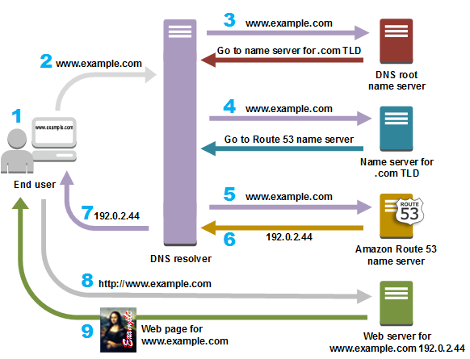
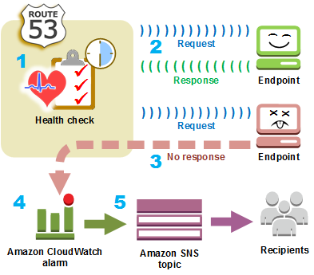

# Overview
+ Amazon Route 53 is a highly available and scalable **Domain Name System (DNS) web service**.
+ You can use Route 53 to perform three main functions in any combination: **domain registration, DNS routing, and health checking**.
# Amazon Route 53 concepts
## [Domain registration concepts](https://docs.aws.amazon.com/Route53/latest/DeveloperGuide/route-53-concepts.html#route-53-concepts-domain-registration)
+ **domain name**
    + The name, such as example.com, that a user types in the address bar of a web browser to access a website or a web application. 
+ **domain registrar**
    + A company that is accredited by ICANN (Internet Corporation for Assigned Names and Numbers) to process domain registrations for specific top-level domains (TLDs). 
+ **domain registry**
    + A company that owns the right to sell domains that have a specific top-level domain.
    + A domain registry defines the rules for registering a domain, such as residency requirements for a geographic TLD.
    + A domain registry also maintains the authoritative database for all of the domain names that have the same TLD.
    + The registry's database contains information such as contact information and the name servers for each domain.
+ **domain reseller**
    + A company that sells domain names for registrars such as Amazon Registrar. Amazon Route 53 is a domain reseller for Amazon Registrar and for our registrar associate, Gandi.
+ **top-level domain (TLD)**
    + The last part of a domain name, such as .com, .org, or .ninja. There are two types of top-level domains:
        + **Generic top-level domains**
            + These TLDs typically give users an idea of what they'll find on the website. 
        + **Geographic top-level domains**
            + These TLDs are associated with geographic areas such as countries or cities.
## [Domain Name System (DNS) concepts](https://docs.aws.amazon.com/Route53/latest/DeveloperGuide/route-53-concepts.html#route-53-concepts-domain-name-system-dns)
+ **alias record**
    + A type of record that you can create with Amazon Route 53 to **route traffic to AWS resources** such as Amazon CloudFront distributions and Amazon S3 buckets.
+ **authoritative name server**
    + A name server that has definitive information about one part of the Domain Name System (DNS) and that **responds to requests from a DNS resolver** by returning the applicable information.
    + For example, an authoritative name server for the .com top-level domain (TLD) **knows the names of the name servers** for every registered .com domain. When a .com authoritative name server receives a request from a DNS resolver for example.com, it responds with the names of the name servers for the DNS service for the example.com domain.
+ **DNS query**
    + Usually a request that is submitted by a device, such as a computer or a smart phone, to the Domain Name System (DNS) for a resource that is associated with a domain name.
    + The response to a DNS query typically is the **IP address** that is associated with a resource such as a web server. 
+ **DNS resolver/recursive name server**
    + When you open a browser and enter a domain name in the address bar, your query goes first to a DNS resolver.
    + The resolver **communicates with DNS name servers to get the IP address** for the corresponding resource, such as a web server.
    + A DNS resolver is also known as **a recursive name server** because it sends requests to a sequence of authoritative DNS name servers until it gets the response (typically an IP address) that it returns to a user's device, for example, a web browser on a laptop computer.
+ **Domain Name System (DNS)**
    + **A worldwide network of servers** that help computers, smart phones, tablets, and other IP-enabled devices to communicate with one another.
    + The Domain Name System **translates easily understood names such as example.com into the numbers**, known as **IP addresses**, that allow computers to find each other on the internet.
+ **hosted zone**
    + **A container for records**, which include information about how you want to route traffic for a domain (such as example.com) and all of its subdomains (such as www.example.com, retail.example.com, and seattle.accounting.example.com).
    + A hosted zone **has the same name as the corresponding domain**.
    + *Public hosted zones* contain records that specify how you want to route traffic on the internet.
    + *Private hosted zones* contain records that specify how you want to route traffic in an Amazon VPC.
    + When you create a hosted zone, Amazon Route 53 **automatically creates a name server (NS) record and a start of authority (SOA) record** for the zone.
    + The **NS record identifies the four name servers** that you give to your registrar or your DNS service so that DNS queries are routed to Route 53 name servers.
    + You can create **more than one hosted zone that has the same name** and add different records to each hosted zone.
+ **IP address**
    + A number that is assigned to a device on the internet—such as a laptop, a smart phone, or a web server—that allows the device to communicate with other devices on the internet.
    + Route 53 supports both IPv4 and IPv6 addresses for the following purposes:
    + You can create records that have a type of A, for IPv4 addresses, or a type of AAAA, for IPv6 addresses.
+ **name servers**
    + Servers in the Domain Name System (DNS) that help to **translate domain names into the IP addresses** that computers use to communicate with one another.
    + Name servers are either **recursive name servers (also known as [DNS resolver](https://docs.aws.amazon.com/Route53/latest/DeveloperGuide/route-53-concepts.html#route-53-concepts-dns-resolver)) or [authoritative name server](https://docs.aws.amazon.com/Route53/latest/DeveloperGuide/route-53-concepts.html#route-53-concepts-authoritative-name-server)s**.
+ **private DNS**
    + A local version of the Domain Name System (DNS) that lets you route traffic for a domain and its subdomains to Amazon EC2 instances within one or more Amazon virtual private clouds (VPCs). 
+ **record (DNS record)**
    + **An object in a hosted zone** that you use to define **how you want to route traffic for the domain or a subdomain**. 
+ **reusable delegation set**
    + A set of four authoritative name servers that you can use with more than one hosted zone. By default, Route 53 assigns a random selection of name servers to each new hosted zone. To make it easier to migrate DNS service to Route 53 for a large number of domains, you can create a reusable delegation set and then associate the reusable delegation set with new hosted zones. (You can't change the name servers that are associated with an existing hosted zone.)
+ **routing policy**
    + A setting for records that determines how Route 53 responds to DNS queries. Route 53 supports the following routing policies:
        + **Simple routing policy** – Use to route internet traffic to a single resource that performs a given function for your domain, for example, a web server that serves content for the example.com website.
        + **Failover routing policy** – Use when you want to configure active-passive failover.
        + **Geolocation routing policy** – Use when you want to route internet traffic to your resources based on the location of your users.
        + **Geoproximity routing policy** – Use when you want to route traffic based on the location of your resources and, optionally, shift traffic from resources in one location to resources in another.
        + **Latency routing policy**– Use when you have resources in multiple locations and you want to route traffic to the resource that provides the best latency.
        + **Multivalue answer routing policy** – Use when you want Route 53 to respond to DNS queries with up to eight healthy records selected at random.
        + **Weighted routing policy** – Use to route traffic to multiple resources in proportions that you specify.
+ **subdomain**
    + A domain name that has one or more labels prepended to the registered domain name.
    + To route traffic for a subdomain, create a record that has the name that you want, such as www.example.com, and specify the applicable values, such as the IP address of a web server.
+ **time to live (TTL)**
    + The amount of time, in seconds, that you want a DNS resolver to **cache (store) the values for a record** before submitting another request to Route 53 to get the current values for that record. If the DNS resolver receives another request for the same domain before the TTL expires, the resolver returns the cached value.
    + A longer TTL reduces your Route 53 charges, which are based in part on the number of DNS queries that Route 53 responds to. A shorter TTL reduces the amount of time that DNS resolvers route traffic to older resources after you change the values in a record, for example, by changing the IP address for the web server for www.example.com.
## [Health checking concepts](https://docs.aws.amazon.com/Route53/latest/DeveloperGuide/route-53-concepts.html#route-53-concepts-health-checking)      
+ **DNS failover**
    + A method for routing traffic away from unhealthy resources and to healthy resources.
    + When you have more than one resource performing the same function—for example, more than one web server or mail server—you can configure Route 53 health checks to check the health of your resources and configure records in your hosted zone to route traffic only to healthy resources.
+ **endpoint**
    + The resource, such as a web server or an email server, that you configure a health check to monitor the health of. You can specify an endpoint by IPv4 address (192.0.2.243), by IPv6 address (2001:0db8:85a3:0000:0000:abcd:0001:2345), or by domain name (example.com).
+ **health check**
    + A Route 53 component that lets you do the following:
    + **Monitor** whether a specified endpoint, such as a web server, is healthy
    + Optionally, get **notified** when an endpoint becomes unhealthy
    + Optionally, **configure DNS failover**, which allows you to reroute internet traffic from an unhealthy resource to a healthy resource
# Register a domain name with Amazon Route 53 
+ Choose a domain name and confirm that it's available, meaning that no one else has registered the domain name that you want.
+ If the domain name you want is already in use, you can try other names or try changing only the *top-level domain*
+ You register the domain name with Route 53. When you register a domain, you provide names and contact information for the domain owner and other contacts. 
+ When you register a domain with Route 53, the service automatically makes itself the DNS service for the domain by doing the following:
    + Creates a [hosted zone](https://docs.aws.amazon.com/Route53/latest/DeveloperGuide/route-53-concepts.html#route-53-concepts-hosted-zone) that has the same name as your domain.
    + Assigns a set of four name servers to the hosted zone. 
    + Gets the name servers from the hosted zone and adds them to the domain.
    + At the end of the registration process, we send your information to the registrar for the domain.
    + The registrar sends your information to the *registry* for the domain. A registry is a company that sells domain registrations for one or more top-level domains, such as .com.
    + The registry stores the information about your domain in their own database and also stores some of the information in the public WHOIS database.
# How internet traffic is routed to your website or web application
+ register the domain name that you want your users to use to access your content.
+ After you register your domain name, Route 53 automatically creates a public hosted zone that has the same name as the domain.
+ To route traffic to your resources, you create *records*, also known as *resource record sets*, in your hosted zone.  
+ **Name**
    + The name of the record corresponds with the domain name (example.com) or subdomain name (www.example.com, retail.example.com) that you want Route 53 to route traffic for.
    + The name of every record in a hosted zone must end with the name of the hosted zone.
+ **Type**
+ The record type usually determines the type of resource that you want traffic to be routed to.

# Amazon Route 53 health  check

# Records
+ After you create a hosted zone for your domain, such as example.com, you create records to tell the Domain Name System (DNS) how you want traffic to be routed for that domain.
+ The name of each record in a hosted zone must **end with the name of the hosted zone**.
## Routing policy
+ **Simple routing policy** – Use for a single resource that performs a given function for your domain, for example, a web server that serves content for the example.com website.
+ **Failover routing policy** – Use when you want to configure active-passive failover.
+ **Geolocation routing policy** – Use when you want to route traffic based on the location of your users. 
    + You can create a default record that handles both queries from IP addresses that aren't mapped to any location and queries that come from locations that you haven't created geolocation records for.
+ **Geoproximity routing policy** – Use when you want to route traffic based on the location of your resources and, optionally, shift traffic from resources in one location to resources in another.
+ **Latency routing policy** – Use when you have resources in multiple AWS Regions and you want to route traffic to the Region that provides the best latency with less round-trip time.
+ **Multivalue answer routing policy** – Use when you want Route 53 to respond to DNS queries with up to eight healthy records selected at random. 
    + **It's not a substitute for a load balancer**, but the ability to return multiple health-checkable IP addresses is a way to use DNS to improve availability and load balancing.
+ **Weighted routing policy** – Use to route traffic to multiple resources in proportions that you specify.
## Alias and non-alias records
+ Alias records let you **route traffic to selected AWS resources**, such as CloudFront distributions and Amazon S3 buckets.
+ They also let you route traffic from one record in a hosted zone **to another record**.
+ Unlike a CNAME record, you can create an alias record **at the top node of a DNS namespace, also known as the zone apex**.
+ When Route 53 receives a DNS query for an alias record, Route 53 responds with the applicable value for that resource: 
    + **An Amazon API Gateway custom regional API or edge-optimized API** – Route 53 responds with one or more IP addresses for your API.
    + **An Amazon VPC interface endpoint** – Route 53 responds with one or more IP addresses for your interface endpoint.
    + **A CloudFront distribution** – Route 53 responds with one or more IP addresses for CloudFront edge servers that can serve your content.
    + **An Elastic Beanstalk environment** – Route 53 responds with one or more IP addresses for the environment.
    + **An ELB load balancer** – Route 53 responds with one or more IP addresses for the load balancer.
    + **An AWS Global Accelerator accelerator** – Route 53 responds with one of the two IP addresses for the accelerator.
    + **An Amazon S3 bucket that is configured as a static website** – Route 53 responds with one IP address for the Amazon S3 bucket.
    + **Another Route 53 record in the same hosted zone** – Route 53 responds as if the query is for the record that is referenced by the alias record.
+ If an alias record points to an AWS resource, you **can't set the time to live (TTL)**; Route 53 uses the default TTL for the resource.
+ If an alias record points to another record in the same hosted zone, Route 53 uses the TTL of the record that the alias record points to.
+ The value that you specify depends in part on the AWS resource that you're routing traffic to: 
    + **CloudFront distribution** – Your distribution must include an alternate domain name that matches the name of the record.
    + **Amazon S3 bucket** – The name of the record must match the name of your Amazon S3 bucket.
    + **Amazon API Gateway** –  An API Gateway API that has a custom domain name, such as api.example.com, that matches the name of the Route 53 record that you want to create.
+ Comparison of alias and CNAME records: 
    + An **alias record can only redirect queries to selected AWS resources**
    + A **CNAME record can redirect DNS queries to any DNS record**. 
    + you can create an alias record that has the same name as the hosted zone (the zone apex)
    + You can't create a CNAME record that has the same name as the hosted zone
    + Route 53 responds to a DNS **query only when the name of the alias record (such as acme.example.com) and the type of the alias record (such as A or AAAA) match** the name and type in the DNS query.
    + A CNAME record **redirects DNS queries for a record name regardless of the record type** specified in the DNS query, such as A or AAAA.
## DNS record types
+ **A record type**: You use an A record to route traffic to a resource, such as a web server, using an IPv4 address in dotted decimal notation.
+ **AAAA record type**: You use an AAAA record to route traffic to a resource, such as a web server, using an IPv6 address in colon-separated hexadecimal format.
+ **CAA record type**: A CAA record specifies which certificate authorities (CAs) are allowed to issue certificates for a domain or subdomain.
+ **A CNAME record**: A CNAME record maps DNS queries for the name of the current record, such as acme.example.com, to another domain or subdomain.
+ **DS record type**: A delegation signer (DS) record refers a zone key for a delegated subdomain zone
+ **MX record type**: An MX record specifies the names of your mail servers and, if you have two or more mail servers, the priority order.
+ **NAPTR record type**: A Name Authority Pointer (NAPTR) is a type of record that is used by Dynamic Delegation Discovery System (DDDS) applications to **convert one value to another or to replace one value with another**.
+ **NS record type**: An NS record identifies the name servers for the hosted zone. 
+ **PTR record type**: A PTR record maps an IP address to the corresponding domain name.
+ **SOA record type:** A start of authority (SOA) record provides information about a domain and the corresponding Amazon Route 53 hosted zone. 
+ **SPF record type**: SPF records were formerly used to verify the identity of the sender of email messages.
+ **SRV record type**: SRV records are used for accessing services, such as a service for email or communications.
+ **TXT record type**: A TXT record contains one or more strings that are enclosed in double quotation marks 
# Traffic flow
+ The traffic flow **visual editor** lets you create complex trees of records and see the relationships among the records.
+ You can create **multiple versions** of a traffic policy so you don't have to start all over when your configuration changes.
+ **Automatic record creation and updating**: A traffic policy can represent dozens or even hundreds of records. Traffic flow lets you create all those records automatically by creating a *traffic policy record*.
# DNSSEC signing

+ Domain Name System Security Extensions (DNSSEC) signing lets DNS resolvers **validate** that a DNS response came from Amazon Route 53 and has not been tampered with.
+ When you use DNSSEC signing, every response for a hosted zone is signed using public key cryptography.
# Routing internet traffic to your AWS resources
+ **CloudFront distribution**
    + Record type: A – IPv4 address.
    + Alias: true
    + Value: cloudfront distribution id 
    + distribution must include an alternate domain name that matches the name of the record.
+ **Amazon S3 bucket**  
    + Record type: A – IPv4 address.
    + Alias: true
    + Value: bucket name 
    + The name of the record must match the name of your Amazon S3 bucket.
+ **Amazon API Gateway**
    + Record type: A – IPv4 address.
    + Alias: true
    + Value: api gateway endpoint 
    + The API Gateway API that has a custom domain name that matches the name of the Route 53 record that you want to create.
+ **Amazon EC2 Instance**
    + Record type: A – IPv4 address.
    + Alias: false
    + Value: public ip address/ elastic ip address
+ **AWS Elastic Beanstalk environment**
    + Alias 
        + Record type: A – IPv4 address.
        + Alias: true
        + Value: beanstalk endpoint url
    + CNAME: 
        + Record type: CNAME
        + Alias: false
        + Value: beanstalk domain name
+ **AWS ELB load balancer**
    + Record type: A – IPv4 address.
    + Alias: true
    + Value: elb endpoint url
+  **Amazon RDS database instance**
    + Record type: CNAME 
    + Alias: false
    + Value: db domain name(endpoint url)
+  **Amazon Virtual Private Cloud interface endpoint​​​​​​​**
    + Record type: A – IPv4 address.
    + Alias: true
    + Value: interface endpoint url
+  **Amazon WorkMail**
    + Record type: **MX – Mail Exchange**..
    + Alias: false
    + Value:  Amazon WorkMail TXT record, copy the value of the **Value** column
# Health Check
## Types of Amazon Route 53 health checks
+ **Health checks that monitor an endpoint**
    + You can configure a health check that monitors an endpoint that you specify either by IP address or by domain name.
    + At regular intervals that you specify, Route 53 submits automated requests over the internet to your application, server, or other resource to verify that it's reachable, available, and functional. 
+ **Health checks that monitor other health checks (calculated health checks)**
    + You can create a health check that monitors whether Route 53 considers other health checks healthy or unhealthy.
+ **Health checks that monitor CloudWatch alarms**
+ **Amazon Route 53 Application Recovery Controller**
## Route 53 Resolver DNS Firewall
+ DNS Firewall provides protection for **outbound DNS requests** from your VPCs. These requests route through Resolver for domain name resolution.
+ With Route 53 Resolver DNS Firewall, you can **filter and regulate outbound DNS traffic** for your virtual private connections (VPCs).  
+ you create reusable collections of filtering rules in DNS Firewall rule groups,
+ associate the rule groups to your VPC
+ and then monitor activity in DNS Firewall logs and metrics.
+ Based on the activity, you can adjust the behavior of DNS Firewall accordingly.
+ You can use **Firewall Manager** to centrally configure and manage your DNS Firewall rule group associations for your VPCs across your accounts in AWS Organizations. Firewall Manager automatically adds associations for VPCs that come into scope of your Firewall Manager DNS Firewall policy. 
+ DNS Firewall provides filtering for outbound DNS queries that pass through the Route 53 Resolver from applications within your VPCs. You can also configure DNS Firewall to send custom responses for queries to blocked domain names.
+ Network Firewall provides filtering for both network and application layer traffic, but does not have visibility into queries made by Route 53 Resolver.
# Reference
[Amazon Route53](https://docs.aws.amazon.com/Route53/latest/DeveloperGuide/Welcome.html)
