# Overview
+ Amazon Elastic Compute Cloud (Amazon EC2) is a web service that provides **secure, resizable compute capacity** in the cloud. 
+ The simple web interface of Amazon EC2 allows you to **obtain and confifigure capacity with minimal friction**.
+ Amazon EC2 reduces the time required to obtain and boot new server instances (called Amazon EC2 instances) to minutes, allowing you to **quickly scale capacity, both up and down**, as your computing requirements change. 
# EC2 Features
+ Virtual computing environments, known as **EC2 instances**
+ Preconfigured templates for your instances, known as **Amazon Machine Images (AMIs)**, that package the bits you need for your server (including the operating system and additional software)
+ Various configurations of CPU, memory, storage, and networking capacity for your instances, known as **Instance types**
+ Secure login information for your instances using **key pairs** (AWS stores the public key, and you store the private key in a secure place)
+ Storage volumes for **temporary data** that’s deleted when you stop or terminate your instance, known as **Instance store volumes**
+ **Persistent storage volumes** for your data using Amazon Elastic Block Store (Amazon EBS), known as **Amazon EBS volumes**
+ Multiple physical locations for your resources, such as instances and EBS volumes, known as **Regions and Availability Zones**
+ A firewall that enables you to specify the protocols, ports, and source IP ranges that can reach your instances using **security groups**
+ Static IP addresses for dynamic cloud computing, known as **Elastic IP addresses**
+ Metadata, known as **tags**, can be created and assigned to EC2 resources
+ Script virtual hardware management with **User Data**
+ Use **Enhanced Networking** for more Packets Per Second (PPS), lower latency, and less jitter
+ **Placement Groups** provides low-latency networking between all instances in the cluster
+ Better IOPS with **EBS-optimized instances**
+ **Dedicated Host** for security and complicance
+ Virtual networks you can create that are logically isolated from the rest of the AWS Cloud, and that you can optionally connect to your own network, known as **virtual private clouds(VPCs)** 
# How to lunch an EC2 instance
+ Select a pre-configured, templated **Amazon Machine Image (AMI)** to get up and running immediately. Or create an AMI containing your applications, libraries, data, and associated configuration settings.
+ Configure **security and network access** on your Amazon EC2 instance.
+ Choose which **instance type(s)** you want, then start, terminate, and monitor as many instances of your AMI as needed, using the web service APIs or the variety of management tools provided.
+ Determine whether you want to run in multiple locations, utilize static IP endpoints, or attach persistent block storage to your instances.
+ Pay only for the resources that you actually consume, like instance-hours or data transfer.
# Compute Basics
There are two concepts that are key to launching instances on AWS: 
+ **Instance type**: the amount of virtual **hardware** dedicated to the instance 
+ **AMI**: the **software** loaded on the instance
# Amazon EC2 Instance
+ An instance is a **virtual server** in the cloud. Its **configuration at launch is a copy of the AMI** that you specified when you launched the instance.
+ You can **launch different types of instances from a single AMI**. An *instance type* essentially determines the hardware of the host computer used for your instance.There are dozens of instance types available, varying in the following dimensions:
  + Virtual CPUs (vCPUs)
  + Memory
  + Storage (size and type)
  + Network performance
+ Instance types are grouped into families based on the ratio of these values to each other.
## Decoding instance names
+ The letter in the first position represents the instance family.
+ The number represents the generation of the processor, with higher numbers being the newest generation.
+ Additional characteristics
    + Instance names can include additional capabilities. This is a list of additional items that you might see in an instance name and what they mean.
    + a – AMD processors
    + g – AWS Graviton processors
    + i – Intel processors
    + d – Instance store volumes
    + n – Network optimization
    + b – Block storage optimization
    + e – Extra storage or memory
    + z – High frequency
+ The last part represents the size of the instance.
## General Purpose
+ General purpose instances provide **a balance of compute, memory and networking resources**, and is **Ideal for applications that use these resources in equal proportions**
### **M5 and M5a instances**
+ These instances provide an ideal cloud infrastructure, offering a balance of compute, memory, and networking resources for a broad range of applications that are deployed in the cloud. They are well-suited for the following:
  + Small and midsize databases 
  + Data processing tasks that require additional memory 
  + Caching fleets 
  + Backend servers for SAP, Microsoft SharePoint, cluster computing, and other enterprise applications 
### **M5zn**
+ These instances are ideal for applications that benefit from **extremely high single-thread performance, high throughput, and low latency networking**. They are well-suited for the following:
  + Gaming 
  + High performance computing 
  + Simulation modeling 
### **M6g and M6gd instances**
+ These instances are powered by **AWS Graviton2 processors** and deliver balanced compute, memory, and networking for a broad range a general purpose workloads. They are well suited for the following:
  + Application servers 
  + Microservices 
  + Gaming servers 
  + Midsize data stores 
  + Caching fleets 
### **Mac1 instances**
+ These instances are powered by **Apple Mac mini computers**. They provide up to 10 Gbps of network bandwidth and 8 Gbps EBS bandwidth through high-speed Thunderbolt 3 connections. They are well suited to develop, build, test, and sign applications for Apple devices, such as iPhone, iPad, iPod, Mac, Apple Watch, and Apple TV.
### **T2, T3, T3a, and T4g instances(Burstable performance instances)**
+ These instances **provide a baseline level of CPU performance with the ability to burst to a higher level** when required by your workload. An **Unlimited** instance can **sustain high CPU performance for any period of time** whenever required. They are well-suited for the following:
  + Websites and web applications 
  + Code repositories 
  + Development, build, test, and staging environments 
  + Microservices 
#### Burstable performance instance requirements
+ The supported instance families are: **T2, T3, T3a, and T4g.**
+ The supported purchasing options are: **On-Demand Instances, Reserved Instances, Dedicated Instances, and Spot Instances**. These instances are **not supported on a Dedicated Host**.  
+ Ensure that the instance size you choose passes the minimum memory requirements of your operating system and applications. 
#### Best practices
Follow these best practices to get the maximum benefit from burstable performance instances.
+ Use a recommended AMI – Use an AMI that provides the required drivers. 
+ Turn on instance recovery – Create a CloudWatch alarm that monitors an EC2 instance and automatically recovers it if it becomes impaired for any reason. 
#### CPU credits 
+ A **CPU Credit** provides the performance of **a full CPU core for one minute**, the following scenarios all use one CPU credit:
+ One vCPU at 100% utilization for one minute 
+ One vCPU at 50% utilization for two minutes 
+ Two vCPUs at 25% utilization for two minutes 
+ The baseline utilization and ability to burst are governed by CPU credits.
+ Each T instance receives CPU Credits continuously, the **rate** of which **depends on the instance size**
+ If the instance does not use the credits it receives, they are stored in its **CPU Credit balance**
+ While **earned credits never expire** on a running instance, there is **a limit to the number of earned credits** that an instance can accrue.  
+ For T2, the CPU credit balance **does not persist between instance stops and starts**. If you stop a T2 instance, the instance loses all its accrued credits. 
+ For T3 and T4g, the CPU credit balance **persists for seven days after an instance stops** and the credits are lost thereafter.  
+ Maximum earned credit balance for an instance is equal to the number of **CPU credits received per hour times 24 hours**
#### Launch credits
+ T2 Standard instances receive Launch credits to provide a good startup experience, but T2 Unlimited instances do not(no need).  
+ T3 and T4g instances(Standard  or Unlimited) never receive launch credits. 
+ T2 Standard instances get **30 launch credits per vCPU** at launch or start. 
+ Launch credits are **spent first**, before earned credits. Unspent launch credits are **accrued in the CPU credit balance**, but **do not count towards the CPU credit balance limit**. 
+ There is a limit to the number of times T2 Standard instances can receive launch credits. The default limit is **100 launches or starts of all T2 Standard instances combined per account, per Region, per rolling 24-hour period.**  

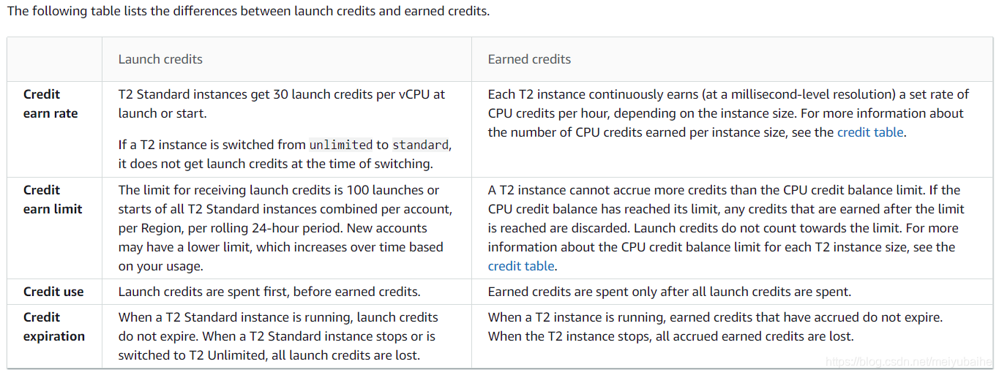
#### Baseline utilization
+ A percentage of vCPU utilization, which is calculated as follows: 
+ `(number of credits earned/number of vCPUs)/60 minutes = % baseline utilization`
+  A `t3.nano` instance, with 2 vCPUs, earns 6 credits per hour, resulting in a baseline utilization of 5% (`(6/2)/60`). 
+  A `t3.xlarge` instance, with 4 vCPUs, earns 96 credits per hour, resulting in a baseline utilization of 40% (`(96/4)/60`). 
#### Unlimited mode
+ The `unlimited` mode is a **credit configuration option** for burstable performance instances. 
+ It can be **enabled or disabled at any time** for a **running or stopped instance**. 
+ You can set `unlimited` as the default credit option at the **account level per AWS Region**, **per burstable performance instance family** 
+ A burstable performance instance configured as `unlimited` can sustain **high CPU utilization for any period of time** whenever required. 
+ If a burstable performance instance configured as `unlimited` depletes its CPU credit balance, it can **spend surplus credits** to burst beyond the [baseline](https://docs.aws.amazon.com/AWSEC2/latest/UserGuide/burstable-credits-baseline-concepts.html#baseline_performance). When its CPU utilization falls below the baseline, it **uses the CPU credits that it earns to pay down the surplus credits that it spent earlier**. 
+ The hourly instance price automatically covers all CPU usage spikes **if the average CPU utilization of the instance is at or below the baseline over a rolling 24-hour period** or the instance lifetime, whichever is shorter.
+ If you use a `t2.micro` or `t3.micro` instance under the [AWS Free Tier](https://aws.amazon.com/free/) offer and use it in `unlimited` mode, charges might apply if your average utilization over a rolling 24-hour period exceeds the [baseline utilization](https://docs.aws.amazon.com/AWSEC2/latest/UserGuide/burstable-credits-baseline-concepts.html#baseline_performance) of the instance. 
+ T3 and T4g instances launch as `unlimited` by default. If the average CPU usage over a 24-hour period exceeds the baseline, you incur charges for surplus credits 
+ The breakeven CPU usage helps you determine when to use unlimited mode versus fixed CPU:
    + If the average CPU usage over a 24-hour period is at or below the breakeven CPU usage, use a burstable performance instance in `unlimited` mode so that you can benefit from the lower price of a burstable performance instance while getting the same performance as a fixed performance instance. 
    +  If the average CPU usage over a 24-hour period is above the breakeven CPU usage, the burstable performance instance will cost more than the equivalently-sized fixed performance instance. If a T3 instance continuously bursts at 100% CPU, you end up paying approximately 1.5 times the price of an equivalently-sized M5 instance.
    
    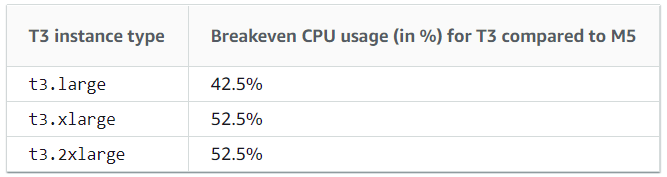
+ Surplus credits that were spent earlier are charged when any of the following occurs:
    + The spent surplus credits exceed the [maximum number of credits](https://docs.aws.amazon.com/AWSEC2/latest/UserGuide/burstable-credits-baseline-concepts.html#burstable-performance-instances-credit-table) the instance can earn in a 24-hour period. Spent surplus credits above the maximum are charged at the end of the hour. 
    + The instance is stopped or terminated. 
    + The instance is switched from `unlimited` to `standard`. 
    + Spent surplus credits are tracked by the CloudWatch metric `CPUSurplusCreditBalance`. Surplus credits that are charged are tracked by the CloudWatch metric `CPUSurplusCreditsCharged` 
+ `CPUCreditBalance` is a CloudWatch metric that tracks the number of credits accrued by an instance. `CPUSurplusCreditBalance` is a CloudWatch metric that tracks the number of surplus credits spent by an instance. 
+ When you change an instance configured as `unlimited` to `standard`, the following occurs:
    + The `CPUCreditBalance` value remains unchanged and is carried over. 
    + The `CPUSurplusCreditBalance` value is immediately charged. 
+  When a `standard` instance is switched to `unlimited`, the following occurs:
    + The `CPUCreditBalance` value containing accrued earned credits is carried over. 
    + For T2 Standard instances, **any launch credits are removed** from the `CPUCreditBalance` value, and **the remaining** `CPUCreditBalance` value containing **accrued earned credits is carried over**. 
#### Standard mode
+ A burstable performance instance configured as `standard` is suited to workloads with an average CPU utilization that is **consistently below the baseline CPU utilization** of the instance.
+ To burst above the baseline, the instance **spends credits that it has accrued** in its CPU credit balance. If the instance is running low on accrued credits, CPU utilization is gradually lowered to the baseline level
+ For T2 Standard, when the instance is stopped, it loses all its accrued credits
+ For T3 and T4g Standard instances, the CPU credit balance persists for seven days after the instance stops and the credits are lost thereafter
## Compute Optimized
+ Ideal for compute bound applications that **benefit from high performance processors**
### **C5 and C5n instances**
+ These instances are well suited for the following:
+ Batch processing workloads 
+ Media transcoding 
+ High-performance web servers 
+ High-performance computing (HPC) 
+ Scientific modeling 
+ Dedicated gaming servers and ad serving engines 
+ Machine learning inference and other compute-intensive applications 
### **C6g, C6gd, and C6gn instances**
+ These instances are powered by **AWS Graviton2 processors** and are ideal for running advanced, compute-intensive workloads, such as the following:
+ High-performance computing (HPC) 
+ Batch processing 
+ Ad serving 
+ Video encoding 
+ Gaming servers 
+ Scientific modeling
+ Distributed analytics 
+ CPU-based machine learning inference 
### Instance performance
+ EBS-optimized instances enable you to get consistently high performance for your EBS volumes by eliminating contention between Amazon EBS I/O and other network traffic from your instance. Some compute optimized instances are EBS-optimized by default at no additional cost.
+ Some compute optimized instance types provide the ability to control processor C-states and P-states on Linux. C-states control the sleep levels that a core can enter when it is inactive, while P-states control the desired performance (in CPU frequency) from a core
### Network performance
+ You can **enable enhanced networking** on supported instance types to **provide lower latencies, lower network jitter, and higher packet-per-second (PPS) performance**.
+ Some instances use a network I/O credit mechanism to allocate network bandwidth to instances based on average bandwidth utilization. They accrue credits when their bandwidth is below their baseline bandwidth, and can use these credits when they perform network data transfers. 
## Memory Optimized
+ Memory optimized instances are designed to deliver **fast performance** for workloads that **process large data sets in memory**.
### **R5, R5a, R5b, and R5n instances**
+ These instances are well suited for the following:
+ High-performance, relational (MySQL) and NoSQL (MongoDB, Cassandra) databases. 
+ Distributed web scale cache stores that provide in-memory caching of key-value type data (Memcached and Redis). 
+ In-memory databases using optimized data storage formats and analytics for business intelligence (for example, SAP HANA). 
+ Applications performing real-time processing of big unstructured data (financial services, Hadoop/Spark clusters). 
+ High-performance computing (HPC) and Electronic Design Automation (EDA) applications. 
### **R6g and R6gd instances**
+ These instances are powered by AWS Graviton2 processors and are ideal for running memory-intensive workloads, such as the following:
+ Open-source databases (for example, MySQL, MariaDB, and PostgreSQL) 
+ In-memory caches (for example, Memcached, Redis, and KeyDB) 
### **High memory instances**
+ These instances offer 6 TiB, 9 TiB, 12 TiB, 18 TiB, and 24 TiB of memory per instance. They are designed to run large in-memory databases, including production deployments of the SAP HANA in-memory database.
### **X1 instances**
+ These instances are well suited for the following:
+ In-memory databases such as SAP HANA, including SAP-certified support for Business Suite S/4HANA, Business Suite on HANA (SoH), Business Warehouse on HANA (BW), and Data Mart Solutions on HANA.  
+ Big-data processing engines such as Apache Spark or Presto.
+ High-performance computing (HPC) applications. 
### **X1e instances**
+ These instances are well suited for the following:
+ High-performance databases. 
+ In-memory databases such as SAP HANA 
+ Memory-intensive enterprise applications. 
### **X2gd instances**
+ These instances are well suited for the following:
+ In-memory databases, such as Redis and Memcached. 
+ Relational databases, such as MySQL and PostGreSQL. 
+ Electronic design automation (EDA) workloads, such as physical verification and layout tools. 
+ Memory-intensive workloads, such as real-time analytics and real-time caching servers. 
### **z1d instances**
These instances deliver both high compute and high memory and are well-suited for the following:
+ Electronic Design Automation (EDA) 
+ Relational database workloads 
### Memory performance
+ X1 instances include Intel Scalable M​​emory Buffers, providing 300 GiB/s of sustainable memory-read bandwidth and 140 GiB/s of sustainable memory-write bandwidth.
+ Memory optimized instances have high memory and require **64-bit HVM AMIs** to take advantage of that capacity. 
### Instance performance
+ Memory optimized instances enable increased cryptographic performance through the latest Intel AES-NI feature, support Intel Transactional Synchronization Extensions (TSX) to boost the performance of in-memory transactional data processing, and support Advanced Vector Extensions 2 (Intel AVX2) processor instructions to expand most integer commands to 256 bits.
+ Some memory optimized instances provide the ability to control processor C-states and P-states on Linux. C-states control the sleep levels that a core can enter when it is inactive, while P-states control the desired performance (measured by CPU frequency) from a core. 
## Accelerated Computing
+ Accelerated computing instances use **hardware accelerators, or co-processors**, to perform functions, such as floating point number calculations, graphics processing, or data pattern matching, more efficiently than is possible in software running on CPUs.
### GPU instances
+ GPU-based instances provide access to NVIDIA GPUs with thousands of compute cores. You can use these instances to accelerate scientific, engineering, and rendering applications by leveraging the CUDA or Open Computing Language (OpenCL) parallel computing frameworks. You can also use them for graphics applications, including game streaming, 3-D application streaming, and other graphics workloads.
### Instances with AWS Inferentia
+ These instances are designed to **accelerate machine learning** using [AWS Inferentia](http://aws.amazon.com/machine-learning/inferentia/), a custom AI/ML chip from Amazon that provides high performance and low latency machine learning inference. These instances are optimized for **deploying Deep Learning (DL) models for applications**, such as natural language processing, object detection and classification, content personalization and filtering, and speech recognition.
### FPGA instances
+ FPGA-based instances provide access to large FPGAs with millions of parallel system logic cells. You can use FPGA-based accelerated computing instances to accelerate workloads such as genomics, financial analysis, real-time video processing, big data analysis, and security workloads by leveraging custom hardware accelerations.
## Storage Optimized
+ Storage optimized instances are designed for workloads that **require high, sequential read and write access to very large data sets on local storage**. They are optimized to deliver tens of thousands of low-latency, random I/O operations per second (IOPS) to applications.
### **D2 instances**
+ These instances are well suited for the following:
+ Massive parallel processing (MPP) data warehouse 
+ MapReduce and Hadoop distributed computing 
+ Log or data processing applications 
### **D3 and D3en instances**
+ These instances offer scale out of instance storage and are well suited for the following:
+ Distributed file systems for Hadoop workloads 
+ File storage workloads such as GPFC and BeeFS 
+ Large data lakes for HPC workloads 
### **H1 instances**
+ These instances are well suited for the following:
+ Data-intensive workloads such as MapReduce and distributed file systems 
+ Applications requiring sequential access to large amounts of data on direct-attached instance storage 
+ Applications that require high-throughput access to large quantities of data 
### **I3 and I3en instances**
+ These instances are well suited for the following:
+ High frequency online transaction processing (OLTP) systems 
+ Relational databases 
+ NoSQL databases 
+ Cache for in-memory databases (for example, Redis) 
+ Data warehousing applications 
+ Distributed file systems 
### Instance performance
+ To ensure the best disk throughput performance from your instance on Linux, we recommend that you use the most recent version of **Amazon Linux 2 or the Amazon Linux AMI**.
+ For instances with NVMe instance store volumes, you must use a Linux AMI with kernel version 4.4 or later. Otherwise, your instance will not achieve the maximum IOPS performance available.
+ D2 instances provide the best disk performance when you use a Linux kernel that supports persistent grants, an extension to the Xen block ring protocol that significantly improves disk throughput and scalability. 
+ **EBS-optimized instances** enable you to get consistently high performance for your EBS volumes by eliminating contention between Amazon EBS I/O and other network traffic from your instance. Some storage optimized instances are EBS-optimized by default at no additional cost. 
+ Some storage optimized instance types provide the ability to control processor C-states and P-states on Linux. C-states control the sleep levels that a core can enter when it is inactive, while P-states control the desired performance (in CPU frequency) from a core. 
## Instance Features
### AMI virtualization types
+ The virtualization type of your instance is determined by the AMI that you use to launch it.  
+ Current generation instance types support **hardware virtual machine (HVM) only**.
+ Some previous generation instance types support **paravirtual (PV)** and some AWS Regions support PV instances.
+ For best performance, we recommend that you use an HVM AMI.
+ In addition, HVM AMIs are required to take advantage of enhanced networking. 
### Instances built on the Nitro System
+ The Nitro System is a collection of AWS-built hardware and software components that enable **high performance, high availability, and high security.**
+ The Nitro System **provides bare metal capabilities** that eliminate virtualization overhead and support workloads that require full access to host hardware. Bare metal instances are well suited for the following: 
+ Workloads that **require access to low-level hardware features** (for example, Intel VT) that are not available or fully supported in virtualized environments 
+ Applications that require a **non-virtualized environment** for licensing or support 
+ The following instances are built on the Nitro System:
  + **Virtualized**: A1, C5, C5a, C5ad, C5d, C5n, C6g, C6gd, C6gn, D3, D3en, G4, I3en, Inf1, M5, M5a, M5ad, M5d, M5dn, M5n, M5zn, M6g, M6gd, `p3dn.24xlarge`, P4, R5, R5a, R5ad, R5b, R5d, R5dn, R5n, R6g, R6gd, T3, T3a, T4g, high memory (u-*), X2gd, and z1d 
  + **Bare metal**: `a1.metal`, `c5.metal`, `c5d.metal`, `c5n.metal`, `c6g.metal`, `c6gd.metal`, `i3.metal`,  `i3en.metal`, `m5.metal`, `m5d.metal`, `m5dn.metal`, `m5n.metal`, `m5zn.metal`, `m6g.metal`, `m6gd.metal`, `mac1.metal`, `r5.metal`, `r5b.metal`, `r5d.metal`, `r5dn.metal`, `r5n.metal`, `r6g.metal`, `r6gd.metal`, `u-6tb1.metal`, `u-9tb1.metal`, `u-12tb1.metal`, `u-18tb1.metal`, `u-24tb1.metal`, `x2gd.metal`, and `z1d.metal` 
### Multiple Storage Options
+ Amazon EBS 
    +  [Amazon EBS](https://aws.amazon.com/ebs/) is a **durable, block-level storage** volume that you can attach to a single, running Amazon EC2 instance.
    + Amazon EBS volumes **persist independently** from the running life of an Amazon EC2 instance.
    + You can also generate an AMI image directly from a running instance-attached EBS volume—although, to be sure no data is lost, it’s best to shut down the instance first. EBS volumes can be 
    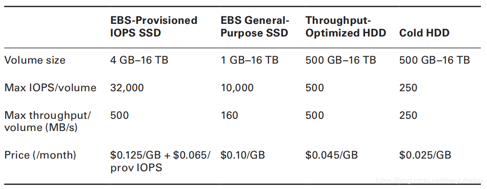
+ Instance store 
    + Instance store volumes are SSDs that are **physically attached to the server hosting your instance** and are connected via a fast NVMe interface, instance store volumes offer **fast data access**
    + provides **temporary block-level storage** for Amazon EC2 instances.
    + The data on an instance store volume **persists only during the life** of the associated Amazon EC2 instance.
    + **ideal for temporary storage of information that changes frequently**, such as buffers, caches, scratch data, and other temporary content, or for data that is replicated across a fleet of instances, such as a load-balanced pool of web servers. 
    +  **Data **in the instance store is **lost** when:
        + The underlying disk drive fails.
        + The instance stops (the data will persist if an instance reboots).
        + The instance terminates
+ Amazon S3 
    + highly durable, highly available **object storage**
### EBS-optimized Instances
+ EBS-optimized instances enable EC2 instances to **fully use the IOPS provisioned on an EBS volume** by eliminating contention between Amazon EBS I/O and other network traffic from your instance，providing the best performance for your EBS volumes.
+ EBS-optimized instances deliver **dedicated throughput** between Amazon EC2 and Amazon EBS+ We recommend using **Provisioned IOPS volumes** with EBS-optimized instances or **instances that support cluster networking** for applications with high storage I/O requirements.
+  Provisioned IOPS—which in some contexts is referred to as EBS Optimized 
### Cluster Networking
+ A **cluster placement group** provides **low-latency networking between all instances** in the cluster.
+ When launched in a placement group, instances can utilize up to **10 Gbps for single-flow** traffic and up to **100 Gbps for multi-flow** traffic. Network traffic to the Internet is limited to 5 Gbps
+ Cluster networking is ideal for **high performance analytics systems** and many science and engineering applications, especially those using the MPI library standard for **parallel programming**.
### **Enhanced Networking**
+ For workloads requiring **greater network performance** 
+ Enhanced networking reduces the impact of virtualization on network performance by enabling a capability called Single Root I/O Virtualization (SR-IOV). This results in **more Packets Per Second (PPS), lower latency, and less jitter.** 
+ Enhanced networking is available only for **instances launched in an Amazon VPC**(Amazon Virtual Private Cloud) 
+ Some instances use a network I/O credit mechanism to allocate network bandwidth to instances based on average bandwidth utilization. They accrue credits when their bandwidth is below their baseline bandwidth, and can use these credits when they perform network data transfers 
## Change the instance type
+ If the root device for your instance is an EBS volume, you can change the size of the instance by changing its instance type. 
+ If the root device for your instance is an instance store volume, you must migrate your application to a new instance with the instance type that you need. 
+ You must select an instance type that is compatible with the configuration of the instance. If the instance type that you want is not compatible with the instance configuration you have, then you must migrate your application to a new instance with the instance type that you need. 
+ To change the instance type, the instance must be in the `stopped` state. 
+ You cannot resize an instance if hibernation is enabled.
+ **You cannot change the instance type if hibernation is enabled**.
+ **A Spot Instance cannot be changed to an instance of another type**. 
# Amazon Machine Image
+ An AMI defines every aspect of the software state at instance launch, including:
    + The Operating System (OS) and its configuration
    + The initial state of any patches
    + Application or system software
+ An AMI includes the following:
    + One or more **Amazon Elastic Block Store (Amazon EBS) snapshots**, or, for instance-store-backed AMIs, **a template for the root volume** of the instance (for example, an operating system, an application server, and applications). 
    + **Launch permissions** that control which AWS accounts can use the AMI to launch instances. 
    + **A block device mapping** that specifies the volumes to attach to the instance when it's launched. 
## AMI Sources
+ All AMIs are based on x86 OSs, either Linux or Windows. There are four sources of AMIs:
    + Published by AWS
    + The AWS Marketplace
    + Generated from Existing Instances
    + Uploaded Virtual Servers 
## AMI Types
+ You can select an AMI to use based on the following characteristics:
    + Region  
    + Operating system 
    + Architecture (32-bit or 64-bit) 
    + Launch permissions 
    + Storage for the root device 
## Region
+ AMIs are **specific to a region**, but can be copied over to other regions 
## Launch permissions
+ The owner of an AMI **determines its availability**(who has access to the AMI) by specifying launch permissions. Launch permissions fall into the following categories.
    + **public**: The owner grants launch permissions to all AWS accounts.
    + **explicit**: The owner grants launch permissions to specific AWS accounts.
    + **implicit**: The owner has implicit launch permissions for an AMI.
## Storage for the root device
+ All AMIs are categorized as either backed by **Amazon EBS** or backed by **instance store**.
+ The former means that the **root device** for an instance launched from the AMI is an Amazon Elastic Block Store (**Amazon EBS) volume created from an Amazon EBS snapshot**.
+ The latter means that the root device for an instance launched from the AMI is an **instance store volume created from a template stored in Amazon S3**.
+ The following table summarizes the important differences when using the two types of AMIs.
+ 
| Characteristic | Amazon EBS-backed AMI | Amazon instance store-backed AMI |
| ---- | ---- | ---- |
| Boot time for an instance | Usually less than 1 minute | Usually less than 5 minutes |  
| Size limit for a root device | 16 TiB | 10 GiB |  
| Root device volume | EBS volume | Instance store volume |  
| Data persistence | By default, the **root volume is deleted** when the **instance terminates**(By default, EBS root volumes have the `DeleteOnTermination` flag set to `true`). Data on any other EBS volumes persists after instance termination by default. | Data on any instance store volumes persists only during the life of the instance. | 
| Modifications  | The instance type, kernel, RAM disk, and user data can be changed while the instance is stopped. | Instance attributes are fixed for the life of an instance. | 
| Charges | You're charged for instance usage, EBS volume usage, and storing your AMI as an EBS snapshot. | 
You're charged for instance usage and storing your AMI in Amazon S3. |  
| AMI creation/bundling | Uses a single command/call | Requires installation and use of AMI tools | 
| Stopped state | Can be in a stopped state. Even when the instance is stopped and not running, the root volume is persisted in Amazon EBS  | Cannot be in stopped state; instances are running or terminated | 
+ AWS EBS vs Instance Store: [https://jayendrapatil.com/aws-ebs-vs-instance-store/](https://jayendrapatil.com/aws-ebs-vs-instance-store/)
## Linux AMI virtualization types
+ Linux Amazon Machine Images use one of two types of virtualization: 
    + **paravirtual (PV)**
    + **hardware virtual machine (HVM).**
+ The **main differences** between PV and HVM AMIs are the way in which they boot and **whether they can take advantage of special hardware extensions** (CPU, network, and storage) for better performance.
+ **For the best performance**, we recommend that you use current generation instance types and **HVM AMIs** when you launch your instances.
+ Historically, PV guests had better performance than HVM guests in many cases, but because of **enhancements in HVM virtualization and the availability of PV drivers** for HVM AMIs, this is no longer true, HVM guests can get the same, or better, performance than paravirtual guests.
### HVM
+ HVM AMIs are presented with **a fully virtualized set of hardware** and boot by executing the master boot record of the root block device of your image.
+ This virtualization type provides the ability to **run an operating system directly on top of a virtual machine** without any modification, as if it were run on the bare-metal hardware.
+ The Amazon EC2 host system emulates some or all of the underlying hardware that is presented to the guest.
+ HVM guests can **take advantage of hardware extensions** that provide fast access to the underlying hardware on the host system.
+ HVM AMIs are required to **take advantage of enhanced networking and GPU processing.** In order to pass through instructions to specialized network and GPU devices, the OS needs to be **able to have access to the native hardware platform**; HVM virtualization provides this access.
+ **All current generation instance types** support HVM AMIs.
+ **All Regions** support HVM instances.
### PV
+ PV AMIs boot with a special boot loader called **PV-GRUB,** which starts the boot cycle and then chain loads the kernel specified in the `menu.lst` file on your image.
+ Paravirtual guests can run on host hardware that does not have explicit support for virtualization.
+ Paravirtual guests **cannot take advantage of special hardware extensions** such as enhanced networking or GPU processing.
+ The following **previous generation** instance types support PV AMIs: C1, C3, HS1, M1, M3, M2, and T1. **Current generation instance types do not support PV AMIs**
+ **Supported region**: Asia Pacific (Tokyo), Asia Pacific (Singapore), Asia Pacific (Sydney), Europe (Frankfurt), Europe (Ireland), South America (São Paulo), US East (N. Virginia), US West (N. California), and US West (Oregon)
## Shared AMIs
+ *A shared AMI* is an AMI that a developer created and made available for other developers to use. 
+ AMIs with **encrypted volumes cannot be made public.**
+ **AMIs are a regional resource**. Therefore, sharing an AMI makes it available in that Region. To make an AMI available in a different Region, **copy the AMI to the Region and then share** it.
+ If an AMI has a product code, or contains a snapshot of an encrypted volume, you can't make it public; you can share the AMI only with specific AWS accounts.
+ You can only share AMIs that **have unencrypted volumes and volumes that are encrypted with a customer managed key**. If you share an AMI with encrypted volumes, you must also **share any customer managed keys** used to encrypt them. 
+ There is **no limit** to the number of AWS accounts with which an AMI can be shared.
+ **User-defined tags** that you attach to a shared AMI are **available only to your AWS account** and not to the other accounts that the AMI is shared with.
+ If you have created a public AMI, or shared an AMI with another AWS user, you can create a ***bookmark*** that allows a user to access your AMI and launch an instance in their own account immediately. This is an **easy way to share AMI references**, so users don't have to spend time finding your AMI in order to use it.
### Guidelines for shared Linux AMIs
+ **Update the AMI tools** before using them: for AMIs backed by **instance store**
+ **Disable password-based remote logins for root**
    + Open the `/etc/ssh/sshd_config`: PermitRootLogin without-password
+ **Disable local root access**
    + log into your running instance and issue the following command:​​​​​​​ ``[ec2-user ~]$ ``sudo passwd -l root``
+ **Remove SSH host key pairs**
    + remove the existing SSH host key pairs located in `/etc/ssh`
    + This forces SSH to generate new unique SSH key pairs when someone launches an instance using your AMI
+ **Install public key credentials**
    + After configuring the AMI to prevent logging in using a password, you must make sure users can log in using another mechanism.
    + Amazon EC2 allows users to specify a public-private key pair name when launching an instance. 
+ **Disabling sshd DNS checks** (optional) 
    + Disabling sshd DNS checks slightly weakens your sshd security.
    + However, if DNS resolution fails, SSH logins still work. If you do not disable sshd checks, DNS resolution failures prevent all logins.
    + Open the `/etc/ssh/sshd_config` file : UseDNS no​​​​​​​
+ **Protect yourself**
    + We recommend against storing sensitive data or software on any AMI that you share.
    + using the `--exclude `directory`` option on `ec2-bundle-vol` to skip any directories and subdirectories that contain secret information 
    + Always **delete the shell history** before bundling.
    + Bundling a running instance requires your private key and X.509 certificate. **Put these and other credentials in a location that is not bundled**  (such as the instance store).
## AMI lifecycle
### Create an AMI
#### Create an Amazon EBS-backed Linux AMI
+ **Create a Linux AMI from an instance**: 
    + First, launch an instance from an AMI that's similar to the AMI that you'd like to create.
    + You can connect to your instance and customize it.
    + When the instance is configured correctly, ensure data integrity by stopping the instance before you create an AMI
    + Then create the image. When you create an Amazon EBS-backed AMI, we automatically register it for you​​​​​​​​​​​​​
    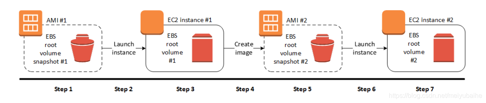
+ Create a Linux AMI **from a snapshot**:If you have **a snapshot of the root device volume of an instance**, you can create an AMI from this snapshot using the AWS Management Console or the command line.
    + During the AMI-creation process, Amazon EC2 **creates snapshots of your instance's root volume and any other EBS volumes** attached to your instance. You're charged for the snapshots until you deregister the AMI and delete the snapshots.
    + After the process completes, you have **a new AMI and snapshot created from the root volume of the instance**. When you launch an instance using the new AMI, we **create a new EBS volume** for its root volume using the snapshot.
    + If you add instance-store volumes or EBS volumes to your instance in addition to the root device volume, the instance-store volumes specified in the block device mapping for the new instance are new and don't contain any data from the instance store volumes of the instance you used to create the AMI.
#### Create an instance store-backed Linux AMI
+ Only the following instance types support an instance store volume as the root device: C3, D2, G2, I2, M3, and R3.
+ Creation process 
    + First, launch an instance from an AMI that's similar to the AMI that you'd like to create.
    + You can connect to your instance and customize it.
    + When the instance is set up the way you want it, you can bundle it.
    + Next you upload the bundle to your Amazon S3 bucket and then register your AMI.
+ Prerequisites: Before you can create an AMI, you must complete the following tasks: 
    + Install the AMI tools. 
    + Install the AWS CLI. 
    + Ensure that you have an Amazon S3 bucket for the bundle. 
    + Ensure that you have your AWS account ID.
    + Ensure that you have your access key ID and secret access key. 
    + Ensure that you have an X.509 certificate and corresponding private key(Used by AMI tools)
    + Connect to your instance and customize it.
+ Convert your instance store-backed AMI to an Amazon EBS-backed AMI 
    + 1.Launch an Amazon Linux instance from an Amazon EBS-backed AMI
    + 2.Upload the X.509 private key that you used to bundle your instance store-backed AMI to your instance. 
    + 3.Set environment variables for your AWS access key and secret key.
    + 4.Prepare an Amazon Elastic Block Store (Amazon EBS) volume for your new AMI
    + 5.Create a folder for your bundle.
    + 6.Download the bundle for your instance store-based AMI to `/tmp/bundle` using the [ec2-download-bundle](https://docs.aws.amazon.com/AWSEC2/latest/UserGuide/ami-tools-commands.html#ami-download-bundle) command.
    + 7.Reconstitute the image file from the bundle using the [ec2-unbundle](https://docs.aws.amazon.com/AWSEC2/latest/UserGuide/ami-tools-commands.html#ami-unbundle) command.
    + 8.Copy the files from the unbundled image to the new EBS volume.
    + 9.Probe the volume for any new partitions that were unbundled.
    + 10.List the block devices to find the device name to mount.
    + 11.Create a mount point for the new EBS volume and mount the volume.
    + 12.Open the `/etc/fstab` file on the EBS volume with your favorite text editor and remove any entries for instance store (ephemeral) volumes. 
    + 13.Unmount the EBS volume and detach it from the instance.
    + 14.Create an AMI from the new EBS volume.
    + 15. After you have tested that you can launch an instance from your new AMI, you can delete the EBS volume that you created for this procedure.
### Copy an AMI
+ You can copy an Amazon Machine Image (AMI) within or **across AWS Regions** using the AWS Management Console, the AWS Command Line Interface or SDKs, or the Amazon EC2 API, all of which support the `CopyImage` action.
+ You can copy both **Amazon EBS-backed** AMIs and **instance-store-backed** AMIs.
+ You can copy AMIs with **encrypted snapshots** and also **change encryption status during the copy process**.​​​​​​​
+ 
| Scenario | Description |  Supported | 
| --- | --- | --- |
| 1 | Unencrypted-to-unencrypted | Yes | 
| 2 | Encrypted-to-encrypted | Yes | 
| 3 | Unencrypted-to-encrypted | Yes |
| 4 | Encrypted-to-unencrypted| No | 
+ You can change or deregister the source AMI with no effect on the target AMI+ With an Amazon EBS-backed AMI, each of its **backing snapshots is copied to an identical but distinct target snapshot**. 
+ If you copy an AMI to a **new Region**, the snapshots are **complete (non-incremental) copies**.
+ If you **encrypt unencrypted backing snapshots or encrypt them to a new KMS key**, the snapshots are **complete (non-incremental) copies**.
+ Subsequent copy operations of an AMI result in **incremental copies** of the backing snapshots.
+ You can use **IAM policies** to grant or deny users permissions to copy AMIs. Resource-level permissions **specified for the `CopyImage`** action apply only to the new AMI. You **cannot specify** resource-level permissions **for the source AMI.**
+ AWS **does not copy launch permissions, user-defined tags, or Amazon S3 bucket permissions** from the source AMI to the new AMI.
+ If you are using an AWS Marketplace AMI, or an AMI that was directly or indirectly derived from an AWS Marketplace AMI, you **cannot copy it across accounts**.
+ Destination Regions are limited to **100 concurrent AMI copies**.
+ You cannot copy a paravirtual (PV) AMI to a Region that does not support PV AMIs.
### Store and restore an AMI using S3
+ You can store an Amazon Machine Image (AMI) in an Amazon S3 bucket, copy the AMI to another S3 bucket, and then restore it from the S3 bucket.
+ By storing and restoring an AMI using S3 buckets, you can copy AMIs **from one AWS partition to another**( A *partition* is a group of AWS Regions​​​​​​​),or from one AWS Region to another.
+ **`CopyImage` **is the recommended API to use for **copying AMIs within an AWS [partition](https://docs.aws.amazon.com/general/latest/gr/aws-arns-and-namespaces.html).** However, `CopyImage` can’t copy an AMI to *another* partition.
+ CreateStoreImageTask：The API creates a task that reads all of the data from **the AMI and its snapshots**, and then uses an [S3 multipart upload](https://docs.aws.amazon.com/AmazonS3/latest/userguide/mpuoverview.html) to store the data in **a single S3 object**.
+ DescribeStoreImageTasks：describes the progress of the AMI store tasks.
+ CreateRestoreImageTask: starts a task that restores an AMI from an S3 object that was previously created by using a CreateStoreImageTask request. 
+ The restore task can be performed in the same or a different Region in which the store task was performed.
+ The S3 bucket from which the AMI object will be restored must be in the same Region in which the restore task is requested. 
+ **Only EBS-backed AMIs can be stored** using these APIs.
+ **Paravirtual (PV) AMIs are not supported**.
+ The **size of an AMI (before compression)** that can be stored is limited to the size limit of a single S3 object, which is **1 TB**.
+ Quota on [store image](https://docs.aws.amazon.com/AWSEC2/latest/UserGuide/ami-store-restore.html#store-ami) requests: 600 GB of storage work (snapshot data) in progress.
+ Quota on [restore image](https://docs.aws.amazon.com/AWSEC2/latest/UserGuide/ami-store-restore.html#restore-ami) requests: 300 GB of restore work (snapshot data) in progress.
+ For the duration of the store task, the snapshots must not be deleted and the IAM principal doing the store must have access to the snapshots, otherwise the store process will fail.
+ You can’t create multiple copies of an AMI in the same S3 bucket.
+ An AMI that is stored in an S3 bucket can’t be restored with its original AMI ID. You can mitigate this by using [AMI aliasing](https://docs.aws.amazon.com/systems-manager/latest/userguide/parameter-store-ec2-aliases.html).
+ Currently the store and restore APIs are only supported by using the AWS Command Line Interface, AWS SDKs, and Amazon EC2 API. You can’t store and restore an AMI using the Amazon EC2 console.
+ To use the store and restore APIs, **the S3 bucket and the AMI must be in the same Region**.
### Deregister your Linux AMI
+ After you deregister an AMI, you **can't use it to launch new instances.**
+ When you deregister an AMI, it **doesn't affect any instances** that you've **already launched** from the AMI.
+ When you deregister an Amazon EBS-backed AMI, **it doesn't affect the snapshot(s) that were created for the volume(s) of the instance** during the AMI creation process.
+ Cleaning up your Amazon EBS-backed AMI.

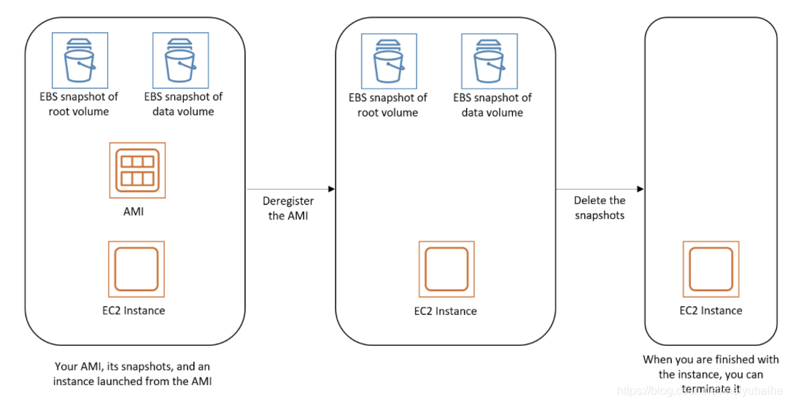
+ When you deregister an instance store-backed AMI, it **doesn't affect the files that you uploaded to Amazon S3** when you created the AMI.

### Automate the EBS-backed AMI lifecycle
+ You can use **Amazon Data Lifecycle Manager** to automate the creation, retention, and deletion of Amazon EBS-backed AMIs and their backing snapshots. 
## Use encryption with EBS-backed AMIs
### Instance-launching scenarios
+ **Launch with no encryption parameters**
    + An unencrypted snapshot is restored to an unencrypted volume, unless encryption by default is enabled, in which case all the newly created volumes will be encrypted.
    + An encrypted snapshot that you own is restored to a volume that is encrypted to the same KMS key.
    + An encrypted snapshot that you do not own (for example, the AMI is shared with you) is restored to a volume that is encrypted by your AWS account's default KMS key.
+ **Instance launch behaviors with `Encrypted` set, but no `KmsKeyId` specified**
    + An unencrypted snapshot is restored to an EBS volume that is encrypted by your AWS account's default KMS key.
    + An encrypted snapshot that you own is restored to an EBS volume encrypted by the same KMS key. (In other words, the `Encrypted` parameter has no effect.)
    + An encrypted snapshot that you do not own (i.e., the AMI is shared with you) is restored to a volume that is encrypted by your AWS account's default KMS key. (In other words, the `Encrypted` parameter has no effect.)
+ **Instance with both `Encrypted` and `KmsKeyId` set**
    + An unencrypted snapshot is restored to an EBS volume encrypted by the specified KMS key.
    + An encrypted snapshot is restored to an EBS volume encrypted not to the original KMS key, but instead to the specified KMS key.
+ Encrypt a volume during launch

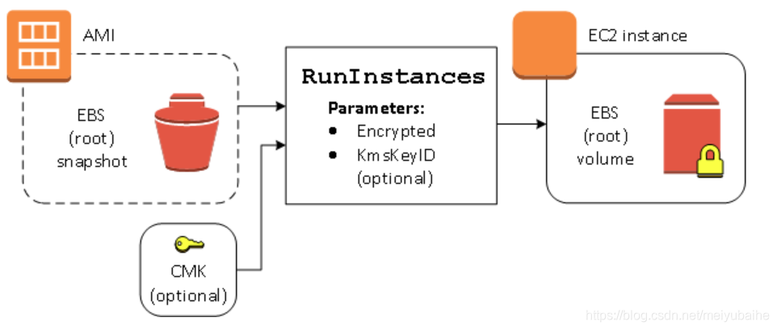
+ Re-encrypt a volume during launch

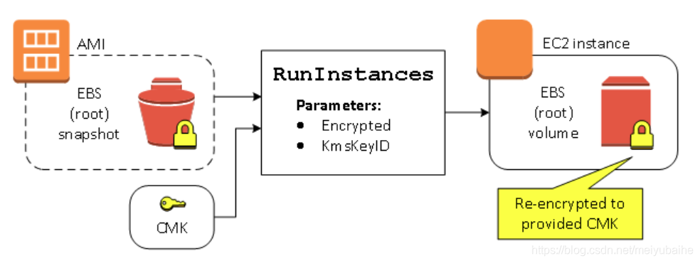
+ Change encryption state of multiple volumes during launch

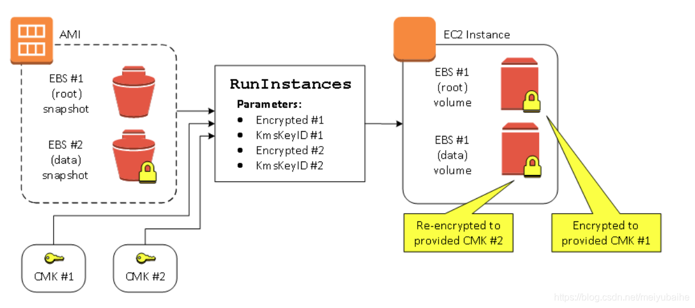
### Image-copying scenarios
+ **Copy with no encryption parameters**
    + An unencrypted snapshot is copied to another unencrypted snapshot, unless encryption by default is enabled, in which case all the newly created snapshots will be encrypted.
    + An encrypted snapshot that you own is copied to a snapshot encrypted with the same KMS key.
    + An encrypted snapshot that you do not own (that is, the AMI is shared with you) is copied to a snapshot that is encrypted by your AWS account's default KMS key.
+ **Copy-image behaviors with `Encrypted` set, but no `KmsKeyId` specified**
    + An unencrypted snapshot is copied to a snapshot encrypted by the AWS account's default KMS key.
    + An encrypted snapshot is copied to a snapshot encrypted by the same KMS key. (In other words, the `Encrypted` parameter has no effect.)
    + An encrypted snapshot that you do not own (i.e., the AMI is shared with you) is copied to a volume that is encrypted by your AWS account's default KMS key. (In other words, the `Encrypted` parameter has no effect.)
+ **Copy-image behaviors with both `Encrypted` and `KmsKeyId` set**
    + An unencrypted snapshot is copied to a snapshot encrypted by the specified KMS key.
    + An encrypted snapshot is copied to a snapshot encrypted not to the original KMS key, but instead to the specified KMS key.
+ Encrypt an unencrypted image during copy 
    + You can also copy an image with multiple snapshots and configure the encryption state of each individually.

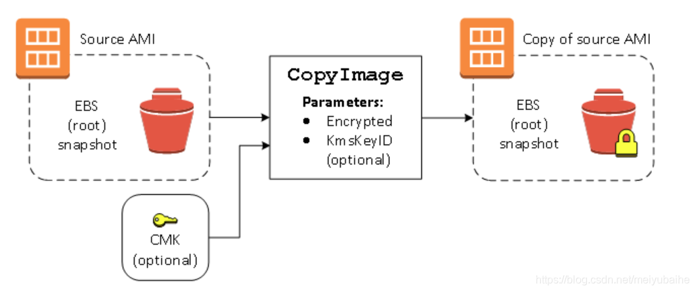
## Amazon Linux
+ Amazon Linux is provided by Amazon Web Services (AWS). It is designed to **provide a stable, secure, and high-performance execution environment** for applications running on Amazon EC2. 
+ AWS provides Amazon Linux 2 and the Amazon Linux AMI. Amazon Linux 2 is recommended.
### Connect to an Amazon Linux instance
+ Amazon Linux does not allow remote root SSH by default. Also, password authentication is disabled to prevent brute-force password attacks. To enable SSH logins to an Amazon Linux instance:
    + you must provide your **key pair** to the instance at launch.
    + You must also set the **security group** used to launch your instance to allow SSH access.
    + By default, the only account that can log in remotely using SSH is **ec2-user**; this account also has **sudo** privileges.
### Run Amazon Linux 2 as a virtual machine on premises
+ Use the Amazon Linux 2 virtual machine (VM) images for on-premises development and testing. These images are available for use on the following virtualization platforms: 
    + VMWare
    + KVM
    + VirtualBox (Oracle VM)
    + Microsoft Hyper-V
+ To use the Amazon Linux 2 virtual machine images with one of the supported virtualization platforms, do the following: 
    + Step 1: Prepare the `seed.iso` boot image which includes the initial configuration information that is needed to boot your new VM, such as the network configuration, host name, and user data.
    + Step 2: Download the Amazon Linux 2 VM image
    + Step 3: Boot and connect to your new VM
### Kernel Live Patching
+ Kernel Live Patching for Amazon Linux 2 enables you to **apply security vulnerability and critical bug patches to a running Linux kernel, without reboots or disruptions** to running applications.
+ This allows you to benefit from improved service and application availability, while keeping your infrastructure secure and up to date.
+ AWS provides kernel live patches for an Amazon Linux 2 kernel version for up to **3 months after its release**. 
#### Supported configurations and prerequisites
+ Kernel Live Patching is supported on Amazon EC2 instances and [on-premises virtual machines](https://docs.aws.amazon.com/AWSEC2/latest/UserGuide/amazon-linux-2-virtual-machine.html) running Amazon Linux 2.
+ To use Kernel Live Patching on Amazon Linux 2, you must use: 
    + A 64-bit (x86_64) architecture that is supported by Amazon Linux 2
    + Amazon Linux 2 with kernel version `4.14.165-131.185` or later
+ You can enable and use Kernel Live Patching on individual instances using the command line on the instance itself, or you can enable and use Kernel Live Patching on a group of managed instances using AWS Systems Manager.
#### Limitations
+ While applying a kernel live patch, you can't perform hibernation, use advanced debugging tools (such as SystemTap, kprobes, and eBPF-based tools), or access ftrace output files used by the Kernel Live Patching infrastructure.
+ Amazon Linux 2 instances with **64-bit ARM (arm64) architecture are not supported.**
## User provided kernels
+ If you need a custom kernel on your Amazon EC2 instances, you can 
    + start with an AMI that is close to what you want,
    + compile the custom kernel on your instance,+ and update the bootloader to point to the new kernel.
+ Recommend that you have a fallback when you test a new kernel. GRUB can fall back to another kernel in the event that the new kernel fails. 
# Instance Life Cycle
+ An Amazon EC2 instance transitions through different states from the moment you launch it through to its termination. The following illustration represents the transitions between instance states. 

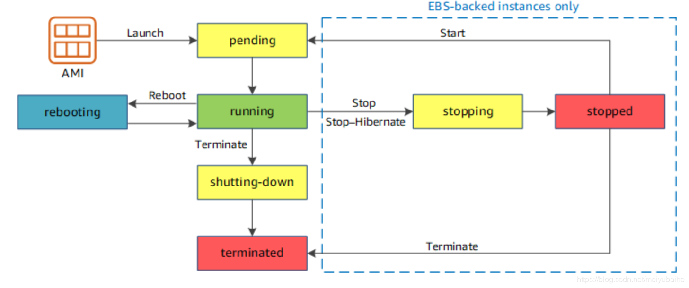
## **Launching **
+ When you launch an instance, it enters the `pending` state.
+ After the instance is ready for you, it enters the `running` state. 
+ As soon as your instance transitions to the `running` state, you're **billed for each second, with a one-minute minimum**
+ The instance receives a **public DNS name** that you can use to contact the instance from the internet.
+ The instance also receives **a private DNS name** that other instances within the same VPC can use to contact the instance.
### Launch an instance using the Launch Instance Wizard
+ Step 1: Choose an Amazon Machine Image (AMI)
+ Step 2: Choose an Instance Type
+ Step 3: Configure Instance Details
+ Step 4: Add Storage
+ Step 5: Add Tags
+ Step 6: Configure Security Group
+ Step 7: Review Instance Launch and Select Key Pair
### Launch an instance from a launch template
+ You can create a *launch template* that contains the configuration information to launch an instance.
+ Launch templates enable you to **store launch parameters** so that you do not have to specify them every time you launch an instance.
+ A launch template can contain all or some of the parameters to launch an instance. When you launch an instance using a launch template, you can **override parameters** that are specified in the launch template. Or, you can **specify additional parameters** that are not in the launch template.
#### Lunch template version
+ For each launch template, you can create **one or more numbered launch template versions**
+ Each version can have different launch parameters.
+ When you launch an instance from a launch template, you can **use any version** of the launch template.
+ If you do not specify a version, the default version is used.
+ You can set any version of the launch template as the default version—by default, it's the first version of the launch template.
#### Launch template restrictions
+ You are limited to creating **5,000 launch templates per Region and 10,000 versions per launch template**.
+ Launch template parameters are optional. However, you must ensure that your request to launch an instance includes all required parameters.
+ Launch template parameters are **not fully validated** when you create the launch template. If you specify incorrect values for parameters, or if you do not use supported parameter combinations, no instances can launch using this launch template. Ensure that you specify the correct values for the parameters and that you use supported parameter combinations. 
+ You can **tag a launch template**, but you **cannot tag a launch template version.**
+ Launch template versions are numbered in the order in which they are created. When you create a launch template version, you **cannot specify the version number yourself.**
#### Control the use of launch templates
+ By default, IAM users **do not have permissions to work with launch templates**.
+ You can **create an IAM user policy** that grants users permissions to create, modify, describe, and delete launch templates and launch template versions. 
### Launch an instance using parameters from an existing instance
+ The Amazon EC2 console provides a **Launch more like this** wizard option that enables you to use a current instance as a base for launching other instances.
+ The **Launch more like this** wizard option **does not clone your selected instance**; it only **replicates some configuration** details.
+ The following configuration details are copied from the selected instance into the launch wizard: 
    + AMI ID
    + Instance type
    + Availability Zone, or the VPC and subnet in which the selected instance is located
    + Public IPv4 address. If the selected instance currently has a public IPv4 address, the new instance receives a public IPv4 address - regardless of the selected instance's default public IPv4 address setting.
    + Placement group, if applicable
    + IAM role associated with the instance, if applicable
    + Shutdown behavior setting (stop or terminate)
    + Termination protection setting (true or false)
    + CloudWatch monitoring (enabled or disabled)
    + Amazon EBS-optimization setting (true or false)
    + Tenancy setting, if launching into a VPC (shared or dedicated)
    + Kernel ID and RAM disk ID, if applicable
    + User data, if specified
    + Tags associated with the instance, if applicable
    + Security groups associated with the instance
+ The following configuration details are not copied from your selected instance. Instead, the wizard applies their default settings or behavior: 
    + Number of network interfaces: The default is one network interface, which is the primary network interface (eth0).
    + Storage: The default storage configuration is determined by the AMI and the instance type.
### Launch an AWS Marketplace instance
+ You can subscribe to an AWS Marketplace product and **launch an instance from the product's AMI** using the Amazon EC2 launch wizard.
## **Bootstrapping **
+ A great benefit of the cloud is the ability to **script virtual hardware management** in a manner that is not possible with on-premises hardware.
+ The process of **providing code to be run on an instance at launch** is called *bootstrapping*.
+ ***UserData** *is passed to the operating system to be **executed as part of the launch process** the firsttime the instance is booted. 
+ On Linux instances this can be shell script+ on Windows instances this can be a batch style script or a PowerShell script.
+ The script can perform tasks such as: 
    + Applying patches and updates to the OS
    + Enrolling in a directory service
    + Installing application software
    + Copying a longer script or program from storage to be run on the instance
    + Installing Chef or Puppet and assigning the instance a role so the configuration management software can config
+ **UserData** is stored with the instance and is **not encrypted**, so it is important to not include any secrets such as passwords or keys in the UserData. 
### **VM Import/Export **
+ **Easily import** Virtual Machines (VMs) from your existing environment as an Amazon EC2 instance and **export** them back to your **on-premises environment**.
+  You can only export previously imported Amazon EC2 instances. **Instances launched within AWS from AMIs cannot be exported**. 
### **Instance Metadata **
+ *Instance metadata* is **data** about your instance that you can use **to configure or manage** the running instance.
+ This is unique in that it is a mechanism to **obtain AWS properties** of the instance **from within the OS** without making a call to the AWS API.
+ Instance metadata includes a wide variety of attributes, including: 
    + The associated security groups
    + The instance ID
    + The instance type
    + The AMI used to launch the instance
+ An HTTP call to http://169.254.169.254/latest/meta-data/ will return the top node of the instance metadata tree.
## Connect to your Linux instance
+ **If your local computer operating system is Linux or macOS X**
    + SSH Client
    + EC2 Instance Connect
    + AWS Systems Manager Session Manager
+ **If your local computer operating system is Windows**
    + PuTTY
    + SSH Client
    + AWS Systems Manager Session Manager
    + Windows Subsysten for Linux
### General prerequisites for connecting to your instance
+ Get information about your instance
+ Enable inbound SSH traffic from your IP address to your instance.
+ Locate the private key
+ (Optional) Get the instance fingerprint
### Connect to your Linux instance using SSH
+ To transfer a file to the destination on the instance: 
    + ssh -i /path/my-key-pair.pem my-instance-user-name@my-instance-public-dns-name
+ To transfer a file from your Amazon EC2 instance to your computer 
    + scp -i /path/my-key-pair.pem /path/my-file.txt ec2-user@my-instance-public-dns-name:path/
### Connect to your Linux instance using EC2 Instance Connect
+ Amazon EC2 Instance Connect provides **a simple and secure way** to connect to your Linux instances using **Secure Shell (SSH)**.
+ With EC2 Instance Connect, you **use AWS Identity and Access Management (IAM) policies and principals to control SSH access** to your instances, **removing the need to share and manage SSH keys**. 
+ To use EC2 Instance Connect to connect to an instance, you need to **configure every instance that will support using Instance Connect** (this is a one-time requirement for each instance), and you need to **grant permission to every IAM principal** that will use Instance Connect. 
#### Set up EC2 Instance Connect
+ **Tasks to set up Instance Connect**
    + Task 1: Configure network access to an instance
    + Task 2: (Conditional) Install EC2 Instance Connect on an instance 
        + Amazon Linux 2 2.0.20190618 or later and Ubuntu 20.04 or later are preconfigured with EC2 Instance Connect. Others do not.
    + Task 3: (Optional) Install the EC2 Instance Connect CLI
    + Task 4: Configure IAM permissions for EC2 Instance Connect 
    + For your IAM principals to connect to an instance using EC2 Instance Connect, you must grant them permission to push the public key to the instance. 
    + You grant them the permission by creating an IAM policy and attaching the policy to the IAM principals that require the permission
+ **Limitations**
+ The following Linux distributions are supported: 
    + Amazon Linux 2 (any version)
    + Ubuntu 16.04 or later
+ If you configured the `AuthorizedKeysCommand` and `AuthorizedKeysCommandUser` settings for SSH authentication, the EC2 Instance Connect installation will not update them. As a result, you cannot use Instance Connect.
#### Connect using EC2 Instance Connect
+ Limitations 
+ The following Linux distributions are supported: 
    + Amazon Linux 2 (any version)
    + Ubuntu 16.04 or later
+ To connect using the Amazon EC2 console (browser-based client), the instance must **have a public IPv4 address.**
+ If the instance does not have a public IP address, you can connect to the instance using an SSH client or the EC2 Instance Connect CLI, and over a private network, such as from a machine within the same VPC or from a machine connected to the VPC over VPN or AWS Direct Connect.
+ EC2 Instance Connect **does not support** connecting using an **IPv6** address.
+ Connect using the Amazon EC2 console (browser-based client)
+ Connect using the EC2 Instance Connect CLI: mssh `i-001234a4bf70dec41EXAMPLE`
+ Connect using your own key and SSH client 
    + `ssh-keygen -t rsa -f my_rsa_key`+ aws ec2-instance-connect send-ssh-public-key \ --instance-id `i-001234a4bf70dec41EXAMPLE` \ --availability-zone `us-west-2b` \ --instance-os-user `ec2-user` \ --ssh-public-key file://`my_rsa_key.pub`+ ssh -o "IdentitiesOnly=yes" -i `my_rsa_key` `ec2-user`@`ec2-198-51-100-1.compute-1.amazonaws.com`
### `​​​​​​​​​​​​​​​​​​​​​`Connect to your Linux instance from Windows using PuTTY
+ PuTTY does not natively support the private key format for SSH keys. PuTTY provides a tool named PuTTYgen, which converts keys to the required format for PuTTY. You must **convert your private key (.pem file) into this format (.ppk file)** in order to connect to your instance using PuTTY.
+ Transfer files to your Linux instance using the **PuTTY Secure Copy client**(command line tool)
+ Transfer files to your Linux instance using **WinSCP**
### [Connect using WSL](https://docs.aws.amazon.com/AWSEC2/latest/UserGuide/WSL.html)
+ WSL is a free download and enables you to **run native Linux command line tools directly on Windows**, alongside your traditional Windows desktop, without the overhead of a virtual machine.
+ To connect to your instance using SSH
+ Transfer files to Linux instances from Linux using SCP
### [Connect using Session Manager](https://docs.aws.amazon.com/AWSEC2/latest/UserGuide/session-manager.html)
+ Session Manager is a fully managed AWS Systems Manager capability that lets you manage your Amazon EC2 instances through an **interactive one-click browser-based shell or through the AWS CLI**. 
+ You can **use Session Manager to start a session** with an instance in your account.
+ After the session is started, you can **run bash commands** as you would through any other connection type
+ With AWS Systems Manager Session Manager, you can manage your Amazon EC2 instances through a browser-based shell or through the AWS CLI. 
+ Session Manager **removes the need to open inbound ports, manage SSH keys, or use bastion hosts**.

## Instance stop and start (Amazon EBS-backed instances only)
+ You can stop and start your instance if it has **an Amazon EBS volume** as its root device.
+ The instance **retains its instance ID**
+ When you stop a running instance, the following happens: 
    + The instance performs **a normal shutdown** and stops running; its status changes to **`stopping` and then `stopped`**.
    + Any Amazon EBS volumes **remain attached** to the instance, and their **data persists**.
    + Any **data stored in the RAM** of the host computer or the **instance store volumes** of the host computer **is gone**.
    + In most cases, the instance is **migrated to a new underlying host computer when it's started** (for dedicated host, it remains on the current host).
    + The instance **retains its private IPv4 addresses and any IPv6 addresses** when stopped and started. We **release the public IPv4 address and assign a new one** when you start it.
    + The instance **retains its associated Elastic IP addresses.** You're charged for any Elastic IP addresses associated with a stopped instance. With **EC2-Classic**, an Elastic IP address is **dissociated** from your instance when you stop it. 
    + When you stop and start a Windows instance, the EC2Config service performs tasks on the instance, such as changing the drive letters for any attached Amazon EBS volumes. 
    + If your instance is in an Auto Scaling group, the Amazon EC2 Auto Scaling service marks the stopped instance as unhealthy, and may terminate it and launch a replacement instance. 
    + When you stop a **ClassicLink instance**, it's **unlinked from the VPC** to which it was linked. You must link the instance to the VPC again after starting it. 
+ You can **modify the following attributes** of an instance only **when it is stopped**: 
    + Instance type
    + User data
    + Kernel
    + RAM disk
+ We **don't charge usage or data transfer fees** for your instance after you stop it, but we do **charge for the storage for any Amazon EBS volumes**.
+ Each time you start a stopped instance we **charge a minimum of one minute for usage**.
## Instance hibernate (Amazon EBS-backed instances only)
+ You can hibernate an instance only if it's [enabled for hibernation](https://docs.aws.amazon.com/AWSEC2/latest/UserGuide/Hibernate.html#enabling-hibernation) and it meets the [hibernation prerequisites](https://docs.aws.amazon.com/AWSEC2/latest/UserGuide/Hibernate.html#hibernating-prerequisites).
+ When you hibernate a running instance, the following happens: 
    + When you initiate hibernation, the instance **moves to the `stopping` state**. Amazon EC2 signals the operating system to perform hibernation (suspend-to-disk). The hibernation freezes all of the processes, **saves the contents of the RAM to the EBS root volume**, and then performs a regular shutdown.
    + After the shutdown is complete, the instance moves to the `stopped` state.
    + Any **EBS volumes remain attached** to the instance, and their **data persists**, including the saved contents of the RAM.
    + Any Amazon EC2 **instance store volumes remain attached** to the instance, but the **data on the instance store volumes is lost**.
    + The instance **retains its private IPv4 addresses and any IPv6 addresses**. 
    + Amazon EC2 **releases the public IPv4 address**.
    + The instance retains its associated Elastic IP addresses. You're charged for any Elastic IP addresses associated with a hibernated instance. With EC2-Classic, an Elastic IP address is disassociated from your instance when you hibernate it. 
    + When you hibernate a ClassicLink instance, it's unlinked from the VPC to which it was linked. You must link the instance to the VPC again after starting it.
+ When you start your instance： 
    + it enters the `pending` state, and we **move the instance to a new host computer**(for dedicated host instance, host will not change)
    + the operating system reads in the contents of the RAM from the EBS root volume, before unfreezing processes to resume its state.
    + the Amazon **EBS root volume is restored** to its previous state and the **RAM contents are reloaded**
    + Previously attached data volumes are reattached and the instance **retains its instance ID.**
    + the instance continues to **retain its private IPv4 addresses and any IPv6 addresses.**
    + **assigns a new public IPv4 address** to the instance.
+ Don't charge usage for a hibernated instance when it is in the `stopping` state, don't charge usage for data transfer fees, but charge for the storage for any Amazon EBS volumes, including storage for the RAM data
### Hibernation prerequisites
+ Supported instance families 
    + C3, C4, C5+ I3+ M3, M4, M5, M5a, M5ad+ R3, R4, R5, R5a, R5ad+ T2, T3, T3a
    + **Instance RAM size**- must be less than 150 GB.
    + **Instance size**- not supported for bare metal instances.
    + Supported AMIs (must be an **HVM AMI that supports hibernation)**
    + Root volume type - must be an **EBS volume**, not an instance store volume
    + Supported EBS volume types - **General Purpose SSD (`gp2` and `gp3`) or Provisioned IOPS** SSD (`io1` and `io2`). 
    + EBS root volume size - must be **large enough to store the RAM contents** and accommodate your expected usage
    + EBS root volume encryption - To use hibernation, the root volume **must be encrypted** to ensure the protection of sensitive content that is in memory at the time of hibernation.
    + **Enable hibernation at launch** - You cannot enable hibernation on an existing instance (running or stopped). 
    + Purchasing options - This feature is available for **On-Demand Instances and Reserved** Instances.
## Instance reboot
+ recommend that you use Amazon EC2 to reboot your instance instead of running the operating system reboot
+ Rebooting an instance is equivalent to rebooting an operating system.
+ The instance **remains on the same host computer and maintains its public DNS name, private IP address, and any data on its instance store volumes**.
+ Rebooting an instance **doesn't start a new instance billing period**
## Instance retirement
+ When an instance reaches its scheduled retirement date, it is stopped or terminated by AWS.
+ If your instance root device is an Amazon EBS volume, the instance is stopped, and you can start it again at any time.
+ If your instance root device is an instance store volume, the instance is terminated, and cannot be used again. Convert your instance to an EBS-backed instance
## Instance termination
+ Each Amazon EBS-backed instance supports the `InstanceInitiatedShutdownBehavior`  attribute, which controls whether the instance stops or terminates when you initiate shutdown from within the instance itself 
+ By default, Amazon EBS root device volumes are automatically deleted when the instance terminates,any additional EBS volumes that you attach persist even after the instance terminates. This behavior is controlled by the **volume's `DeleteOnTermination` attribute**, which you can modify.
### **Termination Protection**
+ To prevent termination via the **AWS Management Console, CLI, or API**
+ This helps to prevent accidental termination through human error.
+ It does not prevent termination triggered by an OS shutdown command, termination from an Auto Scaling group, or termination of a Spot Instance due to Spot price changes
+ You can't enable termination protection for Spot Instances
## Differences between reboot, stop, hibernate, and terminate
+ The following table summarizes the key differences between rebooting, stopping, hibernating, and terminating your instance.
+ 
| Characteristic | Reboot | Stop/start (Amazon EBS-backed instances only) | Hibernate (Amazon EBS-backed instances only) | Terminate | 
| ----- | ----- | ----- | ----- | ----- |
| Host computer | The instance stays on the same host computer | We move the instance to a new host computer (though in some cases, it remains on the current host). | We move the instance to a new host computer (though in some cases, it remains on the current host). | None  | 
| Private and public IPv4 addresses | These addresses stay the same   | The instance keeps its private IPv4 address. The instance gets a new public IPv4 address, unless it has an Elastic IP address, which doesn't change during a stop/start. | The instance keeps its private IPv4 address. The instance gets a new public IPv4 address, unless it has an Elastic IP address, which doesn't change during a stop/start. | None |  
| Elastic IP addresses (IPv4) | The Elastic IP address remains associated with the instance | The Elastic IP address remains associated with the instance | The Elastic IP address remains associated with the instance | The Elastic IP address is disassociated from the instance |  
| IPv6 address | The address stays the same | The instance keeps its IPv6 address | The instance keeps its IPv6 address | None |  
| Instance store volumes | The data is preserved | The data is erased | The data is erased | The data is erased | 
| Root device volume | The volume is preserved  | The volume is preserved  | The volume is preserved  | The volume is deleted by default  | 
| RAM (contents of memory)  | The RAM is erased  | The RAM is erased  | The RAM is saved to a file on the root volume  | The RAM is erased  | 
| Billing  | The instance billing hour doesn't change.  | You stop incurring charges for an instance as soon as its state changes to `stopping`. Each time an instance transitions from `stopped` to `running`, we start a new instance billing period, billing a minimum of one minute every time you start your instance.  | You incur charges while the instance is in the `stopping` state, but stop incurring charges when the instance is in the `stopped` state. Each time an instance transitions from `stopped` to `running`, we start a new instance billing period, billing a minimum of one minute every time you start your instance.  | You stop incurring charges for an instance as soon as its state changes to `shutting-down`. | 
## Managing Instances
+ **Tags** can help you manage not just your Amazon EC2 instances, but also many of your AWS Cloud services.
+ Tags are **key/value pairs** you can associate with your instance or other service.
## Monitoring Instances
+ Amazon CloudWatch
## Modifying an Instance
### Instance Type
+ To resize an instance, set the state to **Stopped**.
+ Choose the **Change** Instance Type function in the tool of your choice select the desired instance type.
+ **Restart** the instance and the process is complete
### Security Groups
+ For instances outside of an Amazon VPC (called** EC2-Classic**), the association of the security groups **cannot be changed after launch**.
+ If an instance is **running in an Amazon VPC**, you can change which security groups are associated with an instance **while the instance is running**.
# Pricing Options
+ Amazon EC2 provides the following purchasing options to enable you to optimize your costs based on your needs:
    + **On-Demand Instances** – Pay, **by the second**, for the instances that you launch. 
    + **Savings Plans** – Reduce your Amazon EC2 costs by making a commitment to a consistent amount of usage, in USD per hour, for a term of 1 or 3 years. 
    + **Reserved Instances** – Reduce your Amazon EC2 costs by making a commitment to a consistent instance configuration, including instance type and Region, for a term of 1 or 3 years. 
    + **Spot Instances** – Request unused EC2 instances, which can reduce your Amazon EC2 costs significantly. 
    + **Dedicated Hosts** – Pay for a physical host that is fully dedicated to running your instances, and bring your existing per-socket, per-core, or per-VM software licenses to reduce costs. 
    + **Dedicated Instances** – Pay, by the hour, for instances that run on single-tenant hardware. 
    + **Capacity Reservations** – Reserve capacity for your EC2 instances in a specific Availability Zone for any duration. 
## **On-Demand Instances**
+ With On-Demand Instances, you **pay for compute capacity by the second with no long-term commitments**. You have full control over its lifecycle—you decide when to launch, stop, hibernate, start, reboot, or terminate it.
+ On-Demand instances are recommended for: 
    + Users that prefer the low cost and flexibility of Amazon EC2 **without any up-front payment or long-term commitment**
    + Applications with short-term, spiky, or unpredictable workloads that cannot be interrupted
    + Applications being developed or tested on Amazon EC2 for the first time
### Limitation
+ There is **a limit on the number** of running On-Demand Instances per **AWS account per Region**. On-Demand Instance limits are managed in terms of the **number of virtual central processing units (vCPUs)** that your running On-Demand Instances are using, regardless of the instance type.
+ You can launch **any combination of instance types** that meet your changing application needs, as long as **the number of vCPUs does not exceed** your account limit.
## **Reserved Instances**
+ Reserved Instances provide you with **a significant discount (up to 75%)** compared to On-Demand instance pricing.
+ Reserved Instances are **not physical instances**, but rather **a billing discount applied to the use of On-Demand Instances** in your account.
+ These On-Demand Instances must match certain attributes, such as instance type and Region, in order to benefit from the billing discount.
+ The following diagram shows a basic overview of purchasing and using Reserved Instances.

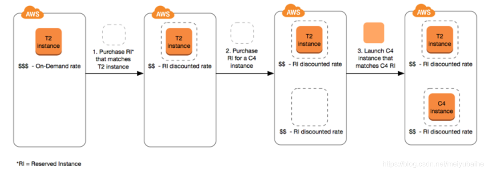
+ Reserved Instances are recommended for: 
    + Applications with **steady state usage**
    + Applications that may **require reserved capacity**
    + Customers that can commit to using EC2 over a 1 or 3 year term to **reduce their total computing costs**
### Key variables that determine Reserved Instance pricing
#### Instance attributes
+ A Reserved Instance has four instance attributes that determine its price.
    + **Instance type**: For example, `m4.large`. This is composed of the instance family (for example, `m4`) and the instance size (for example, `large`). 
    + **Region**: The Region in which the Reserved Instance is purchased. 
    + **Tenancy**: Whether your instance runs on shared (default) or single-tenant (dedicated) hardware.  + 
    + **Platform**: The operating system; for example, Windows or Linux/Unix 
#### Term commitment
+ You can purchase a Reserved Instance for a one-year or three-year commitment, with the three-year commitment offering a bigger discount.
+ **One-year**: A year is defined as 31536000 seconds (365 days). 
+ **Three-year**: Three years is defined as 94608000 seconds (1095 days). 
+ Reserved Instances do not renew automatically; when they expire, you can continue using the EC2 instance without interruption, but you are charged On-Demand rates.
#### Payment options
+ **All Upfront**: Full payment is made at the start of the term, with no other costs or additional hourly charges incurred for the remainder of the term, regardless of hours used. 
+ **Partial Upfront**: A portion of the cost must be paid upfront and the remaining hours in the term are billed at a discounted hourly rate, regardless of whether the Reserved Instance is being used. 
+ **No Upfront**: You are billed a discounted hourly rate for every hour within the term, regardless of whether the Reserved Instance is being used. No upfront payment is required. 
+ Generally speaking, you can **save more money making a higher upfront payment** for Reserved Instances. You can also find Reserved Instances offered by third-party sellers at lower prices and shorter term lengths on the Reserved Instance Marketplace. 
#### Offering class
+ If your computing needs change, you might be able to modify or exchange your Reserved Instance, depending on the offering class.
+ **Standard**: These provide the most significant discount, but **can only be modified**. Standard Reserved Instances **can't be exchanged**. 
+ **Convertible**: These provide a lower discount than Standard Reserved Instances, but **can be exchanged for another Convertible Reserved Instance with different instance attributes**. Convertible Reserved Instances **can also be modified**. 
+ After you purchase a Reserved Instance, you **cannot cancel your purchase**. However, you might be able to [modify](https://docs.aws.amazon.com/AWSEC2/latest/UserGuide/ri-modifying.html), [exchange](https://docs.aws.amazon.com/AWSEC2/latest/UserGuide/ri-convertible-exchange.html), or [sell](https://docs.aws.amazon.com/AWSEC2/latest/UserGuide/ri-market-general.html) your Reserved Instance if your needs change.
### Regional and zonal Reserved Instances (scope)
+ When you purchase a Reserved Instance, you determine the scope of the Reserved Instance. The scope is either regional or zonal. 
    + **Regional**: When you purchase a **Reserved Instance for a Region**, it's referred to as a *regional* Reserved Instance. 
        + A regional Reserved Instance applies a discount to a running On-Demand Instance.
        + **The default On-Demand Instance limit is 20**.
        + You **cannot exceed your running On-Demand Instance limit** by purchasing regional Reserved Instances.+ For example, if you already have 20 running On-Demand Instances, and you purchase 20 regional Reserved Instances, the 20 regional Reserved Instances are used to apply a discount to the 20 running On-Demand Instances. If you purchase more regional Reserved Instances, you will not be able to launch more instances because you have reached your On-Demand Instance limit.
        + Before purchasing regional Reserved Instances, **make sure your On-Demand Instance limit matches or exceeds the number of regional Reserved Instances you intend to own**. If required, make sure you request an increase to your On-Demand Instance limit *before* purchasing more regional Reserved Instances.
    + **Zonal**: When you purchase a **Reserved Instance for a specific Availability Zone**, it's referred to as a *zonal* Reserved Instance. 
        + provides capacity reservation as well as a discount.
        + You can **exceed your running On-Demand Instance limit by purchasing zonal Reserved Instances**.+ For example, if you already have 20 running On-Demand Instances, and you purchase 20 zonal Reserved Instances, you can launch a further 20 On-Demand Instances that match the specifications of your zonal Reserved Instances, giving you a total of 40
    + The **scope does not affect the price**. You pay the same price for a regional or zonal Reserved Instance.
    + Differences between regional and zonal Reserved Instances:  
        |  | Regional Reserved Instances | Zonal Reserved Instances |
        | --- | --- | --- |
        | Ability to reserve capacity | A regional Reserved Instance **does not reserve capacity** | A zonal Reserved Instance **reserves capacity in the specified Availability Zone** | 
        | Availability Zone flexibility | The Reserved Instance discount applies to instance usage in **any Availability Zone in the specified Region** | No Availability Zone flexibility—the Reserved Instance discount applies to instance usage **in the specified Availability Zone only** |
        | Instance size flexibility | The Reserved Instance discount applies to instance usage **within the instance family, regardless of size**. Only supported on Amazon Linux/Unix Reserved Instances with default tenancy. | No instance size flexibility—the Reserved Instance discount applies to instance usage for the **specified instance type and size only**|
        | Queuing a purchase |You **can queue purchases** for regional Reserved Instances. | You **can't queue purchases** for zonal Reserved Instances. |
### Types of Reserved Instances (offering classes)
+ The following are the differences between Standard and Convertible Reserved Instances.
    | | Standard Reserved Instance | Convertible Reserved Instance |
    | --- | --- | --- |
    | Modifying Reserved Instances | Some attributes can be modified | Some attributes can be modified |
    | Exchanging Reserved Instances | Can't be exchanged. | Can be exchanged during the term for another Convertible Reserved Instance with new attributes, including instance family, instance type, platform, scope, or tenancy. |
    | Selling in the Reserved Instance Marketplace | Can be sold in the Reserved Instance Marketplace. | **Can't be sold** in the Reserved Instance Marketplace. | 
    | Buying in the Reserved Instance Marketplace | Can be bought in the Reserved Instance Marketplace. | **Can't be bought** in the Reserved Instance Marketplace. |
### [How Reserved Instances are applied](https://docs.aws.amazon.com/AWSEC2/latest/UserGuide/apply_ri.html)
+ Zonal 
    + Reserved Instances assigned to a specific Availability Zone provide the Reserved Instance discount to **matching instance usage in that Availability Zone.** 
    + **The attributes (tenancy, platform, Availability Zone, instance type, and instance size) of the running instances must match** that of the Reserved Instances.
+ Regional 
    + Regional Reserved Instances are purchased for a Region and provide Availability Zone flexibility.
    + The Reserved Instance discount applies to instance usage in **any Availability Zone** in that Region.
    + Regional Reserved Instances also provide **instance size flexibility** where the Reserved Instance discount applies to instance usage **within the instance family, regardless of size.**
    + The only attributes that must be matched are **the instance family, tenancy, and platform**
    + Instance size flexibility is determined by the normalization factor of the instance size. The discount applies either **fully or partially to running instances of the same instance family**,**depending on the instance size** of the reservation, in any Availability Zone in the Region.
### Use your Reserved Instances
+ If you're launching an instance to take advantage of the billing benefit of a Reserved Instance, ensure that you specify the following information during launch:
+ Platform: You must choose an Amazon Machine Image (AMI) that matches the platform (product description) of your Reserved Instance. 
+ Instance type: Specify the same instance type as your Reserved Instance
+ Availability Zone 
    + If you purchased a zonal Reserved Instance for a specific Availability Zone, you must launch the instance into the same Availability Zone.
    + If you purchased a regional Reserved Instance, you can launch your instance into any Availability Zone.
+ Tenancy: The tenancy of your instance must match the tenancy of the Reserved Instance
### How you are billed
+ With Reserved Instances, you **pay for the entire term regardless of actual use**. 
+ When Reserved Instances **expire**, you are **charged On-Demand rates** for EC2 instance usage.
### Renew a Reserved Instance
+ You can renew a Reserved Instance before it is scheduled to expire.
+ Renewing a Reserved Instance queues the purchase of a Reserved Instance with the same configuration **until the current Reserved Instance expires**.
### Modify Reserved Instances
+ When your needs change, you can **modify your Standard or Convertible Reserved Instances** and continue to benefit from the billing benefit. 
+ You can modify all or a subset of your Reserved Instances, in one or more of the following ways: 
    + **Switch Availability Zones within the same region**
    + Change between EC2-VPC and EC2-Classic.
    + Change the instance type **within the same instance family** (Linux instances only)
    + You can **separate** your original Reserved Instances into two or more new Reserved Instances.
    + You can also **merge** two or more Reserved Instances into a single Reserved Instance.
+ Modification **does not change the remaining term** of your Reserved Instances; their end dates remain the same. **There is no fee**, and you do notreceive any new bills or invoices. 
+ The platform is Linux/UNIX.
+ The original and new Reserved Instance must have the **same instance size footprint**. 
    + Each Reserved Instance has an *instance size footprint*, which is determined by the normalization factor of the instance size and the number of instances in the reservation.
    + To calculate the instance size footprint of a Reserved Instance, **multiply the number of instances by the normalization factor**.
### Exchange Convertible Reserved Instances
+ You can exchange one or more Convertible Reserved Instances for another Convertible Reserved Instance with a different configuration, including instance family, operating system, and tenancy.
+ You can't exchange Standard Reserved Instances, but you can modify them. 
+ Convertible Reserved Instances are **associated with a specific Region**, which is **fixed** for the duration of the reservation's term. You cannot exchange a Convertible Reserved Instance for a Convertible Reserved Instance in a different Region.
+ You can **exchange one or more Convertible Reserved Instances at a time for one Convertible Reserved Instance only**.
+ To **exchange a portion of** a Convertible Reserved Instance, you can modify it into two or more reservations, and then exchange one or more of the reservations for a new Convertible Reserved Instance. 
+ **All Upfront** Convertible Reserved Instances can be exchanged for **Partial Upfront** Convertible Reserved Instances, and vice versa.
+ To benefit from better pricing, you can **exchange a No Upfront Convertible Reserved Instance for an All Upfront or Partial Upfront** Convertible Reserved Instance.
+ You **cannot**exchange All Upfront and Partial Upfront Convertible Reserved Instances for No Upfront Convertible Reserved Instances.
+ You can exchange a No Upfront Convertible Reserved Instance for another No Upfront Convertible Reserved Instance only if the new Convertible Reserved Instance's hourly price is the same or higher than the exchanged Convertible Reserved Instance's hourly price.
+ If you exchange multiple Convertible Reserved Instances that have different expiration dates, **the expiration date** for the new Convertible Reserved Instance is the **date that's furthest in the future**.
+ If you **exchange a single** Convertible Reserved Instance, it must **have the same term** (1-year or 3-years) as the new Convertible Reserved Instance. If you **merge** multiple Convertible Reserved Instances with different term lengths, the new Convertible Reserved Instance **has a 3-year term**.
+ After you exchange a Convertible Reserved Instance, the original reservation is retired.**Its end date is the start date of the new reservation, and the end date of the new reservation is the same as the end date of the original Convertible Reserved Instance**
## **Spot Instances**
+ Amazon EC2 Spot instances allow you to request spare Amazon EC2 computing capacity for up to **90% off the On-Demand price**.
+ Spot instances are recommended for: 
    + Applications that have **flexible start and end times**
    + Applications that are only feasible at very low compute prices
    + Users with urgent computing **needs for large amounts of additional capacity**
    + For workloads that are **not time critical and are tolerant of interruption**
+ The instances will run until: 
    + The customer terminates them.
    + The Spot price goes above the customer’s bid price.
    + There is not enough unused capacity to meet the demand for Spot Instances.
### Concepts
+ **Spot capacity pool** – A set of unused EC2 instances with **the same instance type and Availability Zone.**
+ Spot price – The current price of a Spot Instance per hour.
+ **Spot Instance request**– Requests a Spot Instance. The request provides the maximum price per hour that you are willing to pay for a Spot Instance. 
+ **EC2 instance rebalance recommendation** - Amazon EC2 emits an instance rebalance recommendation signal to notify you that a Spot Instance is at an elevated risk of interruption. This signal gives you the opportunity to proactively rebalance your workloads across existing or new Spot Instances without having to wait for the two-minute Spot Instance interruption notice.
+ **Spot Instance interruption** – Amazon EC2 terminates, stops, or hibernates your Spot Instance when capacity is no longer available or the Spot price exceeds the maximum price for your request. Amazon EC2 provides a Spot Instance interruption notice, which gives the instance a two-minute warning before it is interrupted.
### Strategies for using Spot Instances
+ One strategy is to maintain a minimum level of guaranteed compute resources for your applications by launching **a core group of On-Demand Instances, and supplementing them with Spot Instances** when the opportunity arises.
+ Another strategy is to **launch Spot Instances with a specified duration** (also known as **Spot blocks**), which are designed not to be interrupted and will run continuously for the duration you select
### Best practices for EC2 Spot
+ Spot Instances are recommended for **stateless, fault-tolerant, flexible applications.**
+ **Prepare individual instances for interruptions**: We recommend that you create a rule in [Amazon EventBridge](https://docs.aws.amazon.com/eventbridge/index.html) that captures the rebalance recommendations and interruption notifications, and then triggers a checkpoint for the progress of your workload or gracefully handles the interruption.
+ **Be flexible about instance types and Availability Zones**
    + gives Spot a better chance to find and allocate your required amount of compute capacity
    + A good rule of thumb is to be flexible across **at least 10 instance types** for each workload.
    + In addition, make sure that **all Availability Zones are configured** for use in your VPC and selected for your workload.
+ Use **EC2 Auto Scaling groups or Spot Fleet** to manage your aggregate capacity: Auto Scaling groups and Spot Fleet enable you to launch and maintain a target capacity, and to automatically request resources to replace any that are disrupted or manually terminated.
+ Use the **capacity optimized allocation strategy**: Allocation strategies in Auto Scaling groups help you to provision your target capacity without the need to manually look for the Spot capacity pools with spare capacity
+ Use **proactive capacity rebalancing**：When Capacity Rebalancing is enabled, Auto Scaling or Spot Fleet attempts to proactively replace Spot Instances that have received a rebalance recommendation, providing the opportunity to rebalance your workload to new Spot Instances that are not at elevated risk of interruption. Spot Instances with a defined duration (also known as Spot blocks) do not receive rebalance recommendations.
+ Use **integrated AWS services** to manage your Spot Instances：Amazon EMR, Amazon ECS, AWS Batch, Amazon EKS, SageMaker, AWS Elastic Beanstalk, and Amazon GameLift.
### Spot Instance requests
+ To use Spot Instances, you create a Spot Instance request that includes **the desired number of instances, the instance type, the Availability Zone, and the maximum price** that you are willing to pay per instance hour.
+ Notice that the request type (**one-time or persistent**) determines whether the request is opened again when Amazon EC2 interrupts a Spot Instance or if you stop a Spot Instance. 
+ If the request is persistent, **the request is opened again after your Spot Instance is interrupted.**
+ If the request is persistent and you stop your Spot Instance, **the request only opens after you start your Spot Instance**.
+ Spot Instances with a defined duration (also known as Spot blocks) are designed not to be interrupted and will run continuously for the duration you select. You can use a duration of 1, 2, 3, 4, 5, or 6 hours. The price that you pay depends on the specified duration
+ Interruption behaviors 
    + [Stop interrupted Spot Instances](https://docs.aws.amazon.com/AWSEC2/latest/UserGuide/spot-interruptions.html#stop-spot-instances)
    + [Hibernate interrupted Spot Instances](https://docs.aws.amazon.com/AWSEC2/latest/UserGuide/spot-interruptions.html#hibernate-spot-instances)
+ Terminate interrupted Spot Instances (this is the default behavior) 
## Savings Plans
+ Savings Plans are a flexible pricing model that offer low prices on EC2 and Fargate usage, in exchange for a commitment to a consistent amount of usage (measured in $/hour) for a **1 or 3 year term**.
+ AWS offers three types of Savings Plans:
    + Compute Savings Plans apply to usage across Amazon EC2, AWS Lambda, and AWS Fargate.
    + EC2 Instance Savings Plans apply to Amazon EC2 usage.
    + Amazon SageMaker Savings Plans apply to SageMaker usage. 
## Dedicated Hosts
+ A Dedicated Host is **a physical EC2 server dedicated for your use**. Dedicated Hosts can help you reduce costs by allowing you to use your existing server-bound software licenses, including Windows Server, SQL Server, and SUSE Linux Enterprise Server (subject to your license terms), and can also help you meet compliance requirements.

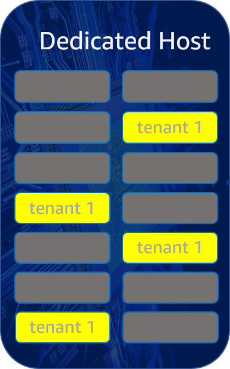
+ A Dedicated Host is also a physical server that's dedicated for your use. With a Dedicated Host, you have visibility and control over how instances are placed on the server.
+ Can be purchased On-Demand (hourly).
+ Can be purchased as a Reservation for up to 70% off the On-Demand price.
+ The following table highlights some of the key differences between Dedicated Hosts and Dedicated Instances:
    |  | Dedicated Host | Dedicated Instance |
    | --- | --- | --- |
    | Billing | Per-host billing | Per-instance billing | 
    | Visibility of sockets, cores, and host ID  | Provides visibility of the number of sockets and physical cores | No visibility |  
    | Host and instance affinity | Allows you to consistently deploy your instances to the same physical server over time | Not supported |  
    | Targeted instance placement | Provides additional visibility and control over how instances are placed on a physical server | Not supported |
    | Automatic instance recovery | Supported | Partial support *|
    | Supported Bring Your Own License (BYOL) | Supported | Not supported |
    | Capacity Reservations	| Not supported | Supported | 
### Dedicated Hosts restrictions
+ To run RHEL, SUSE Linux, and SQL Server on Dedicated Hosts, you must bring your own AMIs. 
+ **Up to two On-Demand Dedicated Hosts** per instance family, per Region can be allocated. 
+ The instances that run on a Dedicated Host can only be **launched in a VPC**.
+ **Auto Scaling groups are supported** when using a launch template that specifies a host resource group. + **Amazon RDS instances** are **not supported.**
+ The AWS Free Usage tier is not available for Dedicated Hosts.
+ Instance placement control refers to managing instance launches onto Dedicated Hosts. You **cannot launch Dedicated Hosts into placement groups.**
### Allocate Dedicated Hosts
+ To begin using Dedicated Hosts, you must allocate Dedicated Hosts in your account using the Amazon EC2 console or the command line tools. After you allocate the Dedicated Host, the Dedicated Host capacity is made available in your account immediately and you can start launching instances onto the Dedicated Host.
### Launch instances onto a Dedicated Host
+ After you have allocated a Dedicated Host, you can launch instances onto it.
+ You **can't launch** instances with `host` tenancy if you **do not have active Dedicated Hosts with enough available capacity** for the instance type that you are launching.
### Launch instances into a host resource group
+ When you launch an instance into **a host resource group that has a Dedicated Host with available instance capacity**, Amazon EC2 launches the instance onto that host.
+ If the host resource group **does not have a host with available instance capacity**, Amazon EC2 **automatically allocates a new host in the host resource group**, and then launches the instance onto that host. 
### Auto-placement
+ Auto-placement is configured at the **host level**.
+ It allows you to manage whether instances that you launch are launched onto a specific host, or onto any available host that has matching configurations.
+ When the auto-placement of a Dedicated Host is **disabled**, it **only accepts Host tenancy instance launches that specify its unique host ID**. This is the default setting for new Dedicated Hosts.
+ When the auto-placement of a Dedicated Host is **enabled**, it **accepts any untargeted instance launches that match its instance type configuration**.
+ Launching an instance onto a Dedicated Host without providing a specific `HostId` enables it to launch on any Dedicated Host that has auto-placement *enabled* and that matches its instance type.
### Host affinity
+ Host affinity is configured at the **instance level.** It establishes a launch relationship between an instance and a Dedicated Host.
+ When affinity is set to **`Host`, an instance launched onto a specific host always restarts on the same host** if stopped. This applies to both targeted and untargeted launches.
+ When affinity is set to **`Off`, and you stop and restart the instance, it can be restarted on any available host**. 
### Work with shared Dedicated Hosts
+ Dedicated Host sharing enables Dedicated Host owners to share their Dedicated Hosts with other AWS accounts or within an AWS organization，A Dedicated Host owner can share a Dedicated Host with: 
    + Specific AWS accounts inside or outside of its AWS organization
    + An organizational unit inside its AWS organization
    + Its entire AWS organization
### Host recovery
+ Host recovery automatically restarts your instances on to a new replacement host if failures are detected on your Dedicated Host.
+ When a system failure is detected on your Dedicated Host, host recovery is initiated and Amazon EC2 **automatically allocates a replacement Dedicated Host**.The replacement Dedicated Host receives a new host ID, but retains the same attributes as the original Dedicated Host, including: 
    + Availability Zone
    + Instance type
    + Tags
    + Auto placement settings
+ After the replacement Dedicated Host is allocated, the **instances are recovered on to the replacement Dedicated Host**. The recovered instances retain the same attributes as the original instances, including: 
    + Instance ID
    + Private IP addresses
    + Elastic IP addresses
    + EBS volume attachments
    + All instance metadata
+ **Stopped instances are not recovered** on to the replacement Dedicated Host.
+ **Instances with instance storage are not recovered** on to the replacement Dedicated Host.
## Dedicated Instances
+ Dedicated Instances are Amazon EC2 instances that **run in a virtual private cloud (VPC) on hardware that's dedicated to a single customer**.
+ Dedicated Instances that belong to different AWS accounts are **physically isolated at a hardware level**, even if those accounts are linked to a single payer account.
+ However, Dedicated Instances may **share hardware with other instances from the same AWS account** that are not Dedicated Instances.

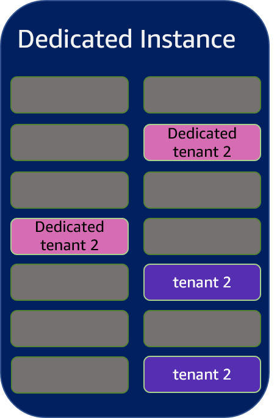
### Dedicated Instance basics
+ Each instance that you launch into a VPC has a tenancy attribute. This attribute has the following values. 
    + `default`: Your instance runs on shared hardware.
    + `dedicated`: Your instance runs on single-tenant hardware.
    + `host`: Your instance runs on a Dedicated Host, which is an isolated server with configurations that you can control.
+ After you launch an instance, there are some limitations to changing its tenancy. 
    + You cannot change the tenancy of an instance from `default` to `dedicated` or `host` after you've launched it. 
    + You cannot change the tenancy of an instance from `dedicated` or `host` to `default` after you've launched it. 
    + You can change the tenancy of an instance from `dedicated` to `host`, or from `host` to `dedicated` after you've launched it.
+ Each VPC has a related instance tenancy attribute. This attribute has the following values. 
    + `default`: An instance launched into the VPC runs on shared hardware by default, unless you explicitly specify a different tenancy during instance launch.
    + `dedicated: `An instance launched into the VPC is a Dedicated Instance by default, unless you explicitly specify a tenancy of `host` during instance launch. You cannot specify a tenancy of `default` during instance launch.
    + You can change the instance tenancy of a VPC from `dedicated` to `default` after you create it. You cannot change the instance tenancy of a VPC from `default` to `dedicated` after it is created.
+ You can use Amazon EC2 Auto Scaling to launch Dedicated Instances
+ You can run a Dedicated Spot Instance by specifying a tenancy of `dedicated` when you create a Spot Instance request. 
## On-Demand Capacity Reservations
+ On-Demand Capacity Reservations enable you to **reserve compute capacity** for your Amazon EC2 instances **in a specific Availability Zone for any duration**. 
+ When you create a Capacity Reservation, you specify: 
    + The **Availability Zone** in which to reserve the capacity
    + The **number of instances** for which to reserve capacity
    + The **instance attributes**, including the instance type, tenancy, and platform/OS
+ Differences between Capacity Reservations, Reserved Instances, and Savings Plans
    |  | Capacity Reservations | Zonal Reserved Instances | Regional Reserved Instances | Savings Plans |
    | --- | --- | --- | --- | --- |
    | **Term** | No commitment required. Can be created and canceled as needed. | Requires a fixed one-year or three-year commitment | Requires a fixed one-year or three-year commitment | Requires a fixed one-year or three-year commitment | 
    | **Capacity benefit** | Capacity reserved in a specific Availability Zone. | Capacity reserved in a specific Availability Zone. | No capacity reserved. | No capacity reserved. |
    | **Billing discount** | No billing discount. | Provides a billing discount.| Provides a billing discount.| Provides a billing discount.|
    | **Instance Limits** | Your On-Demand Instance limits per Region apply. | Default is 20 per Availability Zone. You can request a limit increase. | Default is 20 per Region. You can request a limit increase. | No limit. | 
+ Capacity Reservation limits 
    + The number of instances for which you are allowed to reserve capacity is **based on your account's On-Demand Instance limit.**
    + Active and unused Capacity Reservations count toward your On-Demand Instance limits.
    + Capacity Reservations are not transferable from one AWS account to another.
    + Zonal Reserved Instance billing discounts do not apply to Capacity Reservations.
    + Capacity Reservations can't be created in placement groups.
    + Capacity Reservations can't be used with Dedicated Hosts
    + Capacity Reservations do not ensure that a hibernated instance can resume after you try to start it.
## Savings Plans compared with Reserved Instances
+ Savings Plans offer the following:
    + The ability to switch Regions
    + A plan that automatically adapts itself to change in instances
    + Lower prices on EC2 instances usage, regardless of instance family, size, operating system, tenancy or Region. This also applies to Fargate and Lambda usage. 
+ Two types of Saving Plans relate to Amazon EC2:
    + EC2 Instance Saving Plans: 
        + These provide the lowest prices in exchange for commitment to usage of individual instance families in a Region (for example, M5 usage in US East (N. Virginia)). 
        + This automatically reduces your cost on the selected instance family in that Region regardless of Availability Zone, size, operating system, or tenancy. EC2 Instance Savings Plans give you the flexibility to change your usage between instances within a family in that Region. For example, you can move from c5.xlarge running Windows to c5.2xlarge running Linux and automatically benefit from the Savings Plans prices.
    + Compute Saving Plans: 
        + These plans automatically apply to EC2 instance usage regardless of instance family, size, Availability Zone, Region, operating system, or tenancy, and also apply to Fargate and Lambda usage. 
+ For Reserved Instances consider the following:
    + The price is fixed over the 1- or 3-year commitment period.
    + You are limited to one Region or one Availability Zone.
    + Coverage is broader and includes Amazon Relational Database Services (Amazon RDS).
    + You pay for the entire term of a Reserved Instance, regardless of actual usage, so your cost savings are closely tied to use.
    + When you purchase a Reserved Instance in a specific Availability Zone, it provides a capacity reservation. 
    + You can sell additional capacity on the Reserved Instances marketplace. However, this requires additional monitoring and management overhead.
## Summarize
+ On-Demand Instances – You pay full price, by the second when you launch.
+ Spot Instances – This refers to unused instance resources that you can bid on. Your price is determined by market availability.
+ Reserved Instances – You agree to a specific instance configuration for a period of 1–3 years.
+ Dedicated Hosts – You get a full physical server.
+ Savings Plans – You commit to a certain amount of usage over a 1–3-year period.
# Storage
+ Amazon EC2 provides you with flexible, cost effective, and easy-to-use data storage options for your instances. 
+ These storage options include the following:
    + **Amazon EBS** 
    + **Amazon EC2 instance store**
    + **Amazon EFS file system** 
    + **Amazon S3** 
+ The following figure shows the relationship between these storage options and your instance.

+ Every time you launch an instance from an AMI, **a root storage device is created** for that instance. The root storage device contains all the information necessary to boot the instance. 
## Amazon EBS
+ Amazon EBS provides **durable, block-level storage volumes** that you can attach to a running instance.
+ You can use Amazon EBS as a primary storage device for data that requires **frequent and granular updates**. 
+ The volume **persists independently** from the running life of an instance.
+ As illustrated in the previous figure, **multiple volumes can be attached to an instance**. You can also detach an EBS volume from one instance and attach it to another instance.
+ You can **dynamically change the configuration** of a volume attached to an instance.
+ EBS volumes can also be created as **encrypted volumes** using the Amazon EBS encryption feature.
+ To keep a backup copy of your data, you can **create a snapshot of an EBS volume**, which is stored in Amazon S3.
+ You can **create an EBS volume from a snapshot,** and attach it to another instance. 
### Amazon EBS–optimized instances
+ An Amazon EBS–optimized instance uses an optimized configuration stack and provides **additional, dedicated capacity for Amazon EBS I/O**.
+ This optimization provides the best performance for your EBS volumes by **minimizing contention between Amazon EBS I/O and other traffic** from your instance.
+ EBS–optimized instances deliver **dedicated bandwidth** to Amazon EBS
## Amazon EC2 instance store
+ Many instances can access storage from disks that are **physically attached to the host computer**. This disk storage is referred to as *instance store*.
+ Instance store provides **temporary block-level storage** for instances.
+ Instance store is **ideal for temporary storage** of information that changes frequently, such as buffers, caches, scratch data, and other temporary content, or for data that is replicated across a fleet of instances, such as a load-balanced pool of web servers.
+ An instance store consists of **one or more instance store volumes exposed as block devices**.
+ After you launch an instance, the instance store volumes are available to the instance, but you can't access them until they are mounted. 
### Instance store lifetime
+ You can **specify instance store volumes** for an instance **only when you launch it**.
+ You **can't detach** an instance store volume from one instance and attach it to a different instance.
+ The data on an instance store volume **persists only during the life of the associated instance**; if you **stop, hibernate, or terminate** an instance, any data on instance store volumes is lost. 
+ If an instance **reboots** (intentionally or unintentionally), data in the instance store **persists**.
+ If you change the instance type, an instance store will not be attached to the new instance type If the number of instance store volumes in a block device mapping exceeds the number of instance store volumes available to an instance, the additional volumes are ignored.
## Amazon EFS file system
+ Amazon EFS provides **scalable file storage** for use with Amazon EC2.
+ You can create an EFS file system and configure your instances to mount the file system.
+ You can use an EFS file system as a **common data source for workloads and applications** running on multiple instances. 
+ Amazon EFS enables you to create a file system that **multiple instances can mount and access at the same time**. 
## Amazon S3
+ Amazon S3 provides access to **reliable, fast, and inexpensive data storage** infrastructure. 
+ It is designed to make web-scale computing easier by enabling you to **store and retrieve any amount of data, at any time**, from within Amazon EC2 or **anywhere on the web**.
+ Amazon EC2 uses Amazon S3 to store **EBS snapshots and instance store-backed AMIs**
+ Amazon S3 stores data objects **redundantly on multiple devices across multiple facilities** and **allows concurrent read or write access** to these data objects by many separate clients or application threads.
## Block Device Mappings
+ You specify the EBS volumes and instance store volumes for your instance using a block device mapping.
+ Each entry in a block device mapping **includes a device name and the volume that it maps to**.
+ The default block device mapping is **specified by the AMI** you use. Alternatively, you can **specify** a block device mapping for the instance **when you launch** it.
+ A block device mapping always specifies the root volume for the instance. The root volume is either an Amazon EBS volume or an instance store volume. 
+ You can use a block device mapping to **specify additional EBS** volumes **when you launch your instance**, or you can attach additional EBS volumes **after your instance is running**. 
+ The only way to attach **instance store volumes** to an instance is to use block device mapping to attach the volumes **as the instance is launched**.
+ Each AMI has a block device mapping that specifies the block devices to attach to an instance when it is launched from the AMI. An AMI that Amazon provides includes a root device only. 
    
# Security
+ Security is a shared responsibility between AWS and you. The shared responsibility model describes this as **security of the cloud and security in the cloud**:
+ **Security of the cloud** – AWS is responsible for protecting the infrastructure that runs AWS services in the AWS Cloud.  
+ **Security in the cloud** – Your responsibility includes the following areas:
    + **Controlling network access** to your instances, for example, through configuring your **VPC and security groups**.  
    + **Managing the credentials** used to connect to your instances. 
    + Managing the **guest operating system and software** deployed to the guest operating system, including updates and security patches. 
    + Configuring the **IAM roles** that are attached to the instance and the permissions associated with those roles. 
## Infrastructure security
+ As a managed service, Amazon EC2 is protected by the AWS global network security procedures
+ Use AWS published API calls to access Amazon EC2 through the network. Clients must support Transport Layer Security (TLS) 1.0 or later, and also must support cipher suites with perfect forward secrecy (PFS)
+ Additionally, requests must be signed using an access key ID and a secret access key that is associated with an IAM principal. Or temporary security credentials to sign requests.
### Network isolation
+ Use **separate VPCs** to isolate infrastructure by workload or organizational entity.
+ Use **subnets** to isolate the tiers of your application, use **private subnets** for your instances if they should not be accessed directly from the internet
+ To call the Amazon EC2 API from your VPC without sending traffic over the public internet, use **AWS PrivateLink**.
### Isolation on physical hosts
+ Different EC2 instances on the same physical host are isolated from each other as though they are on separate physical hosts.
## Interface VPC endpoints
+ Interface endpoints are powered by **AWS PrivateLink**, a technology that enables you to **privately access Amazon EC2 APIs** by restricting all network traffic between your VPC and Amazon EC2 to the Amazon network. With interface endpoints, you also don't need an internet gateway, a NAT device, or a virtual private gateway.
## Resilience
+ The AWS global infrastructure  
    + With **Availability Zones,** you can design and operate applications and databases that **automatically fail over between zones** without interruption.
    + If you need to replicate your data or applications over greater geographic distances, use AWS Local Zones. 
+  In addition to the AWS global infrastructure, Amazon EC2 offers the following features to support your data resiliency:
    + Copying AMIs across Regions
    + Copying EBS snapshots across Regions
    + Automating EBS-backed AMIs using Amazon Data Lifecycle Manager
    + Automating EBS snapshots using Amazon Data Lifecycle Manager
    + Maintaining the health and availability of your fleet using Amazon EC2 Auto Scaling
    + Distributing incoming traffic across multiple instances in a single Availability Zone or multiple Availability Zones using Elastic Load Balancing
## Data protection
### Encryption at rest
+ Amazon EBS encryption is an encryption solution for your EBS volumes and snapshots. It uses AWS KMS key.
+ The data on NVMe instance store volumes is encrypted using an XTS-AES-256 cipher implemented on a hardware module on the instance. You cannot disable this encryption and you cannot provide your own encryption key.
### Encryption in transit
+ Use an encryption protocol such as Transport Layer Security (TLS) to encrypt sensitive data in transit between clients and your instances. 
## IAM
+ Your **security credentials** identify you to services in AWS and grant you unlimited use of your AWS resources, such as your Amazon EC2 resources.
+ You can use features of Amazon EC2 and AWS Identity and Access Management (IAM) to allow other users, services, and applications to use your Amazon EC2 resources **without** sharing your security credentials. + Amazon EC2 enables you to **specify additional AWS accounts** that can use your Amazon Machine Images (AMIs) and Amazon EBS snapshots.
+ IAM enables you to do the following: 
    + Create users and groups under your AWS account
    + Assign unique security credentials to each user under your AWS account
    + Control each user's permissions to perform tasks using AWS resources
    + Allow the users in another AWS account to share your AWS resources
    + Create roles for your AWS account and define the users or services that can assume them
    + Use existing identities for your enterprise to grant permissions to perform tasks using AWS resources
### IAM policies for Amazon EC2
+ By default, IAM users **don't have permission** to create or modify Amazon EC2 resources, or perform tasks using the Amazon EC2 API.
+ To allow IAM users to create or modify resources and perform tasks, you must **create IAM policies** that grant IAM users permission to use the specific resources and API actions they'll need, and then **attach those policies to the IAM users or groups** that require those permissions.
+ *Resource-level permissions* refers to the ability to specify which resources users are allowed to perform actions on. Amazon EC2 has **partial support for resource-level permissions**
### IAM roles for Amazon EC2
+ Instead of creating and distributing your AWS credentials, you can delegate permission to make API requests using IAM roles as follows: 
+ Create an IAM role.+ Define which accounts or AWS services can assume the role.
+ Define which API actions and resources the application can use after assuming the role.
+ Specify the role when you launch your instance, or attach the role to an existing instance.
+ Have the application retrieve a set of temporary credentials and use them.
+ You can only attach one IAM role to an instance, but you can attach the same role to many instances.
#### Instance profiles
+ Amazon EC2 uses an ***instance profile*** as a container for an IAM role.
+ **An instance profile can contain only one IAM role**. This limit cannot be increased.
+ When you create an IAM role using the **IAM console**, the console **creates an instance profile automatically** and gives it the **same name as the role** to which it corresponds.
+ If you use the **AWS CLI, API, or an AWS SDK** to create a role, you **create the role and instance profile as separate actions,** with potentially different names.
#### Retrieve security credentials from instance metadata
+ An application on the instance retrieves the **security credentials provided by the role** from the instance metadata item `iam/security-credentials/`*role-name*.
+ These security credentials are **temporary and we rotate** them automatically. 
+ The AWS SDKs, AWS CLI, and Tools for Windows PowerShell **automatically get the credentials** from the EC2 instance metadata service and use them.
### Network Access
+ To enable network access to your instance, you must **allow inbound traffic** to your instance.
+ To open a port for inbound traffic, add a rule to a **security group** that you associated with your instance when you launched it.
## Key Pair
+ A key pair, consisting of a **private key and a public key**, is a set of security credentials that you use to **prove your identity when connecting** to an instance.
+ Amazon EC2 uses public-key cryptography to encrypt and decrypt login information. 
    + uses a public key to encrypt a piece of data
    + an associated private key to decrypt the data
    + These two keys together are called a **key pair**.
+ The Amazon Linux distribution initial user is ec2-user. Initial access to the instance is obtained by **using the ec2-user and the private key to log in via SSH**.
+ When launching a Windows instance, Amazon EC2 generates a random password for the local administrator account and encrypts the password using the public key. Initial access to the instance is obtained by **decrypting the password with the private key.**
+ You can have up to **5,000 key pairs per Region**.
+ Because Amazon EC2 **doesn't keep a copy of your private key**, there is no way to recover a private key if you lose it. 
+ If you lose the private key for an EBS-backed instance, you can regain access to your instance(**not supported for instances with instance-store** backed root volumes) 
    + You must stop the instance,
    + detach its root volume and attach it to another instance as a data volume,
    + modify the `authorized_keys` file with a new public key,
    + move the volume back to the original instance, and restart the instance. 
## Security Groups
+ A *security group* acts as **a virtual firewall** for your EC2 instances to **control incoming and outgoing traffic**.
+ **Inbound rules** control the incoming traffic to your instance, and **outbound rules** control the outgoing traffic from your instance.
+ Security groups allow you to control traffic based on **port, protocol, and source/destination**. 
+ port:The port number affected by this rule
+ protocol:The communications standard for the traffic affected by this rule
+ source/destination: the source for incoming traffic rules, or the destination for outgoing traffic rules. The source/destination can be defined in two ways:
    + ***CIDR block***—An x.x.x.x/x style definition that defines a specific range of IP addresses.
    + ***Security group***—Includes any instance that is associated with the given security group. This helps prevent coupling security group rules with specific IP addresses.
+ Security groups have different capabilities depending on whether they are associated with an Amazon VPC or Amazon EC2-Classic. 
    + **EC2-Classic** Security Groups: Control **outgoing** instance traffic
    + **VPC** Security Groups:Control **outgoing and incoming** instance traffic
+ For instances outside of an Amazon VPC (called **EC2-Classic**), the association of the security groups **cannot be changed after launch**.
+ If an instance is **running in an Amazon VPC**, you can **change** which security groups are associated with an instance **while the instance is running**.
+ Security groups are **associated with network interfaces**. Changing an instance's security groups changes the security groups associated with the **primary network interface (eth0)**. 
### Characteristics
+ By default, security groups **allow all outbound traffic**. Note that Amazon EC2 blocks traffic on port 25 by default. 
+ A security group is **default deny**; that is, it does not allow any traffic that is not explicitly allowed by a security group rule.
+ Security group rules are always **permissive**; you **can't create rules that deny** access.
+ If there is more than one rule for a specific port, Amazon EC2 applies the **most permissive rule**.
+ Security group rules enable you to filter traffic based on protocols and port numbers.
+ Security groups **are stateful**—if you send a request from your instance, the response traffic for that request is allowed to flow in regardless of inbound security group rules. For VPC security groups, this also means that responses to allowed inbound traffic are allowed to flow out, regardless of outbound rules. 
+ Security groups are applied at the **instance level**
+ You can **add and remove rules at any time**. Your changes are **automatically applied** to the instances that are associated with the security group.
+ Every instance must have **at least one security group** but can have more.
+ When you associate multiple security groups with an instance, the rules from each security group are **effectively aggregated** to create one set of rules.
### Connection tracking
+ Your security groups use **connection tracking** to track information about traffic to and from the instance. 
+ **Not all** flows of traffic are tracked. If a security group rule **permits TCP or UDP flows for all traffic (`0.0.0.0/0` or `::/0`)** and there is a corresponding rule in the other direction that **permits all response traffic (`0.0.0.0/0` or `::/0`) for all ports (0-65535)**, then that flow of traffic is not tracked
+ **ICMP traffic is always tracked**, regardless of rules.
+ An **untracked flow of traffic is immediately interrupted** if the rule that enables the flow is removed or modified. 
+ There is a **maximum number of connections** that can be tracked per instance. After the maximum is reached, any packets that are sent or received are lost because a new connection cannot be established.
### Default and custom security groups
+ Your AWS account automatically has a default security group for the default VPC in each Region.
+ Default rules for a default security group: 
    + **Allows inbound traffic** from network interfaces and instances that are assigned to the **same security group**.
    + **Allows all outbound** IPv4 traffic(0.0.0.0/0)
    + Allows all outbound IPv6 traffic. (::/0)
+ You can **add or remove inbound and outbound rules** for any default security group.
+ You **can't delete a default security group.**
+ The following are the default rules for a **custom security group**: 
    + Allows **no inbound** traffic
    + Allows **all outbound** traffic
# Network
+ To increase network performance and reduce latency, you can launch instances in a **placement group**.
+ You can get significantly higher packet per second (PPS) performance using **enhanced networking**.
+ You can accelerate high performance computing and machine learning applications using an **Elastic Fabric Adapter (EFA), which is a network device** that you can attach to a supported instance type.
## Regions and Zones
+ Amazon EC2 is hosted in multiple locations world-wide. These locations are composed of Regions, Availability Zones, Local Zones, AWS Outposts, and Wavelength Zones.
+ Each **Region** is a separate geographic area.
+ **Availability Zones** are multiple, isolated locations within each Region.
+ **Local Zones** provide you the ability to place resources, such as compute and storage, in multiple locations closer to your end users.
+ **AWS Outposts** brings native AWS services, infrastructure, and operating models to virtually any data center, co-location space, or on-premises facility.
+ **Wavelength Zones** allow developers to build applications that deliver ultra-low latencies to 5G devices and end users. Wavelength deploys standard AWS compute and storage services to the edge of telecommunication carriers' 5G networks.
### Regions
+ Each Amazon EC2 Region is designed to be **isolated** from the other Amazon EC2 Regions
+ When you launch an instance, you must select an **AMI that's in the same Region.** 
+ Note that there is a **charge for data transfer between Regions**
+ Your account determines the Regions that are available to you.
+ The number and mapping of **Availability Zones** per Region may **vary between AWS accounts**.
### Availability Zones
+ Each Region has multiple, isolated locations known as *Availability Zones*
+ To ensure that resources are distributed across the Availability Zones for a Region, we independently map Availability Zones to names for each AWS account. For example, the Availability Zone `us-east-1a` for your AWS account might not be the same location as `us-east-1a` for another AWS account.
+ To coordinate Availability Zones across accounts, you must use the *AZ ID*, which is a unique and consistent identifier for an Availability Zone.
+ Migrate an instance to another Availability Zone 
    + Creating an AMI from the original instance
    + Launching an instance in the new Availability Zone
    + Updating the configuration of the new instance
### Local Zones
+ A Local Zone is **an extension of an AWS Region** in geographic proximity to your users.
+ Local Zones have their own connections to the internet and **support AWS Direct Connect**, so that resources created in a Local Zone can serve local users with **low-latency communications**
+ To use a Local Zone： 
    + you must first enable it.
    + create a subnet in the Local Zone.
    + launch any of the following resources in the Local Zone subnet:
        + Amazon EC2 instances 
        + Amazon EBS volumes
        + Amazon ECS
        + Amazon EKS

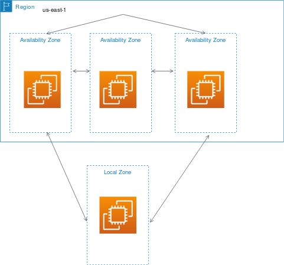
### Wavelength Zones
+ AWS Wavelength enables developers to build applications that deliver ultra-low latencies to mobile devices and end users.
+  Developers can **extend a virtual private cloud (VPC) to one or more Wavelength Zones**
+ To use a Wavelength Zone,: 
    + you must first opt in to the Zone.
    + create a subnet in the Wavelength Zone
    + launch your resources in the Wavelength Zones subnet
+ Wavelength Zones are not available in every Region

### AWS Outposts
+  AWS Outposts is a fully managed service that **extends AWS infrastructure, services, APIs, and tools to customer premises.** 
+ To begin using AWS Outposts, you must create an Outpost and order Outpost capacity
+ You can launch EC2 instances in the Outpost subnet that you created.The root volume must be 30 GB or smaller
+ You can create EBS volumes in the Outpost subnet that you created. When you create the volume, specify the Amazon Resource Name (ARN) of the Outpost.
## Addressing an Instance
+  By default, Amazon EC2 and Amazon VPC use the IPv4 addressing protocol; you can't disable this behavior.
+ When you create a VPC, you must specify an IPv4 CIDR block (a range of private IPv4 addresses).
+ You can optionally assign an IPv6 CIDR block to your VPC and subnets, and assign IPv6 addresses from that block to instances in your subnet. 
### **Public Domain Name System (DNS) Name**
+ When you launch an instance, AWS creates a DNS name that can be used to access the instance.
+ This DNS name is **generated automatically and cannot be specified** by the customer.
+ This DNS name **persists only while the instance is running** and **cannot be transferred** to another instance.
### **Public IP**
+ A launched instance may also have a public IP address assigned.
+ This IP address is assigned from the addresses reserved by AWS and **cannot be specified**.
+ This IP address is unique on the Internet, **persists only while the instance is running**, and **cannot be transferred** to another instance.
+ Your **stopped or hibernated instance receives a new public IP address when it is started**
### **Elastic IP**
+ An elastic IP address is **an unique public address** on the Internet that you reserve independently and associate with an Amazon EC2 instance.
+ An Elastic IP address is static; it does not change over time.
+ This IP address **persists until the customer releases** it and is **not tied to the lifetime or state of an individual instance**.
+ By using an Elastic IP address, you can mask the failure of an instance or software by rapidly remapping the address to another instance in your account. 
+ We currently do not support Elastic IP addresses for IPv6.
+ a small hourly charge if an Elastic IP address is not associated with a running instance, or if it is associated with a stopped instance or an unattached network interface
+ An Elastic IP address is for use in a **specific Region only**, and cannot be moved to a different Region.+ all AWS accounts are limited to **five (5) Elastic IP addresses per Region**
### **Private IP addresses and Elastic Network Interfaces (ENIs)**
+ Additional methods of addressing instances that are available in the context of an Amazon VPC.
+ When you launch an instance, we allocate **a primary private IPv4** address for the instance
+ Each instance is also given **an internal DNS hostname** that resolves to the primary private IPv4 address
+ Each instance has **a default network interface (eth0)** that is assigned the primary private IPv4 address.
+ You can also specify additional private IPv4 addresses, known as **secondary private IPv4** addresses. Unlike primary private IP addresses, secondary private IP addresses can be **reassigned** from one instance to another.
+ All instances are assigned at least one private IPv4 address that, by default, will fall within one of the blocks: 
    + 10.0.0.0 ~10.255.255.255
    + 172.16.0.0 ~172.31.255.255
    + 192.168.0.0 ~192.168.255.255
+ You can specify multiple private IPv4 and IPv6 addresses for your instances. It can be useful to assign multiple IP addresses to an instance in your VPC to do the following: 
    + Host multiple websites on a single server by using multiple SSL certificates on a single server and associating each certificate with a specific IP address.
    + Operate network appliances, such as firewalls or load balancers, that have multiple IP addresses for each network interface.
    + Redirect internal traffic to a standby instance in case your instance fails, by reassigning the secondary IP address to the standby instance.
## Elastic network interfaces
+ An *elastic network interface* is **a logical networking component in a VPC** that represents a virtual network card. It can include the following attributes: 
    + A primary private IPv4 address from the IPv4 address range of your VPC
    + One or more secondary private IPv4 addresses from the IPv4 address range of your VPC
    + One Elastic IP address (IPv4) per private IPv4 address
    + One public IPv4 address
    + One or more IPv6 addresses
    + One or more security groups
    + A MAC address
    + A source/destination check flag
    + A description
+ You can create and configure network interfaces in your account and attach them to instances in your VPC.
+ When you move a network interface from one instance to another, network traffic is redirected to the new instance.
+ Each instance has a default network interface, called the *primary network interface*. You **cannot detach a primary network interface** from an instance.
+ If you have an Elastic IP address, you can **associate it with one of the private IPv4 addresses** for the network interface. You can **associate one Elastic IP address with each private IPv4 address.**
+ **Termination behavior**:You can specify whether the network interface should be automatically deleted when you terminate the instance to which it's attached.
+ **Source/destination checking**
    + You can enable or disable source/destination checks, which ensure that the instance is either the source or the destination of any traffic that it receives.
    + Source/destination checks are **enabled by default**
    + You must **disable source/destination checks** if the instance runs services such as **network address translation, routing, or firewalls**.
### Network cards
+ Instances with **multiple network cards provide higher network performance**, including bandwidth capabilities above 100 Gbps and improved packet rate performance.
+ Each network interface is attached to a network card.
+ The primary network interface must be assigned to network card index 0
+ You can create a network interface in a subnet. You can't move the network interface to another subnet after it's created, and you can only attach the network interface to instances in the **same Availability Zone**.
## Enhanced networking
+ Enhanced networking uses **single root I/O virtualization (SR-IOV)** to provide high-performance networking capabilities on [supported instance types](https://docs.aws.amazon.com/AWSEC2/latest/UserGuide/enhanced-networking.html#supported_instances).
+ SR-IOV is **a method of device virtualization** that provides higher I/O performance and lower CPU utilization when compared to traditional virtualized network interfaces.
+ Enhanced networking provides **higher bandwidth, higher packet per second (PPS) performance, and consistently lower inter-instance latencies**.
+ You can enable enhanced networking using one of the following mechanisms: 
    + Elastic Network Adapter (ENA): install the required ENA module and enable ENA support
    + Intel 82599 Virtual Function (VF) interface: install `ixgbevf` module and enable the `sriovNetSupport` attribute
## Elastic Fabric Adapter
+ An Elastic Fabric Adapter (EFA) is a network device that you can attach to your Amazon EC2 instance to **accelerate** High Performance Computing (HPC) and machine learning applications. 
+ An EFA is an Elastic Network Adapter (ENA) with added capabilities. It provides all of the functionality of an ENA, with an **additional OS-bypass** functionality.
+ OS-bypass is an access model that **allows HPC and machine learning applications to communicate directly with the network interface hardware** to provide low-latency, reliable transport functionality.
+ EFA OS-bypass traffic is limited to a single subnet.
+ EFA OS-bypass traffic is not routable.
+ The EFA must be a member of a security group that allows all inbound and outbound traffic to and from the security group itself.
+  EFAs **cannot be attached to or detached** from an instance in a **running state**
## Placement Groups
+ There are three placement group strategies. 
+ *Cluster* – packs instances close together **inside an Availability Zone**
+ *Partition* – spreads your instances **across logical partitions**
+ *Spread* – strictly places a small group of instances **across distinct underlying hardware to reduce correlated failures**.
+ You **cannot launch Dedicated Hosts** in placement groups.
### Cluster placement group
+ A *Cluster placement group* is **a logical grouping of instances within a single Availability Zone.**
+ A cluster placement group **can't span multiple Availability Zones.**
+ This strategy enables workloads to achieve the **low-latency network performance** necessary for tightly-coupled node-to-node communication that is typical of HPC applications.
+ Placement groups enable applications to participate in a **low-latency, 10 Gbps network**.
+ Recommended for applications that benefit from **low network latency, high network throughput**
+ Choose an instance type that supports **enhanced networking and 10 Gbps network performance.**
+ You can launch multiple instance types into a cluster placement group. We recommend using the same instance type 
### Partition placement group
+ Partition placement groups help **reduce the likelihood of correlated hardware failures** for your application
+ Amazon EC2 ensures that **each partition within a placement group has its own set of racks**
+ groups of instances in one partition **do not share the underlying hardware** with groups of instances in different partitions.
+ This strategy is typically used by **large distributed and replicated workloads**, such as Hadoop, Cassandra, and Kafka.
+ A partition placement group can have partitions in **multiple Availability Zones in the same Region**.
+ A partition placement group supports **a maximum of seven partitions** per Availability Zone.
+ A partition placement group with **Dedicated Instances** can have a maximum of two partitions. 

### spread placement group
+ A spread placement group is a group of instances that are **each placed on distinct racks**, with each rack having its own network and power source.
+ Spread placement groups are recommended for applications that have a small number of critical instances that should be kept separate from each other.
+  suitable for **mixing instance types** or launching instances over time
+ A spread placement group can **span multiple Availability Zones** in the same Region. 
+ A spread placement group supports a maximum of **seven running instances per Availability Zone.**
+ Spread placement groups are **not supported for Dedicated Instances.**

## Tenancy Options
### Shared Tenancy
+ Shared tenancy is the **default tenancy model** for all Amazon EC2 instances
+ Shared tenancy means that **a single host machine may house instances from different customers**
+ secure tenancy model: fully isolates instances from other instances on the same host
### Dedicated Instances
+ Dedicated Instances run on **hardware that’s dedicated to a single customer**. 
+ Dedicated Instance can **launch on any hardware that has been dedicated to the account**.
### Dedicated Host
+ An Amazon EC2 Dedicated Host is **a physical server with Amazon EC2 instance** capacity fully dedicated to a single customer’s use.
+ The customer has complete control over which specific host runs an instance at launch.
# EC2 Fleet Overview
+ An *EC2 Fleet* contains the configuration information to launch a fleet or group—of instances. 
+ An *EC2 Fleet* is **a group of On-Demand Instances and Spot Instances**.
+ Launch multiple instance types **across multiple Availability Zones**, using the **On-Demand Instance, Reserved Instance, and Spot Instance** purchasing options together. 
+ If you have Reserved Instances and you specify On-Demand Instances in your fleet, EC2 Fleet uses your Reserved Instances.
+ Define **separate On-Demand and Spot capacity targets** and the maximum amount you’re willing to pay per hour
+ Specify **an unlimited number of instance types** that work best for your applications
+ Specify how Amazon EC2 should distribute your fleet capacity within each purchasing option 
+ The allocation strategy for your EC2 Fleet determines how it fulfills your request for Spot Instances from the possible Spot capacity pools represented by its launch specifications. 
+ You can also **set a maximum amount per hour that you’re willing to pay** for your fleet, and EC2 Fleet launches instances until it reaches the maximum amount. 
+ You can also specify **multiple Availability Zones, specify different maximum Spot prices** for each instance, and choose additional Spot options for each fleet
## **EC2 Fleet limitations**
+ EC2 Fleet is available only through the API or AWS CLI.
+ An EC2 Fleet request **can't span AWS Regions**. You need to create a separate EC2 Fleet for each Region.
+ An EC2 Fleet request **can't span different subnets** from the same Availability Zone.
## EC2 Fleet configuration strategies
### EC2 Fleet request types
+ **`instant`**:EC2 Fleet places **a synchronous one-time request** for your desired capacity. In the API response, it returns the instances that launched, along with errors for those instances that could not be launched.
+ **`request`:**  EC2 Fleet places **an asynchronous one-time request**for your desired capacity. There after, if capacity is diminished because of Spot interruptions, the fleet does not attempt to replenish Spot Instances, nor does it submit requests in alternative Spot capacity pools if capacity is unavailable.
+ **`maintain`: (Default) **EC2 Fleet places** an asynchronous request for your desired capacity**, and **maintains capacity by automatically replenishing** any interrupted Spot Instances.
+ All three types of requests benefit from an allocation strategy
+ You can only modify an EC2 Fleet that is of type `maintain`. You cannot modify an EC2 Fleet of type `request` or `instant`.
### Allocation strategies for Spot Instances
+ **`lowest-price`**: The Spot Instances come from the Spot capacity pool with the lowest price. This is the default strategy.
+ **`diversified`**: The Spot Instances are distributed **across all Spot capacity pools**.
+ **`capacity-optimized`**: The Spot Instances come from the Spot capacity pool with optimal capacity for the number of instances that are launching. You can optionally set a priority for each instance type in your fleet using **`capacity-optimized-prioritized`**. EC2 Fleet optimizes for capacity first, but honors instance type priorities on a best-effort basis.
+ **`InstancePoolsToUseCount`**: The Spot Instances are **distributed across the number of Spot capacity pools** that you specify. This parameter is **valid only when used in combination with `lowest-price`.**
+ Configure EC2 Fleet for **cost optimization**: specify the **`lowest-price` allocation strategy**
+ Configure EC2 Fleet for **cost optimization and diversification**: use the **`lowest-price`** allocation strategy in combination with **`InstancePoolsToUseCount`**
+ Configure EC2 Fleet for **capacity optimization**: use the `capacity-optimized` allocation strategy.
+ Configure EC2 Fleet for **On-Demand backup**：specify **alternative instance types** for your On-Demand Instances, you can also take advantage of **Prioritize instance types and Use Capacity Reservations** 
### Capacity Rebalancing
+ The goal of Capacity Rebalancing is to keep processing your workload without interruption. 
+ You can configure EC2 Fleet to launch a replacement Spot Instance when Amazon EC2 emits a rebalance recommendation to notify you that a Spot Instance is at an elevated risk of interruption. 
+ EC2 Fleet can launch new replacement Spot Instances until fulfilled capacity is double target capacity
+ We recommend that you configure EC2 Fleet to terminate Spot Instances that receive a rebalance recommendation
+ EC2 Fleet does not count instances that receive a rebalance recommendation when calculating fulfilled capacity during scale in or out
+ Provide as many Spot capacity pools in the request as possible
+ Configure your EC2 Fleet to use the most optimal Spot capacity pools
## Work with EC2 Fleets
+ To start using an EC2 Fleet, you create a request that includes the total target capacity, On-Demand capacity, Spot capacity, **one or more launch specifications** for the instances, and the maximum price that you are willing to pay.
+ The fleet request **must include a launch template** that defines the information that the fleet needs to launch an instance, such as an AMI, instance type, subnet or Availability Zone, and one or more security groups.
+ You can specify **launch specification overrides** for the instance type, subnet, Availability Zone, and maximum price you're willing to pay, and you can assign weighted capacity to each launch specification override.
## Use Amazon EventBridge to monitor EC2 Fleet events
+ When the state of an EC2 Fleet changes, the EC2 Fleet emits a notification. The notification is made available as an event that is sent to Amazon EventBridge(formerly known as Amazon CloudWatch Events)
+ If EventBridge detects an event pattern that matches a pattern defined in a rule, EventBridge invokes a target (or targets) specified in the rule.
## Spot Fleet Overview
+ A Spot Fleet **is set of Spot Instances and optionally On-Demand Instances** that is launched based on criteria that you specify.
+ The Spot Fleet selects the Spot capacity pools that meet your needs and launches Spot Instances to meet the target capacity for the fleet.
+ By default, Spot Fleets are set to **maintain target capacity by launching replacement instances** after Spot Instances in the fleet are terminated.
# Monitoring tools
## Automated monitoring tools
+ **System status checks** – monitor the AWS systems required to use your instance to ensure that they are working properly
+ **Instance status checks** – monitor the software and network configuration of your individual instance.
+ **Amazon CloudWatch alarms**– watch a single metric over a time period you specify, and perform one or more actions based on the value of the metric relative to a given threshold over a number of time periods
+ **Amazon EventBridge** – automate your AWS services and respond automatically to system events. Events from AWS services are delivered to EventBridge in near real time, and you can specify automated actions to take when an event matches a rule you write.
+ **Amazon CloudWatch Logs** – monitor, store, and access your log files from Amazon EC2 instances, AWS CloudTrail, or other sources.
+ **CloudWatch agent** – collect logs and system-level metrics from both hosts and guests on your EC2 instances and on-premises servers.
+ **AWS Management Pack for Microsoft System Center Operations Manager** 
## Manual monitoring tools
+ Amazon EC2 Dashboard
+ Amazon CloudWatch Dashboard
## Best practices for monitoring
+ Make monitoring a priority to head off small problems before they become big ones.
+ Create and implement a monitoring plan that collects monitoring data from all of the parts in your AWS solution so that you can more easily debug a multi-point failure if one occurs.
+ Automate monitoring tasks as much as possible.
+ Check the log files on your EC2 instances.
## Status checks
+ Amazon EC2 performs **automated checks** on every running EC2 instance to identify hardware and software issues
+ Status checks are performed **every minute**, returning a pass or a fail status.
+ Status checks are built into Amazon EC2, so they **cannot be disabled or deleted**.
### System status checks
+ These checks detect underlying problems with your instance that **require AWS involvement to repair**
+ The following are examples of problems that can cause system status checks to fail: 
    + Loss of network connectivity
    + Loss of system power
    + Software issues on the physical host
    + Hardware issues on the physical host that impact network reachability
### Instance status checks
+ Amazon EC2 checks the health of the instance by sending an address resolution protocol (ARP) request to the network interface (NIC).
+ These checks detect problems that require your involvement to repair.
+ The following are examples of problems that can cause instance status checks to fail: 
    + Failed system status checks
    + Incorrect networking or startup configuration
    + Exhausted memory
    + Corrupted file system
    + Incompatible kernel
## CloudWatch
+ You can monitor your instances using Amazon CloudWatch, which collects and processes raw data from Amazon EC2 into **readable, near real-time metrics**.
+ These statistics are recorded for **a period of 15 months**
+ By default, Amazon EC2 sends metric data to CloudWatch **in 5-minute periods**. To send metric data for your instance to CloudWatch in **1-minute periods, you can enable detailed monitoring** on the instance. 
+ You can use Amazon CloudWatch to **collect metrics and logs from the operating systems** for your EC2 instances.
## Automate Amazon EC2 with EventBridge
+ Amazon EventBridge enables you to automate your AWS services and respond automatically to system events such as application availability issues or resource changes.
+ Events from AWS services are delivered to EventBridge in near real time.
+ You can write simple rules to indicate which events are of interest to you, and the automated actions to take when an event matches a rule.
+ The actions that can be automatically triggered include the following: 
    + Invoking an AWS Lambda function
    + Invoking Amazon EC2 Run Command
    + Relaying the event to Amazon Kinesis Data Streams
    + Activating an AWS Step Functions state machine
    + Notifying an Amazon SNS topic or an Amazon SQS queue
## AWS CloudTrail
+ AWS CloudTrail is a service that provides **a record of actions** taken by a user, role, or an AWS service in Amazon EC2 and Amazon EBS.
+ The trail logs events **from all Regions** in the AWS partition and delivers the log files to the Amazon S3 bucket that you specify.
+ Every event or log entry contains information about **who generated the request.**
# Best Practice
## **Security**
+ Manage access to AWS resources and APIs using identity federation, **IAM** users, and IAM roles.
+ Implement the **least permissive** rules for your **security group**. 
+ Regularly **patch, update, and secure the operating system** and applications on your instance. 
+ Launch your instances into a VPC instead of EC2-Classic (If aws account is newly created VPC is used by default)
+ Establish credential management policies and procedures for creating, distributing, rotating, and revoking AWS access credentials
+ Disable password-based logins for instances launched from your AMI.
## **Storage**
+ Understand the implications of the root device type for data persistence, backup, and recovery.
+ **Data on any other EBS volumes persists** after instance termination by default 
+ Use **separate Amazon EBS volumes** for the operating system versus your data.
+ Ensure that the volume with your data persists after instance termination. 
+ Use the **instance store** available for your instance to store **temporary data.**
    + Remember that the data stored in instance store is deleted when you stop, hibernate, or terminate your instance. 
    + If you use instance store for database storage, ensure that you have **a cluster with a replication factor** that ensures fault tolerance. 
+ **Encrypt EBS volumes and snapshots**.  
## **Resource management**
+ Use **instance metadata and custom resource tags** to track and identify your AWS resources.  
+ View your current limits for Amazon EC2. Plan to **request any limit increases in advance** of the time that you'll need them. 
## **Backup and recovery**
+  Regularly **back up** your EBS volumes using **Amazon EBS snapshots**, and create an  **Amazon Machine Image (AMI)** from your instance to save the configuration as a template for launching future instances. 
+ Data Lifecycle Manager (DLM) to automate the creation, retention, and deletion of snapshots taken to back up the EBS volumes
+ Deploy critical components of your application **across multiple Availability Zones**, and replicate your data appropriately. 
+ Design your applications to **handle dynamic IP addressing** when your instance restarts. 
+ **Monitor** and respond to events. 
+ Ensure that you are prepared to **handle failover**.
    + For a basic solution, you can manually attach a network interface or Elastic IP address to a replacement instance. 
    + For an automated solution, you can use Amazon EC2 Auto Scaling.  
    + Regularly test the process of recovering your instances and Amazon EBS volumes if they fail. 
## **Networking**
+  Set the **time-to-live (TTL) value for your applications to 255**, for IPv4 and IPv6. If you use a smaller value, there is a risk that the TTL will expire while application traffic is in transit, causing reachability issues for your instances. 
# AWS Nitro System
+ The majority of EC2 instances run on hardware known as the AWS Nitro System. The AWS Nitro System is built specifically to run instances in the most optimal fashion possible. The AWS Nitro System is a combination of dedicated hardware and a lightweight hypervisor, for faster innovation and enhanced security. 
+ The important element of the AWS Nitro System hardware is how it uses dedicated hardware to offload input and output (I/O) operations. 
+ When Amazon EC2 originally launched, up to 30% of the host's compute resources were allocated to the hypervisor for managing the hardware. This left only 70% of the resources for the remaining hypervisor functions and the customer instances.

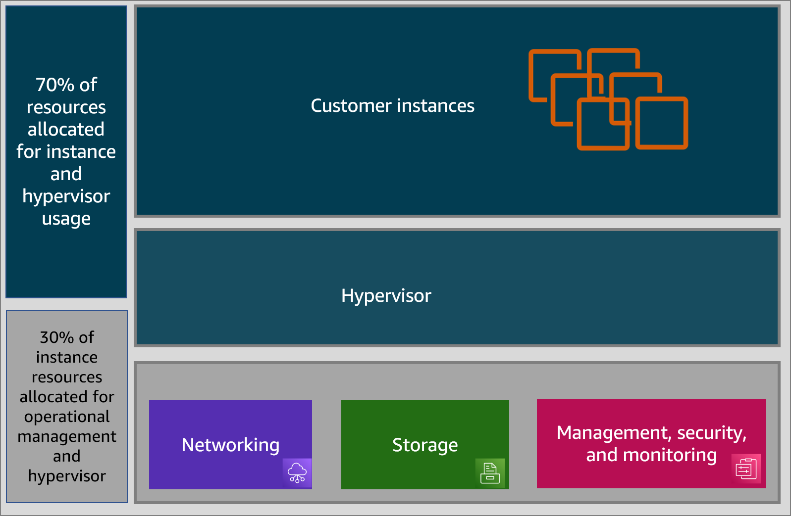
+ Traditionally, a hypervisor's job is to protect the physical hardware and BIOS; virtualize the CPU, storage, and networking; and provide a rich set of management capabilities.
+ With the Nitro System, these functions are **separated and offloaded to dedicated hardware and software**. Doing this **reduces costs and increases performance** by delivering practically all of the server resources to your instances.

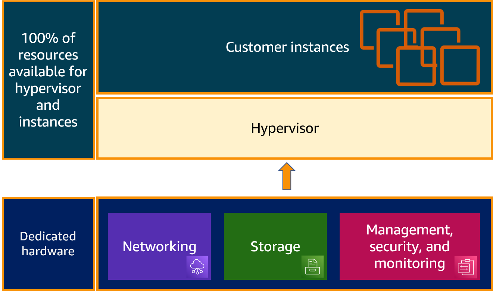

# Exam Essentials
+ **Know the basics of launching an Amazon ec2 instance.**
    + To launch an instance, you must specify:
    + an **AMI**, which defines the **software** on the instance at launch, 
    + an **instance type**, which defines the **virtual hardware** supporting the instance (memory, vCPUs, and so on).
+ **Understand how to provision and launch an EC2 instance.**
    + select the right AMI and instance type
    + configure a security group, 
    + add any extra storage volumes that might be needed, 
    + Point to any necessary user data and scripts, 
    + tag all the elements using descriptive key values.
+ **Know how security groups protect instances**
    + Security groups are **virtual firewalls** controlling traffic in and out of your Amazon EC2 instances. 
    + They are **deny by default**, and you can allow traffic by adding rules specifying traffic **direction, port, protocol, and destination address** (via Classless Inter-Domain Routing [CIDR] block). 
    + They are applied at the **instance level**, meaning that traffic between instances in the same security group must adhere to the rules of that security group. 
    + They are **stateful**, meaning that an outgoing rule will allow the response without a correlating incoming rule. 
+ **Know how to interpret the effect of security groups**
    + When an instance is a member of multiple security groups, the effect is **a union of all the rules** in all the groups. 
+ **Know how to securely access your instances running on the cloud**
    + Security Groups and Network Access Lists+ Access Management (IAM) roles
    + network address translation (NAT) instances
    + key pair at first start
+ **Know How to change the capabilities of an existing instance**
    + Stop instance
    + Change instance type
    + Start instance
+ **Know what architectures are suited for what Amazon ec2 pricing options**
    + **Spot Instances** are best suited for workloads that can accommodate **interruption**. 
    + **Reserved** Instances are best for **consistent, long-term** compute needs. 
    + **On-Demand** Instances provide flexible compute to respond to **scaling needs**. 
+ **Know how to combine multiple pricing options that result in cost optimization and scalability.**
  + On-Demand Instances can be used to scale up a web application running on Reserved Instances in response to a temporary traffic spike. 
  + For a workload with several Reserved Instances reading from a queue, it’s possible to use Spot Instances to alleviate heavy traffic in a cost-effective way. 
  + These are just two of countless examples where a workload may use different pricing options. 
+ **Know the benefits of enhanced networking.**
    + Enhanced networking enables you to get significantly **higher PPS performance, lower network jitter, and lower latencies.**
+ **Know the capabilities of vm import/export.**
    + VM Import/Export allows you to import existing VMs to AWS as Amazon EC2 instances or AMIs.
    + Amazon EC2 instances that were imported through VM Import/Export can also be exported back to a virtual environment. 
+ **Know the methods for accessing an instance over the internet.**
    + You can access an Amazon EC2 instance over the web via **public IP address, elastic IP address, or public DNS name**. 
    + There are additional ways to access an instance **within an Amazon VPC**, including **private IP addresses and ENIs**. 
+ **Know the properties of the Amazon EC2 pricing options.**
    + **On-Demand** Instances require **no up-front commitment**, can be launched any time, and are billed by the hour. 
    + **Reserved** Instances require an **up-front commitment** and vary in cost depending on whether they are paid all up front, partially up front, or not up front. 
    + **Spot** Instances are launched when **your bid price exceeds the current spot price**. Spot Instances will run until the spot price exceeds your bid price, in which case the instance will get **a two-minute warning and terminate**. 
+ **Know what determines network performance.**
    + Every instance type is rated for **low, moderate, high, or 10 Gbps network performance**, with larger instance types generally having higher ratings. 
    + Additionally, some instance types offer **enhanced networking**, which provides additional improvement in network performance. 
+ **Know what instance metadata is and how it’s obtained.**
    + Metadata is information about an Amazon EC2 instance, such as instance ID, instance type, and security groups, that is available from within the instance.
    + It can be obtained through an HTTP call to a specific IP address:http://169.254.169.254/latest/meta-data/
+ **Know how to Create and Launch an AMI Based on an Existing Instance Storage Volume**
  + Create an image from the instance’s volume (you’ll access the dialog through the Actions pull-down menu in the Instances Dashboard). 
  + Launch an instance from the console and select the new AMI from the My AMIs tab. 

# Reference:
+ [Amazon EC2](https://docs.aws.amazon.com/AWSEC2/latest/UserGuide/concepts.html)
+ [Amazon EC2 Basics](https://explore.skillbuilder.aws/learn/course/12471/play/48909/amazon-ec2-basics)
+ [Rightsize Your Amazon EC2 Workload](https://explore.skillbuilder.aws/learn/course/14765/play/68508/rightsize-your-amazon-ec2-workload)
+ [Build with Amazon EC2](https://explore.skillbuilder.aws/learn/course/12996/play/98882/build-with-amazon-ec2)
+ [Amazon EC2 Observability, Monitoring, and Troubleshooting](https://explore.skillbuilder.aws/learn/course/15115/play/72851/amazon-ec2-observability-monitoring-and-troubleshooting)
+ [Amazon Elastic Compute Cloud (Amazon EC2) for Linux Instances - Troubleshooting](https://explore.skillbuilder.aws/learn/course/10318/play;state=%5Bobject%20Object%5D;autoplay=0)
+ [Amazon Elastic Compute Cloud (Amazon EC2) for Windows Instances - Troubleshooting](https://explore.skillbuilder.aws/learn/course/8829/play;state=%5Bobject%20Object%5D;autoplay=0)
+ [Amazon Elastic Compute Cloud (Amazon EC2)–Automate Your Infrastructure](https://explore.skillbuilder.aws/learn/course/17189/play/89913/amazon-elastic-compute-cloud-amazon-ec2-automate-your-infrastructure)