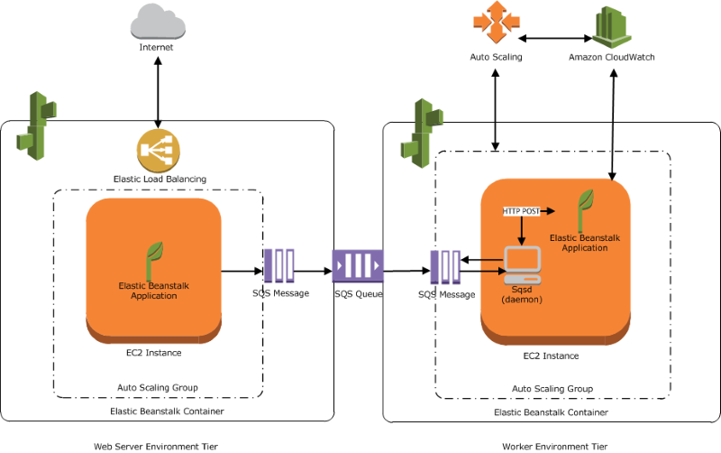

# Overview
+ With Elastic Beanstalk, you can **quickly deploy and manage applications** in the AWS Cloud without having to learn about the infrastructure that runs those applications.
+ Elastic Beanstalk reduces management complexity without restricting choice or control. You **simply upload your application**, and Elastic Beanstalk automatically handles the details of **capacity provisioning, load balancing, scaling, and application health monitoring**.
+ To use Elastic Beanstalk, you create an application, upload an application version in the form of an application source bundle (for example, a Java .war file) to Elastic Beanstalk, and then provide some information about the application. Elastic Beanstalk automatically launches an environment and creates and configures the AWS resources needed to run your code. 
# Concepts
+  An **Elastic Beanstalk application** is a logical collection of Elastic Beanstalk components, including *environments*, *versions*, and *environment configurations*. In Elastic Beanstalk an application is conceptually similar to a folder. 
+ an **application version** refers to a specific, labeled iteration of deployable code for a web application. An application version points to an Amazon Simple Storage Service (Amazon S3) object that contains the deployable code, such as a Java WAR file. 
+ An **environment** is a collection of AWS resources running an application version. 
    + The **environment tier** designates **the type of application that the environment runs**, and determines what resources Elastic Beanstalk provisions to support it.
    + An application that serves HTTP requests runs in a Web server environments. 
    + A backend environment that pulls tasks from an Amazon Simple Queue Service (Amazon SQS) queue runs in a worker environment . 
+ An **environment configuration** identifies a collection of parameters and settings that define how an environment and its associated resources behave. 
+ A **saved configuration** is a template that you can use as a starting point for creating unique environment configurations.  
+ A **platform** is a combination of an operating system, programming language runtime, web server, application server, and Elastic Beanstalk components.  
## Web server environments
+ When you create an environment, Elastic Beanstalk provisions the resources required to run your application. AWS resources created for an environment include one elastic load balancer (ELB in the diagram), an Auto Scaling group, and one or more Amazon Elastic Compute Cloud (Amazon EC2) instances.
+ Every environment has a CNAME (URL) that points to a load balancer. 
+ By default, Elastic Beanstalk defines a security group, which allows everyone to connect using port 80 (HTTP).

## Worker environments
+ AWS resources created for a worker environment tier include an Auto Scaling group, one or more Amazon EC2 instances, and an IAM role. 
+ Elastic Beanstalk also creates and provisions an Amazon SQS queue if you don’t already have one.
+ When you launch a worker environment, Elastic Beanstalk installs the necessary support files for your programming language of choice and a daemon on each EC2 instance in the Auto Scaling group. The daemon reads messages from an Amazon SQS queue. The daemon sends data from each message that it reads to the web application running in the worker environment for processing. If you have multiple instances in your worker environment, each instance has its own daemon, but they all read from the same Amazon SQS queue.

# Permissions
+ The **service role is assumed by Elastic Beanstalk** to use other AWS services on your behalf.
+ The **[instance profile ](https://docs.aws.amazon.com/elasticbeanstalk/latest/dg/concepts-roles-instance.html) is applied to the instances** in your environment and allows them to retrieve application versions from Amazon Simple Storage Service (Amazon S3), upload logs to Amazon S3, and perform other tasks that vary depending on the environment type and platform.
+ create **user policies** and apply them to IAM users and groups in your account to allow users to create and manage Elastic Beanstalk applications and environments. 
# Managing Application
+ application version lifecycle 
    + Each time you upload a new version of your application with the Elastic Beanstalk console or the EB CLI, Elastic Beanstalk creates an application version. If you don't delete versions that you no longer use, you will eventually reach the  application version quota and be unable to create new versions of that application.
    + You can avoid hitting the quota by applying an *application version lifecycle policy* to your applications. A lifecycle policy tells Elastic Beanstalk to delete application versions that are old, or to delete application versions when the total number of versions for an application exceeds a specified number.
+ When you use the AWS Elastic Beanstalk console to deploy a new application or an application version, you'll need to upload a source bundle. Your source bundle must meet the following requirements: 
    + Consist of a single `ZIP` file or `WAR` file (you can include multiple `WAR` files inside your `ZIP` file)
    + Not exceed 512 MB
    + Not include a parent folder or top-level directory (subdirectories are fine)
# Managing environments
+ You can create and manage separate environments for development, testing, and production use, and you can deploy any version of your application to any environment.
+ You can deploy to all of the instances in your environment simultaneously, or split a deployment into batches with rolling deployments.
+ You can deploy multiple environments when you need to run multiple versions of an application.
+ Rebuilding an environment terminates all of its resources and replaces them with new resources with the same configuration.
+ You can also rebuild terminated environments within six weeks (42 days) of their termination. When you rebuild, Elastic Beanstalk attempts to create a new environment with the same name, ID, and configuration.
## Deployments
+ **All at once** – The quickest deployment method. Suitable if you can accept **a short loss of service**, and if quick deployments are important to you. With this method, Elastic Beanstalk deploys the new application version to each instance. 
+ **Rolling** – **Avoids downtime and minimizes reduced availability**, at a cost of a longer deployment time. Suitable if you can't accept any period of completely lost service. With this method, your application is deployed to your environment one batch of instances at a time. Most bandwidth is retained throughout the deployment.
+ **Rolling with additional batch** – Avoids any reduced availability, at a cost of an even longer deployment time compared to the *Rolling* method. Suitable if you must **maintain the same bandwidth** throughout the deployment. With this method, Elastic Beanstalk launches an extra batch of instances, then performs a rolling deployment. Launching the extra batch takes time, and ensures that the same bandwidth is retained throughout the deployment.
+ **Immutable**– A slower deployment method, that ensures your **new application version is always deployed to new instances**, instead of updating existing instances. It also has the additional advantage of a quick and safe rollback in case the deployment fails. With this method, Elastic Beanstalk performs an immutable update to deploy your application. In an immutable update, a second Auto Scaling group is launched in your environment and the new version serves traffic alongside the old version until the new instances pass health checks.
+ **Traffic splitting** – A canary testing deployment method. Suitable if you want to test the health of your new application version using a portion of incoming traffic, while keeping the rest of the traffic served by the old application version.
+ The following table compares deployment method properties.
    | Method | Impact of failed deployment | Deploy time | Zero downtime | No DNS change | Rollback process | Code deployed to |
    | ---- | ---- | ---- | ---- | ---- | ---- | ---- |
    | All at once | Downtime | * | No | Yes | Manual redeploy | Existing instances |
    | Rolling | Single batch out of service; any successful batches before failure running new application version | ** | Yes | Yes | Manual redeploy | Existing instances |
    | Rolling with an additional batch | Minimal if first batch fails; otherwise, similar to **Rolling** | *** | Yes | Yes | Manual redeploy | New and existing instances | 
    | Immutable | Minimal | **** | Yes | Yes | Terminate new instances | New instances | 
    | Traffic splitting | Percentage of client traffic routed to new version temporarily impacted | **** |Yes | Yes | Reroute traffic and terminate new instances | New instances |
    | Blue/green | Minimal | **** | Yes | No | Swap URL | New instances |
### How rolling deployments work
+ When processing a batch, Elastic Beanstalk: 
    + detaches all instances in the batch from the load balancer,
    + deploys the new application version,
    + and then reattaches the instances
    + After reattaching the instances in a batch to the load balancer, Elastic Load Balancing waits until they pass a minimum number of Elastic Load Balancing health checks, and then starts routing traffic to them.
    + Elastic Beanstalk waits until all instances in a batch are healthy before moving on to the next batch.
+ If a deployment fails after one or more batches completed successfully, the completed batches run the new version of your application while any pending batches continue to run the old version. 
### How traffic-splitting deployments work
+ During a traffic-splitting deployment, Elastic Beanstalk creates a new set of instances in a separate temporary Auto Scaling group.
+ Elastic Beanstalk then instructs the load balancer to direct a certain percentage of your environment's incoming traffic to the new instances.
+ Then, for a configured amount of time, Elastic Beanstalk tracks the health of the new set of instances. If all is well, Elastic Beanstalk shifts remaining traffic to the new instances and attaches them to the environment's original Auto Scaling group, replacing the old instances.
+ Then Elastic Beanstalk cleans up—terminates the old instances and removes the temporary Auto Scaling group.
+ Traffic-splitting deployments **require an Application Load Balancer.**
### Blue/Green deployments
+ Because AWS Elastic Beanstalk performs an in-place update when you update your application versions, your application can become unavailable to users for a short period of time. You can avoid this downtime by performing a blue/green deployment, where you deploy the new version to a separate environment, and then **swap CNAMEs** of the two environments to redirect traffic to the new version instantly.
+ Blue/green deployments require that your environment runs independently of your production database,  If your environment has an Amazon RDS DB instance attached to it, the data will not transfer over to your second environment, and will be lost if you terminate the original environment.
## Configuration changes
+ Configuration changes that modify the [launch configuration](https://docs.aws.amazon.com/elasticbeanstalk/latest/dg/command-options-general.html#command-options-general-autoscalinglaunchconfiguration) or [VPC settings](https://docs.aws.amazon.com/elasticbeanstalk/latest/dg/command-options-general.html#command-options-general-ec2vpc) require terminating all instances in your environment and replacing them.
### Rolling updates
+  Elastic Beanstalk **applies your configuration changes in batches**, keeping a minimum number of instances running and serving traffic at all times.
+ This approach **prevents downtime** during the update process. 
+ During a rolling update, capacity is only **reduced by the size of a single batch**, which you can configure. Elastic Beanstalk takes one batch of instances out of service, terminates them, and then launches a batch with the new configuration. After the new batch starts serving requests, Elastic Beanstalk moves on to the next batch.
+ If the rolling update process fails, Elastic Beanstalk starts another rolling update to **roll back to the previous configuration**.
+ A failed rollback ends the update process and leaves your environment in an unhealthy state.
+ **Rolling updates** \occur when you change settings that **require new Amazon EC2 instances** to be provisioned for your environment.
+ **Rolling deployments**  occur whenever you **deploy your application** and can typically be performed **without replacing instances** in your environment.
### Immutable updates
+ Elastic Beanstalk launches a temporary Auto Scaling group outside of your environment with a separate set of instances running with the new configuration. Then Elastic Beanstalk places these instances behind your environment's load balancer.**Old and new instances both serve traffic until the new instances pass health checks**. At that time, Elastic Beanstalk moves the new instances into your environment's Auto Scaling group and terminates the temporary group and old instances.
+ If an immutable environment update fails, the rollback process requires only terminating an Auto Scaling
+ You can't perform an immutable update in concert with resource configuration changes. 
### Disabled
+ Elastic Beanstalk makes no attempt to avoid downtime. It terminates your environment's existing instances and replaces them with new instances running with the new configuration.
## Worker environments
+ If your AWS Elastic Beanstalk application performs operations or workflows that take a long time to complete, you can offload those tasks to a dedicated *worker environment*. Decoupling your web application front end from a process that performs blocking operations is a common way to ensure that your application stays responsive under load.
+ To avoid running long-running tasks locally, you can use the AWS SDK for your programming language to send them to an Amazon Simple Queue Service (Amazon SQS) queue, and run the process that performs them on a separate set of instances. You then design these worker instances to take items from the queue only when they have capacity to run them, preventing them from becoming overwhelme

# Auto Scaling
+ In a single-instance environment, the Auto Scaling group ensures that there is always one instance running.
+ In a load-balanced environment, you configure the group with a range of instances to run, and Auto Scaling adds or removes instances as needed, based on load.
+ The Auto Scaling group also applies the launch configuration for the instances in your environment. 
+ Auto Scaling monitors the health of each Amazon EC2 instance that it launches. 
+ You can configure the group to use the load balancer's health check mechanism
# Reference
[aws elastic beanstalk](https://docs.aws.amazon.com/elasticbeanstalk/latest/dg/Welcome.html)