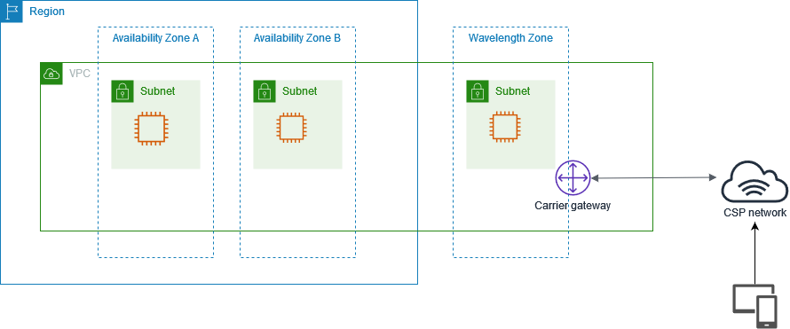

# AWS Wavelength
+ *AWS Wavelength* enables developers to build applications that deliver **ultra-low latencies to mobile devices and end users**.
+ Wavelength deploys standard AWS compute and storage services to the edge of **telecommunication carriers' 5G networks**.
+ You can extend an Amazon Virtual Private Cloud (VPC) to one or more Wavelength Zones.
+ You can then use AWS resources like Amazon Elastic Compute Cloud (Amazon EC2) instances to run the applications that require ultra-low latency and a connection to AWS services in the Region.
# Wavelength concepts
+ Wavelength — A new type of AWS infrastructure designed to run workloads that require **ultra-low latency over mobile networks**.
+ Wavelength Zone (WZ) — A zone in the carrier location where the **Wavelength infrastructure is deployed**. Wavelength Zones are **associated with an AWS Region**. A Wavelength Zone is a **logical extension of the Region**, and is managed by the control plane in the Region.
+ VPC — A customer virtual private cloud (VPC) that **spans Availability Zones, Local Zones, and Wavelength Zones**, and has deployed resources such as Amazon EC2 instances in the subnets that are associated with the zones.
+ Subnet — **A subnet that you create in a Wavelength Zone**. You can create one or more subnets, and then run and manage AWS services, such as Amazon EC2 instances, in the subnet.
+ Carrier gateway — A carrier gateway serves two purposes. It **allows inbound traffic from a carrier network in a specific location, and allows outbound traffic to the carrier network and internet**.
+ Network Border Group — A unique set of Availability Zones, Local Zones, or Wavelength Zones from which AWS advertises IP addresses.
+ Wavelength application — An application that you run on an AWS resource in a Wavelength Zone.
# AWS resources on Wavelength
+ Amazon EC2 instances
+ Amazon EBS volumes
+ Amazon VPC subnets and carrier gateways 
+ Amazon EC2 Auto Scaling
+ Amazon EKS clusters
+ Amazon ECS clusters
+ Amazon EC2 Systems Manager
+ Amazon CloudWatch
+ AWS CloudTrail
+ AWS CloudFormation
# How AWS Wavelength works
+ The following diagram demonstrates how you can create a subnet that uses resources in a communications service provider (CSP) network at a specific location. For resources that must be within the CSP network, you opt in to the Wavelength Zone, and then create resources in the Wavelength Zone.

## VPCs
+ After you create a VPC in a Region, **create a subnet in a Wavelength Zone that is associated with the VPC**. 
+ In addition to the Wavelength Zone, you can create resources in all of the Availability Zones and Local Zones that are associated with the VPC.
+ You have control over the VPC networking components, such as IP address assignment, subnets, and route table creation.
+ VPCs that contain a subnet in a Wavelength Zone can connect to a carrier gateway. A carrier gateway allows you to connect to the following resources:
    + 4G/LTE and 5G devices on the telecommunication carrier network
    + Outbound traffic to public internet resources
## Subnets
+ Any subnet that you create in a Wavelength Zone inherits the main VPC route table, which includes the local route. The local route enables connectivity between the subnets in the VPC, including the subnets that are in the Wavelength Zone.
+ AWS recommends that you configure custom route tables for your subnets in Wavelength Zones. The destinations are the same destinations as a subnet in an Availability Zone or Local Zone, with the addition of a carrier gateway.
## Carrier gateways
+ A carrier gateway serves two purposes. 
    + It **allows inbound traffic from a carrier network in a specific location**
    + it **allows outbound traffic to the carrier network and internet**.
    + There is **no inbound connection configuration from the internet to a Wavelength Zone through the carrier gateway**.
+ A carrier gateway supports IPv4 traffic.
+ Carrier gateways are **only available for VPCs that contain subnets in a Wavelength Zone**.
+ The carrier gateway **provides connectivity between your Wavelength Zone and the telecommunication carrier**, and devices on the telecommunication carrier network.
+ The carrier gateway **performs NAT of the Wavelength instances' IP addresses to the Carrier IP addresses from a pool that is assigned to the network border group**. The carrier gateway NAT function is similar to how an internet gateway functions in a Region.
## Carrier IP address
+ A Carrier IP address is the address that you assign to a network interface, which resides in a subnet in a Wavelength Zone (for example an EC2 instance).
+ The carrier gateway uses the address for traffic from the interface to the internet or to mobile devices. 
+ The carrier gateway uses NAT to translate the address, and then sends the traffic to the destination. 
+ Traffic from the telecommunication carrier network routes through the carrier gateway.
+ You allocate a Carrier IP address from a network border group, which is a unique set of Availability Zones, Local Zones, or Wavelength Zones from which AWS advertises IP addresses, for example, us-east-1-wl1-bos-wlz-1.
## Routing
+ You can set the carrier gateway as a destination in a route table for the following resources:
    + VPCs that contain subnets in a Wavelength Zone
    + Subnets in Wavelength Zones
+ Create a custom route table for the subnets in the Wavelength Zones so that the default route goes to the carrier gateway, which then sends traffic to the internet and telecommunication carrier network.
+ Traffic initiated from the EC2 instance for the internet uses the 0.0.0.0/0 route to route traffic to the carrier gateway. The carrier gateway maps the EC2 instance IP address to the Carrier IP address, and then sends the traffic to the telecommunication carrier.
## DNS
+ EC2 instances use EC2 DNS to resolve domain names to IP addresses. Route 53 supports DNS features, such as domain registration, and DNS routing. Both public and private hosted Wavelength Zones are supported for routing traffic to specific domains. Route 53 resolvers are hosted in the Region.
+ You can also use your own DNS services to resolve domain names.
# Maximum Transmission Unit
+ Generally, the Maximum Transmission Unit (MTU) is as follows:
+ 9001 bytes between Amazon EC2 instances in the same Wavelength Zone.
+ 1500 bytes between carrier gateway and a Wavelength Zone.
+ 1468 bytes between AWS Direct Connect and a Wavelength Zone.
+ 1300 bytes between an Amazon EC2 instance in a Wavelength Zone and an Amazon EC2 instance in the Region.
# Reference
[AWS Wavelength](https://docs.aws.amazon.com/wavelength/latest/developerguide/what-is-wavelength.html)