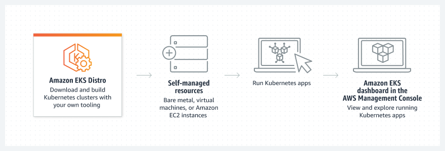

# Overview
+ Amazon EKS Distro is a distribution of the same open-source Kubernetes and dependencies deployed by Amazon Elastic Kubernetes Service (EKS), helping you to manually run Kubernetes clusters anywhere. 
+ Amazon EKS Distro is an open-source distribution of Kubernetes from AWS
+ Perform reproducible builds using the same open-source Kubernetes source code, tooling, and documentation as Amazon EKS.
+ Deploy EKS Distro on your own self-provisioned hardware infrastructure, including bare-metal servers, VMware vSphere virtual machines, Amazon EC2 instances, and infrastructure on other clouds
+ Update your builds with the latest security patches, plus extended support in alignment with the Amazon EKS Version Lifecycle Policy.

# Use cases
+ Run the same secure, validated, and tested Kubernetes components that power Amazon EKS within self-managed infrastructure on AWS, on premises, and on other clouds.
+ Remove the need to keep up with upstream Kubernetes and security patches so you can focus on your core business.
+ Continue using your own hardware and data center investments to run your Kubernetes workloads.
# Reference
+ [Amazon EKS Distro](https://aws.amazon.com/eks/eks-distro/)
+ [Amazon EKS Distro FAQs](https://aws.amazon.com/eks/eks-distro/faqs/?pg=ln&sec=hs)