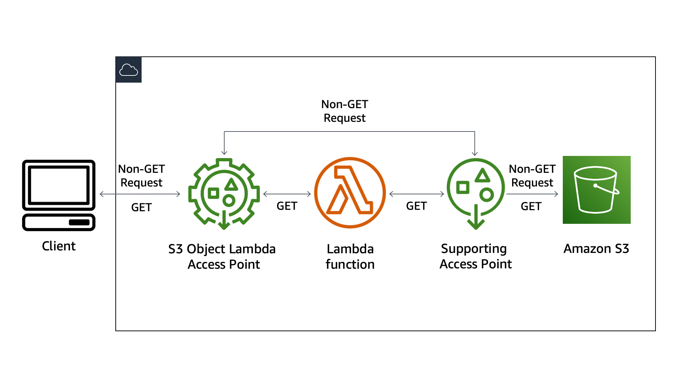
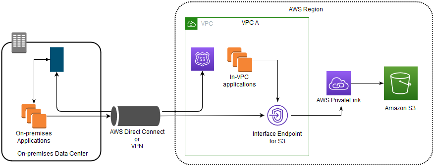
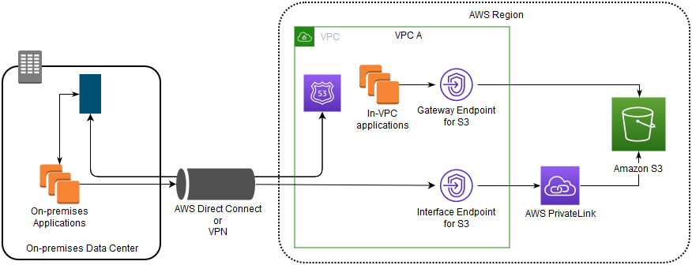
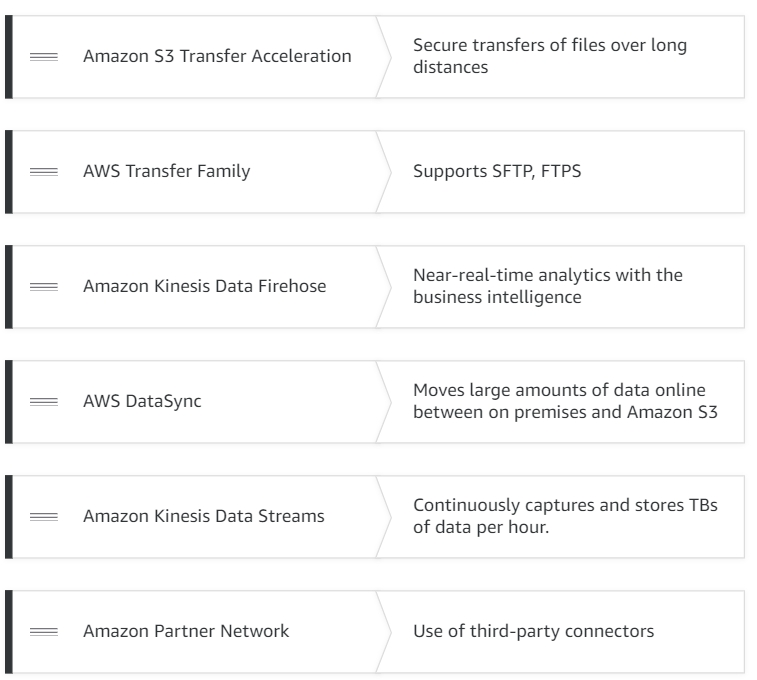
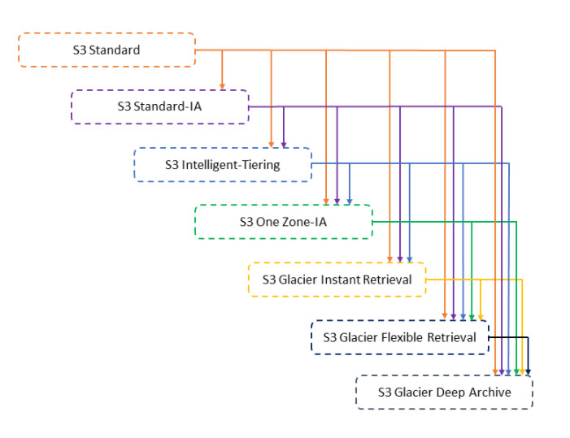
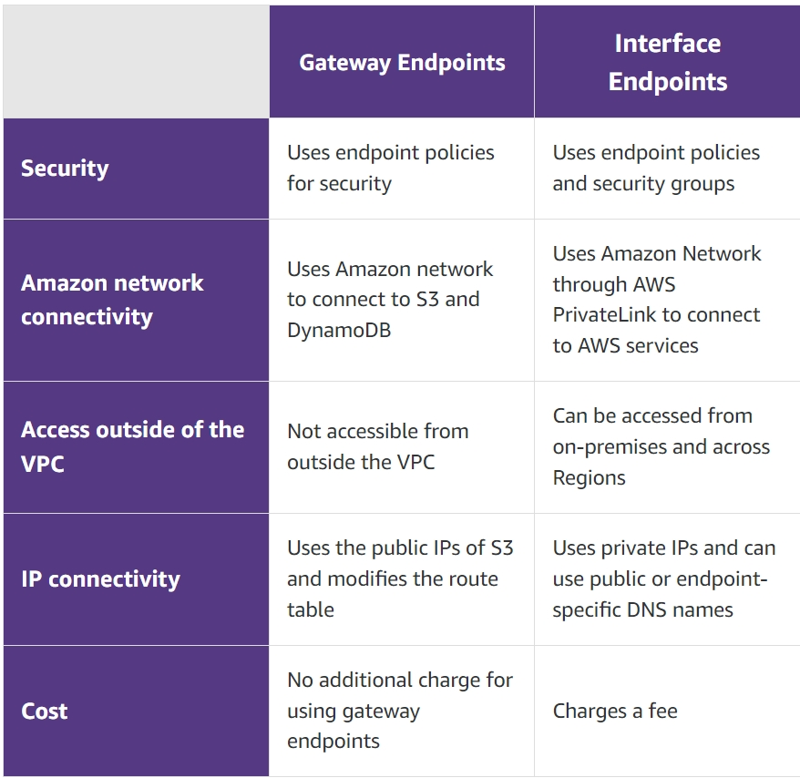

# Overview
+ Amazon Simple Storage Service (Amazon S3) is **storage for the Internet**. It is designed to make web-scale computing easier.
+ Amazon S3 has a simple web services interface that you can use to **store and retrieve any amount of data, at any time, from anywhere** on the web
# Buckets
+ A bucket is **a container for objects** stored in Amazon S3. Every object is contained in a bucket.
+ Buckets serve several purposes: 
    + They **organize the Amazon S3 namespace** at the highest level.
    + They **identify the account** responsible for storage and data transfer charges.
    + They play a role in **access control**.
    + They serve as the **unit of aggregation for usage reporting**.
+ An Amazon S3 **bucket name is globally unique** and the namespace is shared by all AWS accounts. 
+ The AWS account that creates a resource owns that resource.  
    +  For example, if you create an IAM user in your AWS account and grant the user permission to create a bucket, the user can create a bucket. But the user does not own the bucket; the AWS account that the user belongs to owns the bucket. 
+ **Amazon S3 Transfer Acceleration** is a **bucket-level feature that enables fast, easy, and secure transfers of files over long distances** between your client and an S3 bucket. Transfer Acceleration **takes advantage of the globally distributed edge locations in Amazon CloudFront**. As the data arrives at an edge location, the data is routed to Amazon S3 over an optimized network path. 
+ To access an acceleration-enabled bucket, use ``bucketname`.s3-accelerate.amazonaws.com`.
+ After you create a bucket, you **can't change its name or Region**.
+ By default, you can create up to **100 buckets in each of your AWS accounts**. If you need additional buckets, you can increase your account bucket limit to a **maximum of 1,000 buckets** by submitting a service limit increase. 
+ There is **no limit to the number of objects** that you can store in a bucket.
+ There is **no hierarchy of subbuckets or subfolders**.  
+ However, you can infer logical hierarchy using **key name prefixes and delimiters** as the Amazon S3 console does. 
+ If you need server-side encryption for all of the objects that are stored in a bucket, use a bucket policy
# Objects
+ Objects are the **fundamental entities** stored in Amazon S3.
+ Objects consist of **object data and metadata**.
+ The data portion is opaque to Amazon S3.
+ The metadata is a set of name-value pairs that describe the object.
+ A **key is the unique identifier** for an object within a bucket.
+ Every object in a bucket has **exactly one key**.
+ The combination of **a bucket, key, and version ID uniquely identify** each object. 
+ Objects stored in a Region never leave the Region unless you explicitly transfer them to another Region
+ Amazon S3 provides **strong read-after-write consistency** for PUTs and DELETEs of objects in your Amazon S3 bucket in all AWSRegions.
+ You can use *versioning* to keep multiple versions of an object in the same bucket
+ each object can be **up to 5 TB in size**
+  Object metadata is a set of name-value pairs. After you upload the object, you **cannot** modify object metadata.
+ There are two kinds of metadata in Amazon S3: **system-defined metadata and user-defined metadata**. 
+ With a **single PUT** api operation, you can upload a single object **up to 5 GB in size**.+ Using the **multipart upload API**, you can upload a single large object, **up to 5 TB in size**.
+ With the Amazon S3 Console, you can upload a single object up to 160 GB in size
+ In general, when your object size reaches **100 MB, you should consider using multipart uploads** instead of uploading the object in a single operation.
## Multipart upload process
+ Multipart upload is a three-step process: 
    + You initiate the upload: If you want to provide any metadata describing the object being uploaded, you must provide it in the request to initiate multipart upload.
    + you upload the object parts, and after you have uploaded all the parts,
    + you complete the multipart upload.
    + Upon receiving the complete multipart upload request, Amazon S3 constructs the object from the uploaded parts, and you can then access the object just as you would any other object in your bucket.
+ You can create a copy of your object up to 5 GB in a single atomic operation. However, to copy an object that is greater than 5 GB, you must use the multipart upload API.
## **Presigned URLs**
+ All objects and buckets are private by default. However, you can use a presigned URL to optionally share objects or enable your customers/users to **upload objects to buckets without AWS security credentials or permissions**.
+ You can use presigned URLs to generate a URL that can be used to access your S3 buckets.
+ When you create a presigned URL, you **associate it with a specific action**.
+ You can share the URL, and anyone with access to it can perform the action embedded in the URL as if they were the original signing user.
+ The URL will **expire and no longer work** when it reaches its expiration time. 
+ In essence, presigned URLs are a **bearer token that grants access to customers** who possess them.
+ When you create a presigned URL, you must provide your security credentials and then specify a bucket name, an object key, an HTTP method (GET to download the object，PUT for uploading objects), and an expiration date and time. 
## S3 Object Lambda
+ With S3 Object Lambda you can **add your own code to Amazon S3 GET requests to modify and process data** as it is returned to an application
+ S3 Object Lambda uses AWS Lambda functions to automatically process the output of a standard S3 GET request.

+  To create an Object Lambda access point, you need the following resources: 
    + An IAM policy
    + An Amazon S3 bucket
    + A standard S3 access point
    + An AWS Lambda function
# Storage classes
+ Amazon S3 offers a range of storage classes designed for different use cases.
+ Amazon **S3 STANDARD** for general-purpose storage of frequently accessed data
+ Amazon **S3 STANDARD_IA** for long-lived, but less frequently accessed data
+ **S3 Glacier** for long-term archive
# Access Control
+ **Bucket policies** provide **centralized access control to buckets and objects** based on a variety of conditions, including Amazon S3 operations, requesters, resources, and aspects of the request (for example, IP address).
+ Only the **bucket owner** is allowed to associate a policy with a bucket
+ You can use **AWS Identity and Access Management (IAM)** to manage access to your Amazon S3 resources.
+ You can control access to each of your buckets and objects using an **access control list (ACL)**.  
+ You can use ACLs to grant basic read/write permissions **to other AWS accounts**
+ It defines **which AWS accounts or groups are granted access and the type of access**.
+ When you create a bucket or an object, Amazon S3 creates a **default ACL that grants the resource owner** full control over the resource. 
+ You have the following options for protecting data at rest in Amazon S3: 
    + **Server-Side Encryption** – Request Amazon S3 to encrypt your object before saving it on disks in its data centers and then decrypt it when you download the objects. 
    + Amazon S3-managed keys (SSE-S3)
    + AWS KMS keys stored in AWS Key Management Service (AWS KMS) (SSE-KMS) 
        + Amazon S3 Bucket Keys reduce the cost of Amazon S3 server-side encryption using AWS Key Management Service (SSE-KMS). 
        +  S3 Bucket Keys **decrease the request traffic** from Amazon S3 to AWS Key Management Service (AWS KMS) and reduce the cost of SSE-KMS. 
    + **Server-Side Encryption with Customer-Provided Keys (SSE-C)**
    + Server-side encryption encrypts only the object data, not object metadata.
    + **Client-Side Encryption** – Encrypt data client-side and upload the encrypted data to Amazon S3. In this case, you manage the encryption process, the encryption keys, and related tools. 
        + Use a customer master key (CMK) stored in AWS Key Management Service (AWS KMS).
        + Use a key that you store within your application.
# AWS PrivateLink for Amazon S3
+ With AWS PrivateLink for Amazon S3, you can provision **interface VPC endpoints (interface endpoints) in your virtual private cloud (VPC)**.
+ These endpoints are directly accessible from applications that are **on premises over VPN and AWS Direct Connect**, or **in a different AWS Region over VPC peering**.
+ Interface endpoints are represented by **one or more elastic network interfaces (ENIs)** that are assigned **private IP addresses from subnets in your VPC**.
+ Requests that are made to interface endpoints for Amazon S3 are **automatically routed to Amazon S3** on the Amazon network.
+ You can use two types of VPC endpoints to access Amazon S3: *gateway endpoints* and *interface endpoints*. 
  
+ A **gateway endpoint** is a **gateway that you specify in your route table to access Amazon S3 from your VPC** over the AWS network. 
+ **Interface endpoints** extend the functionality of gateway endpoints by **using private IP addresses to route requests to Amazon S3 from within your VPC**, on premises, or from a VPC in another AWS Region using VPC peering or AWS Transit Gateway. 
+ Interface endpoints are **compatible** with gateway endpoints. If you have an existing gateway endpoint in the VPC, you can use both types of endpoints in the same VPC.
    | Gateway endpoints for Amazon S3  | Interface endpoints for Amazon S3  |
    | ---- | ---- |
    | In both cases, your network traffic remains on the AWS network.  | | 
    | Use Amazon S3 public IP addresses | Use private IP addresses from your VPC to access Amazon S3 |
    | Does not allow access from on premises | Allow access from on premises |
    | Does not allow access from another AWS Region | Allow access from a VPC in another AWS Region using VPC peering or AWS Transit Gateway |
    | Not billed | Billed |
+ Using interface endpoints to access Amazon S3 without a gateway endpoint or an internet gateway in the VPC

+ Using gateway endpoints and interface endpoints together in the same VPC to access Amazon S3

#  CORS configuration
+ To  configure your bucket to allow **cross-origin requests**, you create a CORS configuration.
+ The CORS configuration is a document with rules that **identify the origins that you will allow to access your bucket**, the operations (HTTP methods) that will support for each origin, and other operation-specific information.
+ WIth CORS configuration, instead of accessing a website by using an Amazon S3 website endpoint, you can use your own domain, such as `example1.com` to serve your content.
# Managing your Amazon S3 storage
## S3 Versioning
+ Versioning in Amazon S3 is a means of **keeping multiple variants of an object** in the same bucket.
+ You can use the S3 Versioning feature to **preserve, retrieve, and restore** every version of every object stored in your buckets.
+ With versioning you can **recover more easily** from both unintended user actions and application failures.
+ Buckets can be in one of three states: 
    + Unversioned (the default)
    + Versioning-enabled
    + Versioning-suspended
+ You enable and suspend versioning at the **bucket level.**
+ After you version-enable a bucket, it can never return to an unversioned state. But you can *suspend* versioning on that bucket.
+ You can **permanently delete an object by specifying the version** you want to delete. Only the **owner of an Amazon S3 bucket** can permanently delete a version.
+ You can add more security by configuring a bucket to **enable MFA** (multi-factor authentication) delete.
## S3 Object Lock
+ With S3 Object Lock, you can store objects using a ***write-once-read-many*** (WORM) model.
+ Object Lock can help prevent objects **from being deleted or overwritten** for a fixed amount of time or indefinitely.
+ Object Lock provides two ways to manage object retention: *retention periods* and *legal holds*. 
    + **Retention period** — Specifies **a fixed period of time** during which an object remains locked. During this period, your object is WORM-protected and can't be overwritten or deleted. 
    + **Legal hold** — Provides the same protection as a retention period, but it has **no expiration date**. Instead, a legal hold remains in place until you explicitly remove it. Legal holds are **independent from retention periods**.
+ Object Lock works only in **versioned buckets**, and retention periods and legal holds apply to **individual object versions**.
+ When you lock an object version, Amazon S3 stores the lock information in the metadata for that object version. Placing a retention period or legal hold on an object **protects only the version** specified in the request. It **doesn't prevent new versions** of the object from being created.
## S3 storage classes
+ **S3 Standard** — The default storage class. If you don't specify the storage class when you upload an object, Amazon S3 assigns the S3 Standard storage class.
+ **Reduced Redundancy** — The Reduced Redundancy Storage (RRS) storage class is designed for noncritical, reproducible data that can be stored with less redundancy than the S3 Standard storage class. 
    + We recommend that you not use this storage class. The S3 Standard storage class is more cost effective.
    + For durability, RRS objects have an average annual expected loss of **0.01 percent of objects.**
+ **S3 Intelligent-Tiering** is an Amazon S3 storage class designed to **optimize storage costs by automatically moving data to the most cost-effective access tier**, without operational overhead. 
    + There are no retrieval fees for S3 Intelligent-Tiering.
    + For a **small monthly object monitoring and automation fee**, S3 Intelligent-Tiering monitors the access patterns and moves the objects automatically from one tier to another.
    + It works by storing objects in four access tiers: **two low latency access tiers optimized for frequent and infrequent access**, and **two opt-in archive access tiers designed for asynchronous access that are optimized for rare access.**
    + S3 Intelligent-Tiering works by monitoring access patterns and then moving the objects that have not been accessed in **30 consecutive days to the Infrequent Access tier**. S3 Intelligent-Tiering automatically moves objects that haven’t been accessed for **90 consecutive days to the Archive Access tier**, and after **180 consecutive days of no access, to the Deep Archive Access tier**.
    + In order to access **archived objects** later, you first need to **restore** them
+ The **S3 Standard-IA** and **S3 One Zone-IA** storage classes are designed for **long-lived and infrequently accessed data**.  
    + S3 Standard-IA and S3 One Zone-IA objects are available for **millisecond access** (similar to the S3 Standard storage class).
    + **S3 Standard-IA** — Amazon S3 stores the object data redundantly **across multiple geographically separated Availability Zones** (similar to the S3 Standard storage class)
    + **S3 One Zone-IA** — Amazon S3 stores the object data in **only one Availability Zone**, which makes it less expensive than S3 Standard-IA.
+ The **S3 Glacier** and **S3 Glacier Deep Archive** storage classes are designed for **low-cost data archiving**. 
    + These storage classes offer the same durability and resiliency as the S3 Standard storage class.
    + **S3 Glacier** — Use for archives where portions of the data might need to be **retrieved in minutes**. Data stored in the S3 Glacier storage class has a **minimum storage duration period of 90 days** and can be **accessed in as little as 1-5 minutes using expedited retrieval**. 
    + **S3 Glacier Deep Archive** — Use for archiving data that **rarely needs to be accessed**. Data stored in the S3 Glacier Deep Archive storage class has a **minimum storage duration period of 180 days** and a default **retrieval time of 12 hours**.
+ **S3 Outposts**：With Amazon S3 on Outposts, you can create S3 buckets on your AWS Outposts and store and retrieve objects on-premises for applications that require local data access, local data processing, and data residency.  
    + Objects stored in the S3 Outposts (`OUTPOSTS`) storage class are always **encrypted using server-side encryption with Amazon S3 managed encryption keys (SSE-S3)**
    + You can also explicitly choose to encrypt objects stored in the S3 Outposts storage class using server-side encryption with customer-provided encryption keys (SSE-C)

    | Storage class | Designed for | Durability (designed for) | Availability (designed for) |Availability Zones | Min storage duration| Min billable object size | Other considerations |
    | --- | --- | --- | --- | --- | --- | --- | --- |
    | S3 Standard | Frequently accessed data | 99.999999999% | 99.99% | >= 3 | None | None | None |  
    | S3 Standard-IA | Long-lived, infrequently accessed data | 99.999999999% | 99.9% | >= 3 | 30 days | 128 KB | Per GB retrieval fees apply.  |  
    | S3 Intelligent-Tiering | Long-lived data with changing or unknown access patterns | 99.999999999% | 99.9% | >= 3 | 30 days | None  | Monitoring and automation fees per object apply. No retrieval fees.  |
    | S3 One Zone-IA | Long-lived, infrequently accessed, non-critical data | 99.999999999%  | 9.5% | 1  | 30 days | 128 KB | Per GB retrieval fees apply. Not resilient to the loss of the Availability Zone. |  
    | S3 Glacier | Long-term data archiving with retrieval times ranging from minutes to hours | 99.999999999% | 99.99% (after you restore objects) | >= 3 | 90 days | 40 KB Per GB retrieval fees apply. You must first restore archived objects before you can access them. | 
    | S3 Glacier | Deep Archive Archiving rarely accessed data with a default retrieval time of 12 hours | 99.999999999% | 99.99% (after you restore objects) | >= 3 | 180 days | 40 KB Per GB retrieval fees apply. You must first restore archived objects before you can access them. |   
    | RRS (not recommended) | Frequently accessed, non-critical data | 99.99% | 99.99%  | >= 3 | None | None | None | 
+ Archive retrieval options 
    + **`Expedited`** 
        + Quickly access your data stored in the S3 Glacier storage class or S3 Intelligent-Tiering Archive Access tier when occasional urgent requests for a subset of archives are required.  
        + data that is accessed using expedited retrievals is typically made available within **1–5 minutes**.
        + Not available for objects in S3 Glacier Deep Archive or S3 Intelligent-Tiering Deep Archive Access
    + **`Standard`** 
        + Access any of your archived objects within several hours.  
        + Standard retrievals typically **finish within 3–5 hours** for objects stored in the S3 Glacier storage class or S3 Intelligent-Tiering Archive Access tier
        .+ They typically **finish within 12 hours** for objects stored in the S3 Glacier Deep Archive or S3 Intelligent-Tiering Deep Archive Access storage class.
        + Standard retrievals are **free for objects stored in S3 Intelligent-Tiering**.
    + **`Bulk`** 
        + The lowest-cost retrieval option in Amazon S3 Glacier, enabling you to retrieve large amounts, even petabytes, of data inexpensively. 
        + Bulk retrievals typically **finish within 5–12 hours** for objects stored in the S3 Glacier storage class or S3 Intelligent-Tiering Archive Access tier.
        + They typically **finish within 48 hours** for objects stored in the S3 Glacier Deep Archive storage class or S3 Intelligent-Tiering Deep Archive Access tier.
        + Bulk retrievals are **free for objects stored in S3 Intelligent-Tiering**.
+ Amazon S3 objects that are stored in the S3 Glacier or S3 Glacier Deep Archive storage classes are **not immediately accessible**. To access an object in these storage classes, you must **restore a temporary copy of it to its S3 bucket** for a specified duration (number of days).
    + With the select type of [POST Object restore](https://docs.aws.amazon.com/AmazonS3/latest/API/RESTObjectPOSTrestore.html), you can perform filtering operations using simple Structured Query Language (SQL) statements directly on your data that is archived by Amazon S3 to S3 Glacier. 
    + Archive objects that are queried by select must be formatted as **uncompressed comma-separated values (CSV)**.
    + The archive must **not be encrypted** with SSE-C or client-side encryption.·
## S3 storage lifecycle
+ An *S3 Lifecycle configuration* is **a set of rules** that **define actions** that Amazon S3 applies to a group of objects.
+ There are two types of actions: 
    + **Transition actions**—Define when objects transition to another [Using Amazon S3 storage classes](https://docs.aws.amazon.com/AmazonS3/latest/userguide/storage-class-intro.html).
    + **Expiration actions**—Define when objects expire. Amazon S3 deletes expired objects on your behalf.

+ If you create an S3 Lifecycle expiration rule that causes objects that have been in S3 Intelligent-Tiering, S3 Standard-IA, or S3 One Zone-IA storage for less than 30 days to expire, you are charged for 30 days. If you create a Lifecycle expiration rule that causes objects that have been in S3 Glacier storage for less than 90 days to expire, you are charged for 90 days. If you create a Lifecycle expiration rule that causes objects that have been in S3 Glacier Deep Archive storage for less than 180 days to expire, you are charged for 180 days. 
## S3 inventory
+ Amazon S3 inventory is one of the tools Amazon S3 provides to help **manage your storage**.
+ You can use it to **audit and report on the replication and encryption status** of your objects for business, compliance, and regulatory needs.
+ Amazon S3 inventory provides comma-separated values (CSV), ORC or Apache Parquet **output files that list your objects and their corresponding metadata** on a daily or weekly basis for an S3 bucket or a shared prefix 
+ You can **query Amazon S3 inventory** using standard SQL 
+ The bucket that the inventory lists the objects for is called the *source bucket*. The bucket where the inventory list file is stored is called the *destination bucket*.
## Replicating objects
+ Replication enables **automatic, asynchronous copying of objects** across Amazon S3 buckets. 
+ Buckets that are configured for object replication can be **owned by the same AWS account or by different accounts**. 
+ Objects may be replicated to **a single destination bucket or multiple destination buckets**.
+ Destination buckets can be **in different AWS Regions or within the same Region** as the source bucket.
+ By default, replication only supports **copying new Amazon S3 objects** after it is enabled
+ You can use replication to copy existing objects and clone them to a different bucket, but in order to do so, you must contact [AWS Support Center](https://console.aws.amazon.com/support/home#/).
## Cost allocation S3 bucket tags
+ To **track the storage cost or other criteria** for individual projects or groups of projects, label your Amazon S3 buckets using **cost allocation tags**.
+ A *cost allocation tag* is a key-value pair that you associate with an S3 bucket.
+ After you activate cost allocation tags, AWS **uses the tags to organize your resource costs** on your cost allocation report.
+ AWS provides two types of cost allocation tags, an **AWS-generated tag and user-defined tags**.
+ You must **activate both types of tags separately in the Billing and Cost Management console** before they can appear in your billing reports.
## S3 Select
+ With Amazon S3 Select, you can use simple structured query language (SQL) statements to filter the contents of an Amazon S3 object and retrieve just the subset of data that you need.
+ Amazon S3 Select works on objects stored in **CSV, JSON, or Apache Parquet** format. It also works with objects that are **compressed with GZIP or BZIP2** (for CSV and JSON objects only), and **server-side encrypted** objects. 
## S3 Batch Operations 
+ S3 Batch Operations can perform **a single operation on lists of Amazon S3 objects** that you specify.
+ A job is the basic unit of work for S3 Batch Operations
+ A job contains all of the information necessary to run the specified operation on a list of objects.
+ Operations supported by S3 Batch Operations
    + Copy objects 
    + Invoke AWS Lambda function  
        + must create new Lambda functions specifically for use with S3 Batch Operations. You can't reuse existing Amazon S3 event-based functions with S3 Batch Operations.
        + The Lambda functions that are used with S3 Batch Operations must accept and return messages.
    + Replace all object tags
    + Delete all object tags
    + Replace access control list
    + Restore objects
    + S3 Object Lock retention
    + S3 Object Lock legal hold
+ You can assign each job a **numeric priority**, which can be any positive integer. 
    + S3 Batch Operations prioritize jobs according to the assigned priority.
    + Jobs with a higher priority (or a higher numeric value for the priority parameter) are evaluated first.
+ To help you manage your S3 Batch Operations jobs, you can **add job tags**. 
    + With job tags, you can **control access to your Batch Operations jobs** and enforce that tags be applied when any job is created.
# Monitoring Amazon S3
+ Amazon S3 is integrated with **AWS CloudTrail**, a service that provides a record of actions taken by a user, role, or an AWS service in Amazon S3 
+ If you create a trail, you can enable continuous delivery of CloudTrail events to an Amazon S3 bucket, including events for Amazon S3
+ **Server access logging** provides detailed records for the requests that are made to a bucket. 
+ You can use server access logs for **security and access audits, learn about your customer base, or understand your Amazon S3 bill**
+ Both the source and target buckets must be in the same AWS Region and owned by the same account.
+ Amazon S3 **periodically** collects access log records, consolidates the records in log files, and then uploads log files to your target bucket as log objects.
+ Amazon S3 uses a special log delivery account, called the **Log Delivery group**, to write access logs. 
+ The purpose of server logs is to give you an idea of **the nature of traffic** against your bucket
+ It is rare to **lose log records**, but server logging is **not meant to be a complete** accounting of all requests.
+ AWS CloudTrail logs provide a record of actions taken by a user, role, or an AWS service in Amazon S3, while Amazon S3 server access logs provide detailed records for the requests that are made to an S3 bucket.
| Log properties | AWS CloudTrail | Amazon S3 server logs | 
| --- | --- | --- |
| Can be forwarded to other systems (CloudWatch Logs, CloudWatch Events) | Yes | No | 
| Deliver logs to more than one destination (for example, send the same logs to two different buckets) | Yes | No |  
| Turn on logs for a subset of objects (prefix) | Yes  | No | 
| Cross-account log delivery (target and source bucket owned by different accounts) | Yes | No |  
| Integrity validation of log file using digital signature/hashing | Yes | No |  
| Default/choice of encryption for log files | Yes  | No | 
| Object operations (using Amazon S3 APIs) | Yes | Yes |  
| Bucket operations (using Amazon S3 APIs) | Yes | Yes |  
| Searchable UI for logs | Yes | No | 
| Fields for Object Lock parameters, Amazon S3 Select properties for log records | | Yes  
| Fields for `Object Size`, `Total Time`, `Turn-Around Time`, and `HTTP Referer` for log records | | Yes |  
| Lifecycle transitions, expirations, restores | | Yes |  
| Logging of keys in a batch delete operation  | | Yes | 
| Authentication failures1 | |  Yes |   
| Accounts where logs get delivered | Bucket owner2, and requester | Bucket owner only **Performance and Cost****AWS CloudTrail****Amazon S3 Server Logs** | 
| Price | Management events (first delivery) are free; data events incur a fee, in addition to storage of logs | No additional cost in addition to storage of logs  | 
| Speed of log delivery | Data events every 5 mins; management events every 15 mins | Within a few hours |  
| Log format | JSON | Log file with space-separated, newline-delimited records | 
# Using analytics and insights
+ By using **Amazon S3 analytics Storage Class Analysis** you can **analyze storage access patterns** to help you decide when to **transition** the right data to the right storage class. 
+ You can have **multiple storage class analysis filters per bucket**, up to 1,000, and will receive a **separate analysis** for each filter.
+ Storage class analysis observes the access patterns of a filtered object data set for **30 days or longer** to gather enough information for the analysis.
+ **Amazon S3 Storage Lens** aggregates your usage and activity metrics and displays the information in the account snapshot on the Amazon S3 console home (**Buckets**) page, interactive dashboards, or through a metrics export that you can download in CSV or Parquet format. 
+  You can use the dashboard to **visualize insights and trends**, flag outliers, and receive **recommendations for optimizing storage costs** and applying data protection best practices.
+ Amazon S3 Storage Lens provides a single view of **usage and activity** across your Amazon S3 storage.
+ It has drilldown options to generate insights **at the organization, account, bucket, object, or even prefix level**.
+ It analyzes storage metrics to deliver contextual recommendations to help you **optimize storage costs and apply best practices for protecting your data**.
# Hosting a static website using Amazon S3
+ When you configure your bucket as a static website, the website is available at the AWS **Region-specific website endpoint** of the bucket.
+ Website endpoints are **different from** the endpoints where you send REST API requests.
+ Depending on your Region, your Amazon S3 website endpoint follows one of these two formats. 
    + **s3-website dash (-) Region** ‐ `http://`bucket-name`.s3-website-`Region`.amazonaws.com`
    + **s3-website dot (.) Region** ‐ `http://`bucket-name`.s3-website.`Region`.amazonaws.com`
+  For your customers to access content at the website endpoint, you must **make all your content publicly readable**. 
+ Amazon S3 website endpoints **do not support HTTPS** or access points. If you want to use HTTPS, you can **use Amazon CloudFront** to serve a static website hosted on Amazon S3. 
+ If you have a registered domain, you can **add a DNS CNAME** entry to point to the Amazon S3 website endpoint.
+ Instead of accessing the website using an Amazon S3 website endpoint, you can use your own **domain registered with Amazon Route 53** to serve your content
+ When you configure a bucket as a static website, you must: 
    + enable static website hosting+ configure an index document+ and set permissions
# Best practices
+ You can scale read and write operations by reading from and writing to **multiple prefixes**.
+ You can achieve the best performance by **issuing multiple concurrent requests** to Amazon S3. Spread these requests over separate connections to maximize the accessible bandwidth from Amazon S3. 
+ Using the **`Range` HTTP header** in a [GET Object](https://docs.aws.amazon.com/AmazonS3/latest/API/RESTObjectGET.html) request, you can fetch a byte-range from an object, transferring only the specified portion. 
+ Aggressive timeouts and retries help drive consistent latency.
+ Use Amazon S3 Transfer Acceleration to **Minimize Latency Caused by Distance**: **Transfer Acceleration** uses the globally distributed edge locations in CloudFront to **accelerate data transport over geographical distances**. 
+ To optimize performance, we recommend that you **access the bucket from Amazon EC2 instances in the same AWS Region** when possible. This helps **reduce network latency and data transfer costs**.
+ If a workload is sending repeated GET requests for a common set of objects, you can use a cache such as [Amazon CloudFront](https://docs.aws.amazon.com/cloudfront/index.html), [Amazon ElastiCache](https://docs.aws.amazon.com/elasticache/index.html), or [AWS Elemental MediaStore](https://docs.aws.amazon.com/mediastore/index.html) to optimize performance. 
# Amazon S3 on Outposts
+ With Amazon S3 on Outposts, you can create S3 buckets on your AWS Outposts and easily store and retrieve objects on premises for applications that require local data access, local data processing, and data residency. 
+ S3 on Outposts provides a new storage class, `OUTPOSTS`, which uses the S3 APIs, and is designed to store data **durably and redundantly across multiple devices and servers** on your AWS Outposts.
+ You communicate with your Outposts bucket using an **access point and endpoint connection over a virtual private cloud (VPC)**
+ To get started with Amazon S3 on Outposts, you need an Outpost with Amazon S3 capacity deployed at your facility. 
+ in S3 on Outposts, bucket names are unique to an Outpost and require the `Outpost-id` along with the bucket name to identify them. 
    + arn:aws:s3-outposts:<region>:<account>:outpost/<outpost-id>/bucket/<bucket-name>
# integrate with other services
+ AWS DataSync makes it simple and fast to move large amounts of data online between on-premises storage and Amazon S3. 
+ The AWS Transfer Family provides fully managed support for file transfers directly into and out of Amazon S3
+ You can use Amazon S3 Transfer Acceleration for fast, easy, and secure transfers of files over long distances. 
+ You can also stream data into Amazon S3 by using Amazon Kinesis Data Firehose, a fully managed streaming service. Because it captures and automatically loads streaming data in Amazon S3 and Amazon Redshift, you get near-real-time analytics with the business intelligence tools that you already use.
+ Kinesis Data Streams can continuously capture and store terabytes of data per hour from hundreds of thousands of sources, such as website clickstreams, financial transactions, social media feeds, IT logs, and location -tracking events.
+ You can use third-party connectors from the Amazon Partner Network for additional Amazon transfer service support.

+ AWS Direct Connect is a dedicated network connection from your on-premise data center to AWS. It provides a dedicated connection for higher throughput and secure data transfer without passing through the internet.
+ You can use the AWS Storage Gateway, in File Gateway mode, to store your on premises data in an existing Amazon S3 bucket. 

# Security mechanisms
+ AWS Identity and Access Management
+ Bucket policies
+ Pre-Signed URLs
+ Access control lists
+ When to use a bucket policy
    + You need to grant cross-account permissions to other AWS accounts or users in another account, without using IAM roles.
    + Your IAM policies reach the size limits for users, groups, roles. 
    + You prefer to keep access control policies in the Amazon S3 environment.
    + Although both bucket and user policies support granting permission for all Amazon S3 operations, the user policies are for managing permissions for users in your account. 
+ Presigned URLs
    + All objects and buckets by default are private and only the object owner has permission to access these objects. However, the object owner can share their objects with others who do not have AWS credentials. They can create a presigned URL to grant time-limited permission to download the objects.
# Amazon S3 Object Ownership
+ Object writer – The account that is writing the object owns the object.
+ Bucket owner preferred – The bucket owner will own the object if uploaded with the bucket-owner-full-control canned ACL. Without this setting and canned ACL, the object is uploaded to the bucket but remains owned by the uploading account.
# Amazon S3 Block Public Access settings
+ Block all public access
    + Block public access granted through new ACLs
        + This option prevents you from creating any new ACL, either for a bucket or object, that grants public access permissions. This option affects only the creation of new public ACLs. It does not alter any existing ACLs or policies. Any existing ACLs or policies granting public access permissions will not be affected and public access to those resources will remain intact.
    + Block public access granted through any ACLs
        + This option affects only how ACL public permissions are evaluated. When you enable this option, any existing ACLs that grant public permission on buckets and objects are ignored. This setting does not alter existing ACLs themselves. However, any resources configured with existing public ACLs will no longer be publicly accessible. 
    + Block public access granted through new public bucket policies
        + This option prevents only the creation of new bucket policies that grant public access. Any existing bucket policies are not affected. If you currently have any bucket policies configured that grant public access, those buckets or objects remain publicly accessible. 
    + Block public and cross-account access granted through any public bucket policies
        + This option affects only how bucket policy permissions are evaluated. When you enable this option, any buckets or objects that have public permissions granted through bucket policies are ignored. 
+ On the Amazon S3 console, you can use Access Analyzer for Amazon S3 to review all buckets that have bucket access control lists (ACLs), bucket policies, or access point policies that grant public or shared access
# encryption
+ Server-side encryption
    + Amazon S3 encrypts an object before saving it to disk and decrypts it when you download it.
    + server-Side Encryption with Amazon S3-Managed Keys (SSE-S3)
    + Server-Side Encryption with Customer Master Keys (CMKs) Stored in AWS Key Management Service (SSE-KMS) is similar to SSE-S3, but with some additional benefits and charges for using this service.
        + SSE-KMS also provides you with an audit trail showing when and who used the CMK. Additionally, you can choose to create and manage customer managed CMKs, or use AWS managed CMKs that are unique to you, your service, and your Region.
    + Server-Side Encryption with Customer-Provided Keys (SSE-C)   
+ Client-side encryption is the act of encrypting sensitive data before sending it to Amazon S3.
    + Use a customer master key (CMK) stored in AWS Key Management Service (AWS KMS).
    + Use a master key that you store within your application. 
+ A data lake is a centralized repository that allows you to migrate, store, and manage all structured and unstructured data at unlimited scale.

# Amazon S3 data lake
+ A data lake is a centralized repository that allows you to migrate, store, and manage all structured and unstructured data at unlimited scale.
+ The Amazon S3-based data lake solution uses Amazon S3 as its primary storage platform. Amazon S3 provides an optimal foundation for a data lake because of its virtually unlimited scalability. You can nondisruptively increase storage from gigabytes to petabytes of content.
    + Features
        + Decoupling storage from compute
        + Centralized data architecture
        + Integration with clusterless and serverless AWS services
        + Standardized APIs
    + Thus, an essential component of an Amazon S3-based data lake is the data catalog. The data catalog provides a query-able interface of all assets stored in the data lake’s S3 buckets. The design of the data catalog is to provide a single source of truth about the contents of the data lake. 
+ Amazon Athena and Amazon Redshift Spectrum provide the in-place querying capabilities of an Amazon S3 data lake. 
+ Amazon Athena is an interactive query service that makes it easy for you to analyze data directly in Amazon S3, using standard SQL.
    + Amazon Athena is an interactive query service that makes it easy for you to analyze data directly in Amazon S3, using standard SQL. You can get results in a matter of seconds. 
    + Athena is serverless, so there is no infrastructure to set up or manage. You only pay for the volume of data assets scanned during the queries you run.
    + You can use Athena to process unstructured, semi-structured, and structured data sets. It integrates with Amazon QuickSight for easy visualization.
+ A second way to perform in-place querying of data assets in an Amazon S3-based data lake is to use Amazon Redshift Spectrum. Amazon Redshift is a large-scale, managed data warehouse service used with data assets in Amazon S3. However, data assets must be loaded into Amazon Redshift before queries run. 
+ You would typically use Athena for ad hoc data discovery and SQL querying, and then use Redshift Spectrum for more complex queries and scenarios where a large number of data lake users want to run concurrent BI and reporting workloads.
+ With Amazon FSx for Lustre, you can launch and run a Lustre file system that can process massive data sets at up to hundreds of gigabytes per second of throughput, millions of IOPS, and sub-millisecond latencies.  Amazon FSx for Lustre file systems can link to Amazon S3 buckets, allowing you to access and process data concurrently from a high-performance file system.
# Cost Optimization
+ Four pillars of cost optimization
    + Application requirements
    + Application requirements
    + Understand, analyze, and optimize
    + Continuous right sizing
+ Understand your data access patterns
+ Understanding and identifying your workload patterns is critical for optimizing cost savings and performance efficiencies. 
+ Amazon S3 Storage Class Analysis observes data access patterns over a period of time. After Storage Class Analysis observes the infrequent access patterns, you can use the analysis results to help improve your lifecycle policies by determining when to transition data to less frequently accessed storage classes.
+ Amazon S3 Intelligent-Tiering optimizes costs by automatically moving data between three access tiers with the option to activate a fourth and fifth archive and deep archival tiers. 
    + The first tier is optimized for frequent Access, the next lower-cost tier is optimized for infrequent Access, and the Archive Instant Access tier is a very low-cost tier optimized for rarely accessed data. 
    + Additionally, there is an archive access tier that must be activated before using. Once activated, S3 Intelligent Tiering moves data that has not been accessed for 90+ consecutive day to the this archival tier. This tier has the same performance as the S3 Glacier Flexible Retrieval storage class. 
    + The last, optional tier, is the Deep Archive Access tier. Once activated, objects that have not been access for 180 days automatically move to this lowest cost tier. This tier has the same performance as the S3 Glacier Deep Archive storage class.
    + S3 Intelligent-tiering delivers automated cost savings and performance
        + Up to 40 percent cost savings using the Frequent and Infrequent Access tiers
        + Up to 68 percent cost savings using the Archive Instant Access tier
        + Up to 95 percent cost savings using the optional archive and deep archive tiers
        + No operational overhead, no lifecycle charges, no retrieval charges, and no minimum storage duration
        + Frequent, Infrequent, and Archive Instant Access tiers have the same low-latency and high-throughput performance of S3 Standard
        + Opt-in asynchronous archive capabilities for objects that become rarely accessed

# inventory and access logging tools 
+ Amazon S3 Inventory
    + Amazon S3 inventory is one of the tools Amazon S3 provides to help manage your storage. You can use it to audit and report on the replication and encryption status of your objects for business, compliance, and regulatory needs.
+ Amazon S3 Server Access logging
    + Amazon S3 Server access logging provides detailed records for the requests that are made to a bucket. Server access logs are useful for many applications. For example, access log information can be useful in security and access audits. It can also help you learn about your customer base and understand your Amazon S3 bill.

+ AWS CloudTrail Logs
    + AWS CloudTrail is a service that enables governance, compliance, operational auditing, and risk auditing of your AWS account. With CloudTrail, you can log, continuously monitor, and retain account activity related to actions across your AWS infrastructure. CloudTrail provides event history of your AWS account activity, including actions taken through the AWS Management Console, AWS SDKs, command line tools, and other AWS services.

+ Using these tools together
    + S3 Inventory is used to determine which objects are in your buckets. Server Access Logs and CloudTrail logs help you to determine which of these objects are being accessed and how frequently they are accessed.  Using these tools together allows you to determine if objects are being put to S3, but never accessed. Once that determination is made, objects that are never accessed can be moved to archived tiers for storage cost savings.

# Amazon S3 Storage Class Analysis
+ Amazon S3 Storage Class Analysis allows you to monitor access patterns across objects to help determine when to transition data to the right storage class to optimize costs.
+ It also provides daily visualizations of your storage usage on the AWS Management Console that you can export to an S3 bucket to analyze using business intelligence tools of your choice.
+ Using this tool helps save costs by helping you determine when to transition your data to less frequently accessed storage classes. 
+ You can use the analysis results it provides to make informed, data-driven decisions about placement of data in storage classes to help further reduce storage costs.
+ Configuration: Storage class analysis is configured by deciding what you want to analyze. You can configure the following operations:
    + bucket
        + You can use storage class analysis to analyze the entire contents of an Amazon S3 bucket. 
        + This option allows you to receive an analysis for every object in the bucket.
    + prefix and tags
        + You can configure filters that group objects together by prefix, object tags, or by a combination of both. 
        + You receive a separate analysis for each filter you configure.
        + You can have up to 1000 filter configurations per bucket.
    + exoports
        + Storage class analysis for a bucket or filter, allows daily exports of analysis data. The analysis for the day is added to the file to form a historic analysis log for the configured filter. The file is updated daily in the destination of your choice. 
+ Once you've configure Storage Class Analysis reports, it takes 24 hours to generate the first report. After that, Amazon S3 continues monitoring and providing exports on a daily basis. 

# Amazon QuickSight
+ Amazon QuickSight is a cloud-scale business intelligence (BI) service.
+ Quicksight uses Amazon S3 analytics data to gain insight into your data usage and growth patterns.
+ You can access visualizations through the Amazon S3 console without  the need for manual exports or additional data preparation.
+ Pre-built visuals are provided to help you understand the storage access patterns of your buckets.
+ In Amazon QuickSight, a data dashboard is a collection of charts, graphs, and insights. Dashboards come in a wide variety of designs, depending on what you do and the analytics that you need to accomplish your objectives.
+ To use QuickSight, you first need to enable Storage Class Analysis for your buckets. Storage class analysis observes your access patterns over time and can automatically send it into Amazon QuickSight. For this to happen, you must first grant Amazon QuickSight access to each Amazon S3 bucket that you want to gather or read export files from. 

# S3 Lifecycle policies
+ A lifecycle policy is a rule that moves objects between storage classes based on the object create date.
+ Lifecycle management allows objects to automatically transition (move) to more economical storage classes as the content ages.
+ Lifecycle management also allows you to create rules to expire objects (delete them) based on the object’s age.
+ If you don't know the access patterns of your objects, or if your access patterns constantly change, your best option is to use the Amazon S3 Intelligent-Tiering storage class. This storage class is designed to optimize storage costs by automatically moving data to the most cost-effective access tier, based on access pattern, without manual intervention. 
+ 
+ Object size constraints  
    + When using lifecycle policies to transition objects between storage classes, there are some considerations to remember when looking at the size of the objects.
    + If the object is larger than 128 KB there is a cost benefit for transitioning these larger objects from S3 Standard or S3 Standard-IA storage classes to the S3 Intelligent-Tiering. You also see cost benefits when moving large objects from S3 Standard storage class to the Standard-IA or One Zone-IA storage classes.
    + Remember, Amazon S3 does not transition objects between storage classes if they are smaller than 128 KB because it's not cost effective to do so.
+ Use cases
    + Application logs
    + Limited time access
    + Archival
+ Object expiration
    + When an object reaches the end of its lifetime, Amazon S3 queues it for removal and removes it asynchronously. There might be a delay between the expiration date and the date at which Amazon S3 removes an object. You are not charged for storage time associated with an object that has expired. 
    + Versioning-enabled bucket
        + If the current object version is not a delete marker,  the lifecycle expiration action causes Amazon S3 to add a delete marker with a unique version ID. 
    + Versioning-suspended bucket
        + In a versioning-suspended bucket, the expiration action causes Amazon S3 to create a delete marker with null as the version ID. This delete marker replaces any object version with a null version ID in the version hierarchy, which effectively deletes the object.
    + For non-version-enabled buckets, when an object expires, the object is permanently deleted.
+ Minimiums
    + It's not cost effective to transition objects smaller than 128 KB from S3 Standard and S3 Standard IA to S3 Intelligent tiering.
    + Objects must remain for a minimum of 30 days in S3 Standard before they can transition to S3 Standard-IA, and S3 One Zone-IA.
    + Objects in S3 Intelligent-Tiering, S3 Standard-IA, and S3 One Zone-IA storage are charged for a minimum storage duration of 30 days, and objects deleted before 30 days incur a pro-rated charge equal to the storage charge for the remaining days 
+ Configurations not supported
    + Lifecycle configuration on multi-factor authentication (MFA)-enabled buckets is not supported.
    + Lifecycle actions are not captured by AWS CloudTrail object level logging. If logging is requried, you can use Amazon S3 Server access logs to capture S3 lifecycle-related actions.

# Multipart uploads
+ Multipart uploads accelerate the uploading of large objects by splitting them into parts that are then uploaded in parallel.
+ You can upload these parts independently and in any order.
+ If the transmission of any part fails, you can retransmit just that part without affecting other parts.
+ Once uploaded, Amazon S3 assembles these parts and creates the object.
+ You should consider using multipart uploads if:
    + Your object size is over 100 MB
    + Uploading files over a network with inconsistent or erratic uptime 
+ S3 Lifecycle policies
    + In a lifecycle policy, you can use the AbortIncompleteMultipartUpload element to set a maximum number of  days for a multipart upload to remain in progress.

# Archiving for cost savings
+ By using Amazon S3 Glacier Instant Retrieval, S3 Glacier Flexible Retrieval, or the S3 Glacier Deep Archive tier, you can retain more data for longer periods of time at a lower storage cost.
+ If the upload size ranges from 1 byte to 5 GB in size you can perform the upload in a single operation.
+ For archives greater than 100 MB you should use multipart uploads. 
+ The S3 Glacier Instant Retrieval storage class, delivers low cost storage with milliseconds retrieval.
    + Instant access to archived data
    + Data is stored across three or more AWS Availability Zones
    + Retrieval fee per GB
    + 128 KB minimum object size
    + Can transition data into either S3 Glacier Flexible Retrieval or S3 Glacier Deep Archive for long-term retention and immediate cost savings
    + For each object stored in S3 Glacier Amazon S3 adds 40 KB of chargeable overhead for metadata, with 8 KB charged at S3 Standard rates and 32 KB charged at S3 Glacier or S3 Deep Archive rates 
+ Amazon S3 Glacier Flexible Retrieval
    + S3 Glacier Flexible Retrieval is used for archive data that does not require immediate access but needs the flexibility to retrieve large sets of data at no cost.
    + Access your data in minutes 
        + Expedited (1–5 mins)
        + Standard (3–5 hours)
        + Bulk (5-12 hours)
    + Free bulk retrievals
    + Retrieval fee per GB for non-bulk retrievals
    + Data is stored across three or more AWS Availability Zones
    + Minimum storage duration of 90 days
    + Can transition data to S3 Glacier Deep Archive for long-term retention and immediate cost savings
    + For each object stored in S3 Glacier Amazon S3 adds 40 KB of chargeable overhead for metadata, with 8 KB charged at S3 Standard rates and 32 KB charged at S3 Glacier or S3 Deep Archive rates
+ Amazon S3 Glacier Deep Archive
    + S3 Glacier Deep Archive provides the lowest cost storage in the cloud with data retrieval within a few hours. 
    + Designed to provide durable long-term storage for large amounts of data
    + Retrieval time within 12 hours
    + Data is stored across three or more AWS Availability Zones
    + Minimum duration requirement of 180 days of storage
    + For each object stored in S3 Glacier Deep Archive Amazon S3 adds 40 KB of chargeable overhead for metadata, with 8 KB charged at S3 Standard rates and 32 KB charged at S3 Glacier or S3 Deep Archive rates 
# Retrieving objects archived in S3 Glacier Flexible Retrieval or S3 Glacier Deep Archive
+ When requesting a file restore from the S3 Glacier Flexible Retrieval or S3 Glacier Deep Archive storage classes, you have three retrieval options available to you. 
+ Expedited retrievals typically complete within 1–5 minutes for all but the largest (250 MB+) archives. Provisioned capacity ensures that retrieval capacity for expedited retrievals is available when you need it. 
+ standard retrievals: For S3 Glacier Flexible Retrieval, the standard retrievals typically complete within 3–5 hours. This is the default option for retrieval requests that do not specify the retrieval option.  
+ Bulk retrievals typically complete within 5–12 hours and are free for the S3 Glacier Flexible Retrieval storage class. For S3 Glacier Deep Archive, the bulk retrievals complete within 48 hours and is the lowest-cost retrieval option.

# Amazon S3 Glacier Flexible Retrieval provisioned capacity
+ Provisioned capacity units allow you to pay a fixed, up-front, monthly fee to ensure the availability of retrieval capacity.
+ Provisioned capacity helps ensure that your retrieval capacity for expedited retrievals from S3 Glacier Flexible Retrieval is available when you need it. + Each unit of capacity allows at least three expedited retrievals to be performed every five minutes and provides up to 150 MB/s of retrieval throughput.
+ If your workload requires highly reliable and predictable access to a subset of your data in minutes, you should purchase provisioned retrieval capacity. 
+ The S3 Glacier storage classes must complete a restore request job before you can view the output. After completion, a job will not expire for at least 24 hours, allowing you to download the output within the 24-hour period after the job is completed.

# S3 Storage Lens
+ Here are the benefits of using S3 Storage Lens
    + Provides a single view of object storage usage and activity across hundreds of accounts in your organization, with drill-downs to account, bucket, or prefix level.
    + Produces actionable recommendations to help improve cost-efficiency and apply data protection best practices.
    + Best of all, there is no performance impact as a result of using S3 Storage Lens.
+ Amazon S3 Storage Lens aggregates your usage and activity metrics and displays the information in an interactive dashboard on the Amazon S3 console or through a metrics data export that is downloaded in CSV or Parquet format.
+ You use the dashboard to visualize insights and trends, flag outliers, and it provides recommendations for optimizing storage costs and applying data protection best practices.
+ S3 Storage Lens is controlled through the AWS Management Console, the AWS Command Line Interface (CLI), AWS SDKs, or REST API.
+ S3 Storage Lens terms
    + Default dashboard
        + You can create up to 50 dashboards per Region
    + Custom dashboards
    + Metrics
        + S3 Storage Lens offers two types of storage metrics: 
        + Usage metrics are free and provide information on the size, quantity, and characteristics of your storage. Free metrics are retained for a 14-day period.
        + Activity metrics are available for a fee and require that you enable advanced metrics and recommendations metrics.Activity metrics detail how often your storage is requested, including: the number of requests by type, upload and download bytes, and errors. Activity metrics have a 15-month data retention policy.
    + Recommendations
        + Provide automated suggestions to help optimize your storage. 
    + Call-outs
        + Call-outs are recommendations alerting you to interesting anomalies within your storage usage and activity over a period that might need further attention or monitoring. Call-outs do not necessarily indicate an issue, they could represent planned or anticipated activity in your storage.
        + Call-outs are available when advanced metrics are enabled (there is a fee for advanced metrics).
    + Reminders
        + Reminders provide insights into how Amazon S3 works and can help you learn more ways to use S3 features to reduce storage costs. 
        + Reminders are available when advanced metrics are enabled (there is a fee for advanced metrics).
# Amazon S3 offers a variety of security features
+ Block Public Access overrides other S3 access permissions to easily enforce a no-public-access policy.
    + Using Amazon S3, you can block public access to all of your objects either at the bucket level or the account level
    + When Amazon S3 receives a request to access a bucket or an object, it determines whether the bucket or the bucket owner's account has a Block Public Access setting applied. If the request was made through an access point, Amazon S3 also checks for Block Public Access settings for the access point. If there is an existing Block Public Access setting that prohibits the requested access, Amazon S3 rejects the request.
+ AWS Identity and Access Management (IAM)
    + Amazon S3 offers both resource-based and user-based access policies. 
    + A bucket policy is a resource-based AWS Identity and Access Management (IAM) policy.
+ Access Points 
    -Access Points simplify managing data access at scale for applications that use shared data sets on Amazon S3.
    + Access points are named network endpoints that are attached to buckets and are used to perform Amazon S3 object operations, such as GetObject and PutObject.
    + Each access point has distinct permissions and network controls that S3 applies for any request that is made through that access point.
+ Presigned URLs
    + With Query String Authentication (presigned URLs), you can grant time-limited access to objects with temporary URLs.
    + You can use a presigned URL to share objects or allow your customers/users to upload objects to buckets without AWS security credentials or permissions. 
+ Encryption
    + Encryption ensures that your in-transit or at-rest data cannot be opened or read by unintended recipients in the event that the data is intercepted or accessed by unauthorized users.
+ VPC endpoint 
    + A VPC endpoint is a logical entity within a VPC that allows connectivity to AWS services such as Amazon S3.
    + The VPC endpoint routes requests across the Amazon network to S3 and then routes responses back to the VPC.

# Managing Access at Scale Using Access Points
+ Access points are named network endpoints that attach to S3 buckets. They enforce distinct permissions and network controls for any request made through the access point.
+ You can access the objects in an Amazon S3 bucket with an access point using the AWS Management Console, AWS CLI, AWS SDKs, or the S3 REST APIs. 
+ Access points provide simplified control for shared datasets in the same bucket. Each access point has its own access permissions. You add access points as your application set grows. Each application or group can have its own access points. 
+ Access Points help manage large sets of data without needing to use a long, complex bucket policies. As a bucket policy grows in complexity, managing the policy becomes very time consuming. Access Points also restrict S3 storage access to stay within the virtual private cloud (VPC) thus ensuring your data never leaves the Amazon network.
+ Each access point is associated with only one bucket.
+ You can create a maximum of 1,000 access points per AWS account per Region. 
+ Access point policies are limited to 20 KB in size.
+ Permission in an access point policy requires that the underlying bucket allow the same access for ease of management. For this reason, AWS recommends that you delegate bucket access control to access points attached to a bucket
+ To configure a bucket in which all access is through access control policies, configure the bucket policy to allow full access. Then, create access point policies to restrict access based on your user or application needs. 
+ An access point that's accessible only from a specified VPC has a network origin of VPC. Amazon S3 rejects any request made to the access point that doesn't originate from that VPC.
+ An access point that's accessible from the internet is said to have a network origin of Internet. It can be used from anywhere on the internet, subject to any other access restrictions in place for the access point, underlying bucket, and related resources, such as the requested objects. 
+ Restrictions that you include in an access point policy apply only to requests made through that access point.

# Sharing Objects Using Presigned URLs
+ By default, all objects and buckets are private. Only the object owner has permission to access these objects. However, the object owner can share their objects with others who do not have AWS credentials. They can create a presigned URL to grant time-limited permission to download the objects. 
+ The main purpose of a presigned URL is to grant temporary access to the required object. When you create a presigned URL, you must provide your security credentials and specify the following:
    + Bucket name
    + Object key
    + HTTP method (PUT for uploading objects)
    + Expiration date and time
+ Anyone who receives the presigned URL can then access the object. 
+ If you created a presigned URL using a temporary token, the URL expires when the token expires, even if you created the URL with a later expiration time. 

# Protecting Sensitive Data Using Encryption
+ Data protection refers to securing data while in transit (data traveling to and from Amazon S3) and at rest (while stored on disks in Amazon S3 data centers)
+ You can protect data in transit using either HTTPS or client-side encryption.
+ Server-side encryption is the encryption of data at its destination by the application or service that receives it.
    + For data at rest, Amazon S3 provides you with two options: server-side encryption and client-side encryption.
    + When you use server-side encryption, Amazon S3 encrypts an object before saving it to disk and decrypts it when you download it.
    + Server-Side Encryption with Amazon S3-Managed Keys (SSE-S3)
        + each object encrypts with a unique key, which is then encrypted with a primary key.
        + Amazon S3 manages the keys and automatically rotates them.
        + Amazon S3 server-side encryption uses one of the strongest block ciphers available, 256-bit Advanced Encryption Standard (AES-256), to encrypt your data. 
        + No charges are incurred when using SSE-S3. However, requests to configure and use SSE-S3 incur standard Amazon S3 request charges.
    + Server-Side Encryption with Customer Master Keys (CMKs) Stored in AWS Key Management Service (SSE-KMS)
        + A customer master key (CMK) is a logical representation of a master key.
        + A charge is incurred when you use SSE-KMS, and you are subject to request limits. To reduce the cost of SSE-KMS, use Amazon S3 Bucket Keys.
        + S3 Bucket Keys for SSE-KMS
            + Workloads that access millions or billions of objects encrypted with SSE-KMS can generate large volumes of requests to AWS Key Management Service (AWS KMS).
            + When you configure your bucket to use an S3 Bucket Key for SSE-KMS, AWS KMS generates a bucket-level key that is used to create unique data keys for new objects that you add to the bucket.
            + This S3 Bucket Key is used for a time-limited period within Amazon S3, reducing the need for Amazon S3 to make requests to AWS KMS to complete encryption operations.
            + This reduces traffic from S3 to AWS KMS. As a result, you can access AWS KMS encrypted objects in S3 at a fraction of the previous cost.
    + Server-Side Encryption with Customer-Provided Keys (SSE-C)
        + With Server-Side Encryption with Customer-Provided Keys (SSE-C), you manage the encryption keys.
        + Amazon S3 manages the encryption, as it writes to disks, and decryption, when you access your objects. 

# Simplify Access With Amazon VPC Endpoints
+ A VPC endpoint is a logical entity within a VPC that allows connectivity to AWS services, such as Amazon S3.
+ The VPC endpoint routes requests across the Amazon network to S3 and then routes responses back to the VPC. 
+ Because the traffic stays on the Amazon network, the endpoint allows you to privately connect to supported AWS services without requiring an internet gateway, NAT device, VPN connection, or AWS Direct Connect connection. Traffic between your VPC and the AWS service does not leave the Amazon network. 
+ Endpoints are virtual devices that scale horizontally, are highly available, and redundant. 
+ VPC endpoints use AWS PrivateLink, a technology that you can implement to privately access services by using private IP addresses. 
+ Gateway endpoints support both Amazon S3 and Amazon DynamoDB. Gateway endpoints are specified in your route table and use the route prefix to direct traffic destined for S3 or DynamoDB to the gateway endpoint. 
    + Reduce data transfer charges resulting from outbound network communication between VPC and services that require public AWS services, such as S3
    + Security in depth using IAM, Gateway Endpoint policies, and S3 bucket policies 
    + Compliance and regulatory adherence, as data does not leave the Amazon network
+ An interface endpoint is an elastic network interface (network interface) with a private IP address from the IP address range of your subnet. This extends the functionality of existing gateway endpoints by allowing you to access S3 using private IP addresses. It serves as an entry point for traffic destined to supported AWS services or to a VPC endpoint service. 
    + Interface endpoints can easily extend your on-premises networks to connect to your VPC and S3. 
    + This reduces the need to operate fleets of proxy servers in your VPC that allow on-premises applications to send data to the private IP of the proxy servers that forward the requests to S3. With interface endpoints, those on-premises applications can send data to the private IP of an interface endpoint. Doing this lessens the added complexity and point-of-failure of the proxy server fleets.
    + Reduce data transfer charges resulting from outbound network communication between VPC and services that require public AWS services
    + Security and easy access control using VPC endpoint policies
    + Applications in an Amazon VPC can securely access AWS PrivateLink endpoints across AWS Regions using inter-Region VPC peering 
    + Simplifies on-premises network and firewall configuration for S3 access. No longer requires public IPs or an internet gateway
    + Reduce the need to build self-managed proxy servers with private IPs for S3 access from on-premises applications
    + Security groups are associated with the endpoint network interface. The security group rules control the traffic to the endpoint network interface from resources in your VPC. Outside services cannot initiate requests to resources in your VPC through an endpoint. An endpoint returns responses only to traffic that is initiated from resources within your VPC. 
+ 
# Reference
+ [amazon glacier](https://docs.aws.amazon.com/amazonglacier/latest/dev/introduction.html)
+ [Amazon S3](https://docs.aws.amazon.com/AmazonS3/latest/userguide/Welcome.html)
