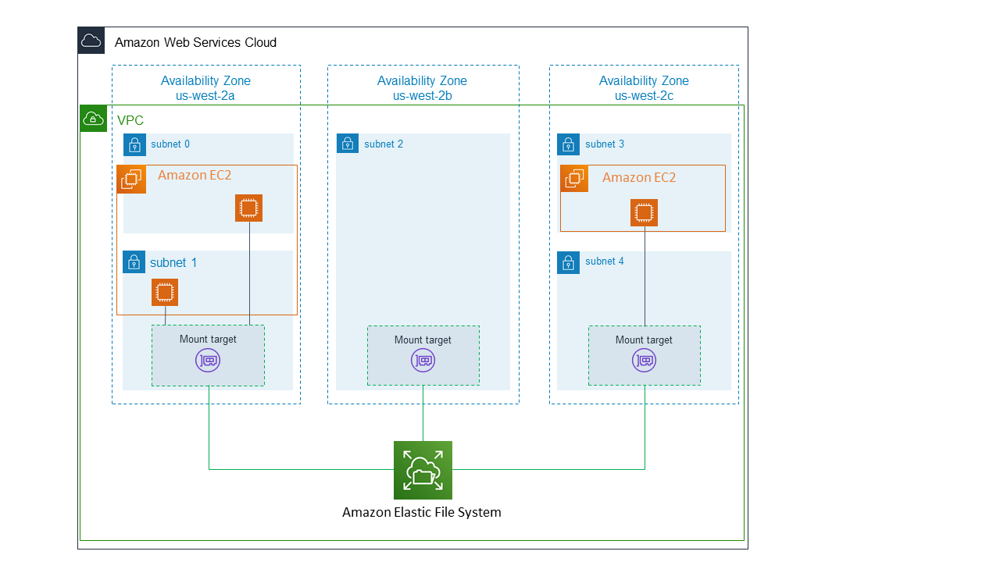
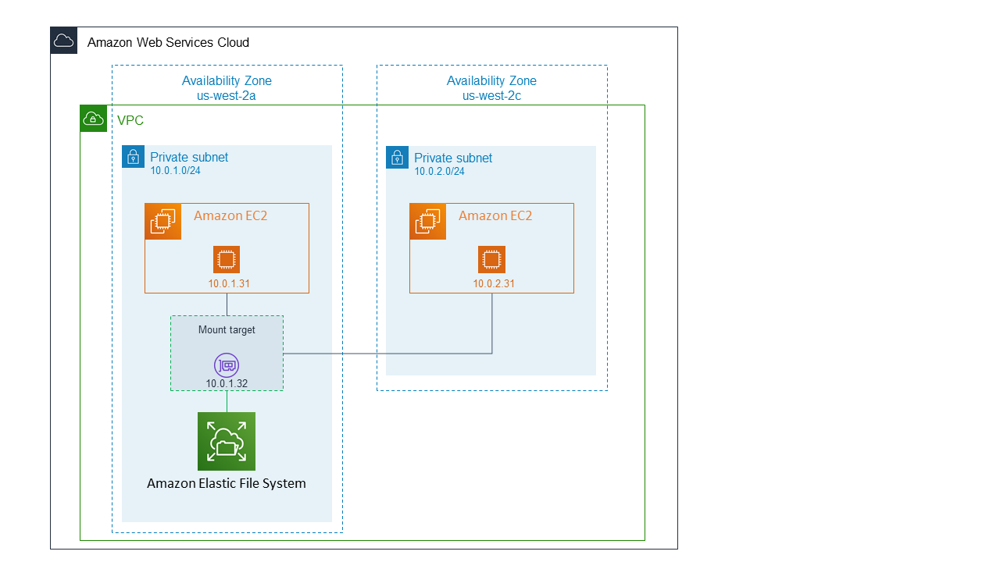
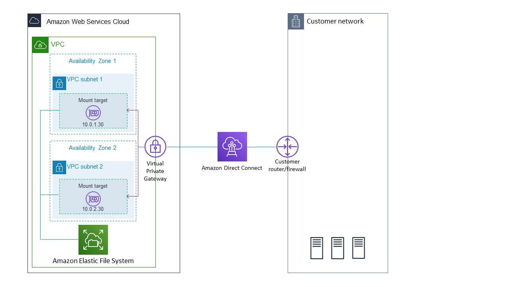
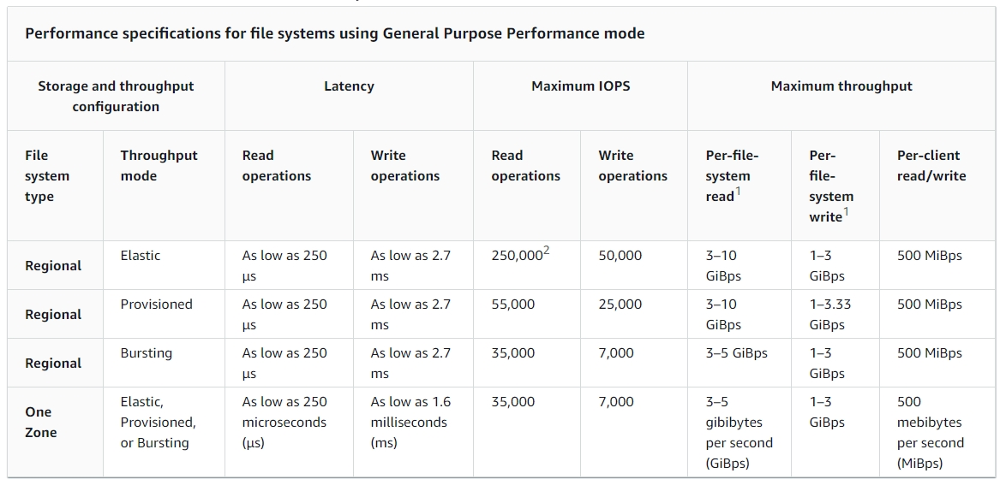
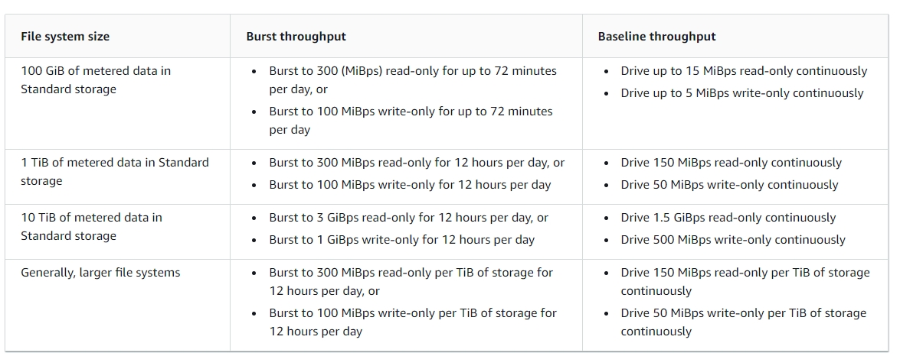

# Overview
+ Amazon Elastic File System (Amazon EFS) provides a simple, serverless, set-and-forget elastic file system for use with AWS Cloud services and on-premises resources.
+ It is built to **scale on demand** to petabytes without disrupting applications,**growing and shrinking automatically** as you add and remove files, eliminating the need to provision and manage capacity to accommodate growth.
+ Amazon EFS has **a simple web services interface** that allows you to create and configure file systems quickly and easily.
+ Amazon EFS supports the **Network File System version 4** (NFSv4.1 and NFSv4.0)protocol
+ Amazon EFS offers a range of storage classes designed for different use cases. These include: 
    + **Standard storage classes** –**EFS Standard and EFS Standard–Infrequent Access** (Standard–IA), which offer **multi-AZ** resilience and the highest levels of durability and availability.
    + **One Zone storage classes** –**EFS One Zone and EFS One Zone–Infrequent Access (EFS One Zone–IA)**, which offer customers the choice of **additional savings** by choosing to save their data in **a single AZ**.
+ EFS file systems can **grow to petabyte** scale, drive high levels of throughput, and allow **massively parallel access** from compute instances to your data.
+ Amazon EFS supports **authentication, authorization, and encryption capabilities** to help you meet your security and compliance requirements. 
+ Amazon EFS is designed to provide the throughput, IOPS, and low latency needed for a broad range of workloads.
# Amazon EFS: How it works
+ To access your Amazon EFS file system in a VPC, you **create one or more mount targets** in the VPC. 
+ For file systems using Standard storage classes, you can create **a mount target in each availability Zone** in the AWS Region.
+ For file systems using One Zone storage classes, you create **only a single mount target** that is **in the same Availability Zone as the file system**.
+ A *mount target* provides an IP address for an NFSv4 endpoint at which you can mount an Amazon EFS file system.
+ You mount your file system using its **Domain Name Service (DNS) name**, which **resolves to the IP address of the EFS mount target** in the same Availability Zone as your EC2 instance.
+ Amazon EFS **lifecycle management** automatically manages cost-effective file storage for your file systems. When enabled, lifecycle management migrates files that haven't been accessed for a set period of time to an infrequent access storage class, Standard-IA or One Zone-IA. 
+ Amazon EFS with Standard storage classes

+ Amazon EFS with One Zone storage classes

+ Amazon EFS with AWS Direct Connect and AWS Managed VPN

#  Transferring data into and out of Amazon EFS
+ You can use **AWS Transfer Family and AWS DataSync** to transfer data into and out of your Amazon EFS file systems.
+ You can also use DataSync to transfer files between two EFS file systems, including file systems **in different AWS Regions** and file systems **owned by different AWS accounts**.
+ Using Transfer Family, you can securely **enable third parties** such as your vendors, partners, or customers **access to your files over the supported protocols at scale globally**, without needing to manage any infrastructure. 
+ The Transfer Family server and your Amazon EFS file system are **located in the same AWS Region**.
# Managing Amazon EFS file systems
+ File system management tasks refer to **creating and deleting file systems** and **managing tags**,**file system backups, access, and network accessibility** with mount targets of existing file systems.
## [Managing mount targets](https://docs.aws.amazon.com/efs/latest/ug/manage-fs-access.html)
+ As long as you have one mount target in an Availability Zone, the EC2 instances launched in any of its subnets can **share the same mount target**.
+ At a minimum, you should **create a mount target in each Availability Zone** from which you want to access the file system.
+ To avoid application disruption, **stop applications and unmount the file system** before deleting the mount target.
+ you can create mount targets for the file system in **one VPC at a time**. If you want to access the file system from another VPC, first delete the mount targets from the current VPC. Then create new mount targets in another VPC.
+ When you create a mount target, you associate **security groups** with the mount target.
## [Managing ](https://docs.aws.amazon.com/efs/latest/ug/manage-fs-access.html)EFS storage classes
| Storage class | Designed for | Durability |(designed for)Availability | Availability zones |Other considerations |
| --- | --- | --- | --- | --- | --- |
| EFS Standard | Frequently accessed data requiring the highest durability and availability. | 99.999999999% (11 9's) | 99.99% | >=3 | None |  
| EFS Standard–Infrequent Access (IA) | Long lived, infrequently accessed data requiring the highest durability and availability.  | 99.999999999% (11 9's) | 99.99%  | >=3  | Per GB retrieval fees apply. |  
| EFS One Zone | Frequently accessed data that doesn’t require highest levels of durability and availability. | 99.999999999% (11 9's)* | 99.90% | 1  | Not resilient to the loss of the Availability Zone.  | 
| EFS One Zone-IA | Long lived, infrequently accessed data that doesn’t require highest levels of durability and availability. | 99.999999999% (11 9's)*  | 99.90%  | 1  | Not resilient to the loss of the Availability Zone. Per GB retrieval fees apply. | 

## Managing access to encrypted file systems
+ Amazon EFS supports two forms of encryption for file systems, **encryption in transit and encryption at rest**.
+ **Any key management you need to perform is only related to encryption at rest**.
+ Amazon EFS automatically manages the keys for encryption in transit.
+ When you create a file system using encryption at rest, you specify a customer master key (CMK). The CMK can be `aws/elasticfilesystem` (**the AWS managed CMK for Amazon EFS**), or it can be a **CMK that you manage**.
+ **File data**—the contents of your files—is encrypted at rest using the **CMK that you specified** when you created your file system.
+ **Metadata**—file names, directory names, and directory contents—is encrypted by **a key that Amazon EFS manages**.
# Amazon EFS performance
+ Amazon EFS file systems are **distributed** across an unconstrained number of storage servers.
+ This distributed data storage design enables file systems to **grow elastically** to petabyte scale. It also enables **massively parallel access** from compute instances, including Amazon EC2, Amazon ECS, and AWS Lambda, to your data.
+ The Amazon EFS distributed design **avoids the bottlenecks and constraints** inherent to traditional file servers.
+ The **distributed nature** of Amazon EFS file systems **enables high levels of availability, durability, and scalability**.
## Performance modes
+ **General Purpose performance mode**
    + We recommend the General Purpose performance mode for the majority of your Amazon EFS file systems.
    + General Purpose is ideal for latency-sensitive use cases, like **web serving environments, content management systems, home directories, and general file serving**.
    + If you don't choose a performance mode when you create your file system, Amazon EFS selects the General Purpose mode for you by default.
+ **Max I/O performance mode**
    + File systems in the Max I/O mode can scale to **higher levels of aggregate throughput and operations per second**.
    + This scaling is done with a tradeoff of slightly higher latencies for file metadata operations.
    + **Highly parallelized applications** and workloads, such as **big data analysis, media processing, and genomic analysis**, can benefit from this mode.

## Throughput modes
+ **Throughput bursting mode**
    + All EFS file systems,**regardless of size**, can burst to **100 MiB/s** of metered throughput.
    + File systems that have **more than 1 TiB** in the EFS Standard or One Zone storage class can burst to **100 MiB/s per TiB** of data stored in the file system.
    + The portion of **time **that a file system can burst is** determined by its size**. + Amazon EFS uses **a credit system** to determine when file systems can burst.
    + Each file system **earns credits over time at a baseline rate that is determined by the size** of the file system that is stored in the EFS Standard or One Zone storage class.
    + The baseline rate is **50 MiB/s per TiB** of storage
    + Amazon EFS **meters read operations at a one-third the rate** of other operations toward the baseline rate
    + A file system **accumulates burst credits** whenever it is **inactive or driving throughput below** its baseline metered rate+ 

    

+ To calculate the file system size that you need to sustain the level activity that you want： 
    + Identify your throughput needs by looking at your historical usage.
    + Divide this number by 24 hours, 60 minutes, 60 seconds, and 1024 bytes to get the average KiB/second your application required for that day.
    + Calculate the file system size (in GiB) required to sustain this average throughput by dividing the average throughput number (in KiB/s) by the baseline throughput number (50 KiB/s/GiB) that EFS provides.

+ **Throughput Provisioned mode**
+ Provisioned Throughput mode is available for applications with **high throughput** to storage (MiB/s per TiB) ratios, or with requirements greater than those allowed by the Bursting Throughput mode. 
+ By default, we **recommend** that you run your application in the **Bursting Throughput mode**.
# Amazon EFS use cases
+ **Big data and analytics**——Amazon EFS provides the **scale and performance** required for big data applications that **require high throughput to compute nodes** coupled with read-after-write consistency and low-latency file operations.
+ **Media processing workflows**——A strong data consistency model with **high throughput and shared file access** can **cut the time** it takes to perform media processing workflows and consolidate multiple local file repositories into a single location for all users.
+ **Content management and web serving**——Amazon EFS provides a **durable, high throughput file system** for content management systems that store and serve information for a range of applications like websites, online publications, and archives.
+ **Home directories**——Amazon EFS can provide storage for organizations that have many users that need to **access and share common datasets**
# AWS file storage services
+ **Amazon EFS** was the original managed file sharing service in AWS. It is scalable, elastic, cloud native, and fully managed. Amazon EFS supports the NFS protocol. Unlike the other AWS-managed file storage service offerings, you do not need to select a specific storage capacity when you create an Amazon EFS file system. With Amazon EFS, capacity is always dynamically added or removed for you as you add or remove files. Amazon EFS file systems can scale to Petabytes in size depending on your needs.
+ **FSx for Lustre** is an AWS fully managed parallel file system built on Lustre for **high performance computing (HPC) workloads**. When you create an FSx for Lustre file share, you will need select the specific performance and capacity parameters that are most suited for your application requirements.
+ **FSx for Windows File Server** is an AWS fully managed shared file system providing access to **Windows compute environments**. FSx for Windows File Server supports the SMB protocol. FSx for Windows File Server provides seamless integration with Microsoft Active Directory environments for managing access permissions.
+ **FSx for ONTAP** provides fully managed, highly reliable, scalable, high-performing, shared storage for **large organizations employing multi-protocol environments**. FSx for ONTAP supports **Linux, Windows, and MacOS workloads**.
+ With **Amazon FSx for OpenZFS**, you can launch, run, and scale fully managed file systems on AWS that replace the ZFS or other Linux-based file servers you run on premises. Amazon FSx for OpenZFS helps to provide better agility and lower costs.

# Reference
+ [AWS EFS](https://docs.aws.amazon.com/efs/latest/ug/whatisefs.html)
+ [Amazon Elastic File System (Amazon EFS) Primer](https://explore.skillbuilder.aws/learn/course/64/amazon-elastic-file-system-amazon-efs-primer)