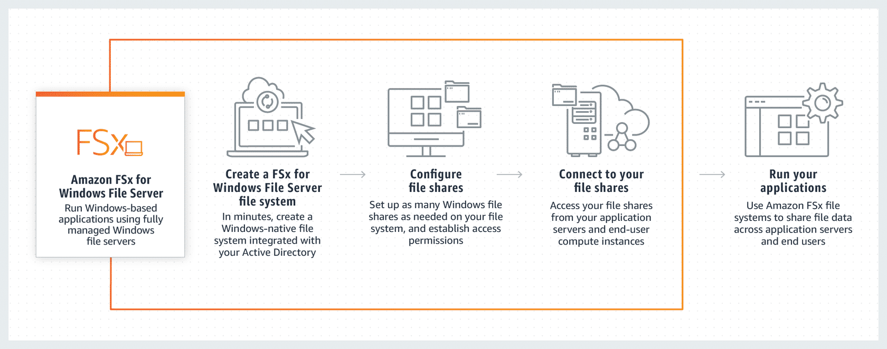
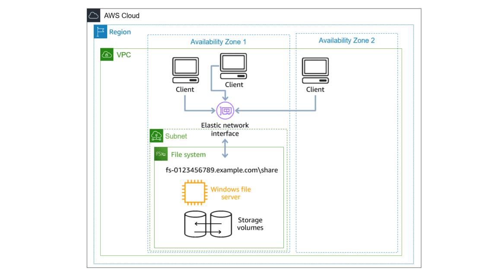
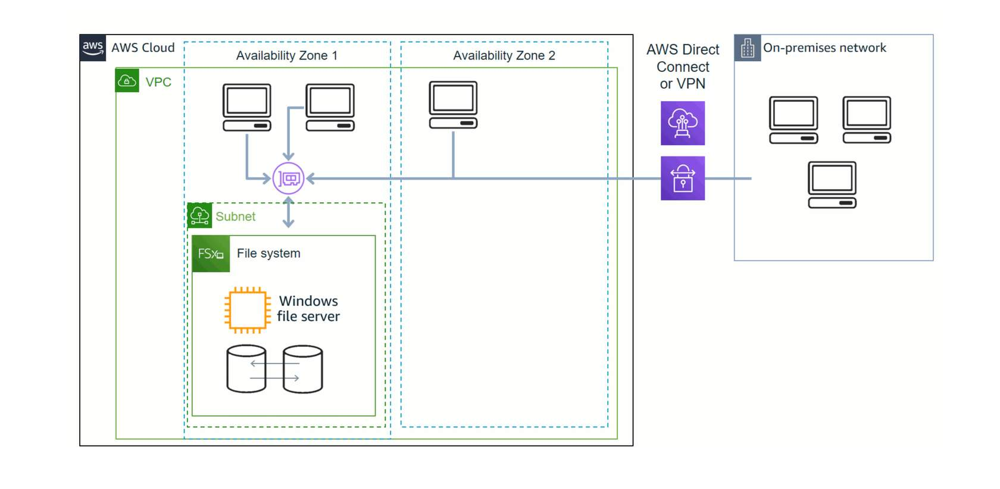
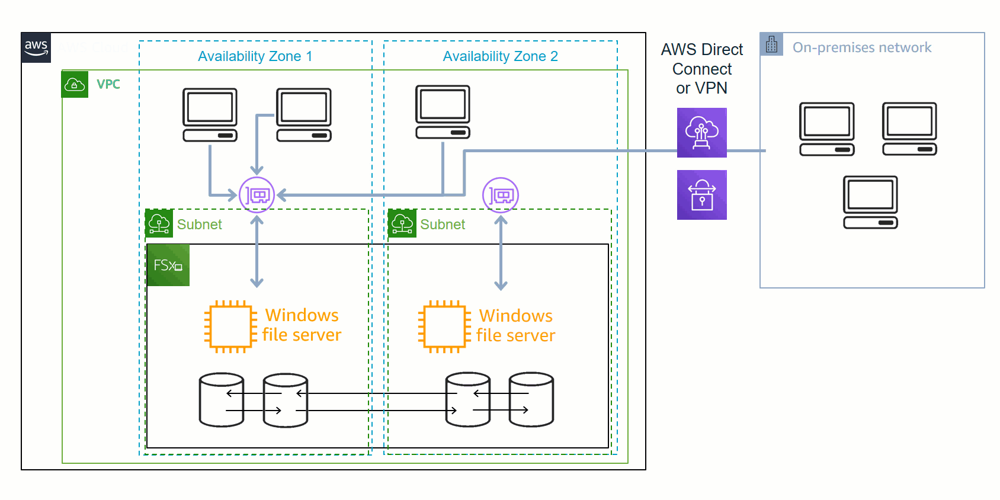
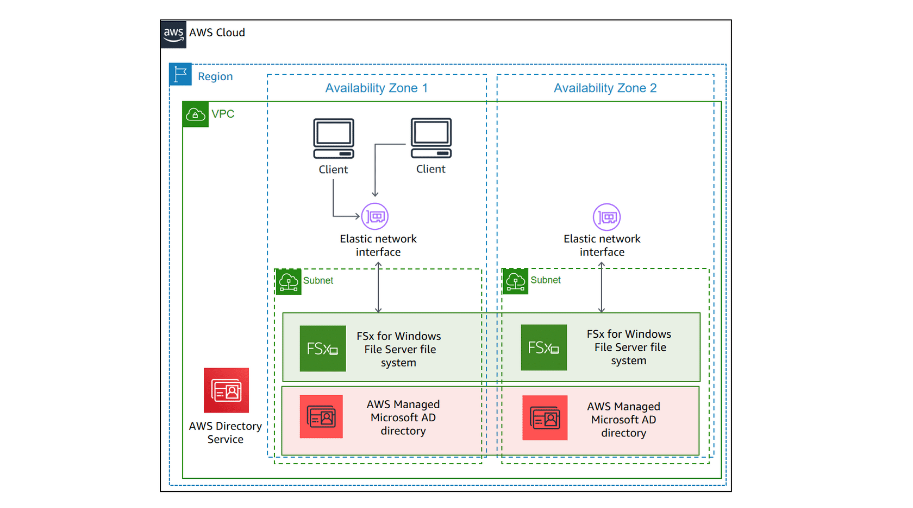
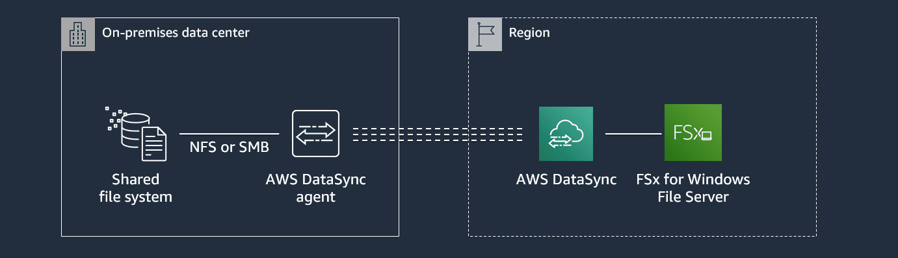
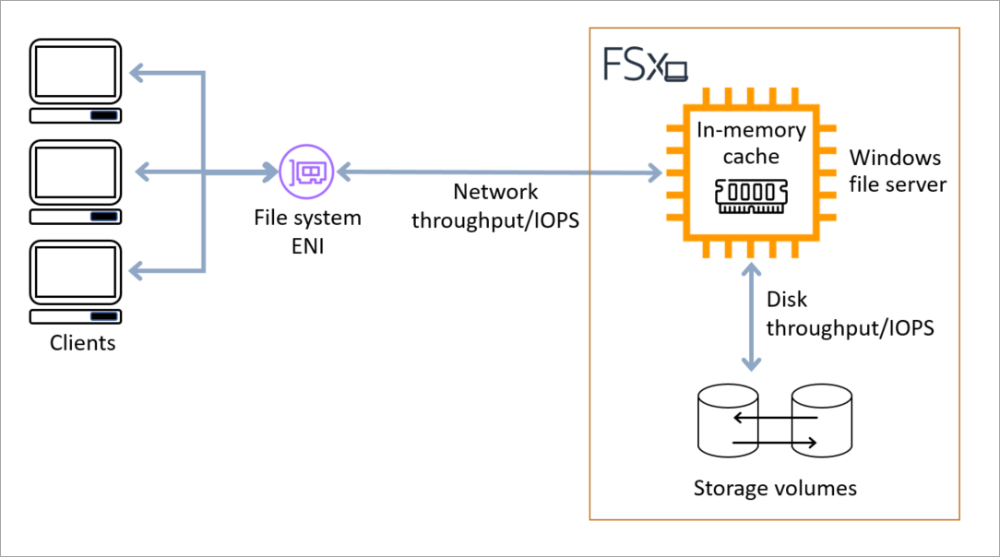

# Overview

+ Amazon FSx for Windows File Server provides **fully managed Microsoft Windows file servers**, backed by a fully native Windows file system.
+ Amazon FSx has native support for **Windows file system features** and for the **industry-standard Server Message Block (SMB) protocol** to access file storage over a network.
+ Windows applications and workloads ideal for Amazon FSx include **business applications, home directories, web serving, content management, data analytics, software build setups, and media processing workloads**.
+  As a fully managed service, FSx for Windows File Server eliminates the administrative overhead of managing file servers and storage volumes. FSx for Windows File Server automatically keeps your Windows software up to date, detects and addresses hardware failures, and performs backups.
# FSx for Windows File Server benefits
+ Native Windows compatibility
+ Fast and flexible performance
+ High availability and durability
+ Security and compliance
+ Broad accessibility
# Practical Use Cases for FSx for Windows File Server
+ home directories
+ Microsoft SQL Server failover clusters
+ web serving and content management
+ media processing workloads
+ business applications
+ data analytics
# Resources
+ The primary resources in Amazon FSx are *file systems* and *backups*.
+ **A file system** is where you store and access your files and folders. A file system is made up of one or more Windows file servers and storage volumes. 
    +  Your file system is accessible by its Domain Name System (DNS) name.
    + A file system consists of a **Windows file server** and **storage volumes**.
    + The Windows file server serves data over the network to your users accessing the file system.
    + The storage volumes (or disks) host your file system data.
    + You can choose HDD or SSD storage volumes for your file system.
    + HDD storage is appropriate for a broad spectrum of workloads, including **home directories and content management systems**.
    + SSD storage is ideal for **high-performance and latency-sensitive workloads**, including databases, media processing workloads, and data analytics applications. 
+ **Amazon FSx for Windows File Server backups** are file-system-consistent, highly durable, and incremental. 
+ **A Windows file share** is a specific folder (and its subfolders) within your file system that you make accessible to your compute instances with SMB 
    + File shares are accessed using either the **file system's DNS name or DNS aliases** that you associate with the file system. 
    + You can access your shares from all Windows versions starting from Windows Server 2008 and Windows 7, and also from current versions of Linux.
    + You can access your file shares from on-premises compute instances using AWS Direct Connect or AWS VPN
+ **Elastic network interface** 
    + An elastic network interface is a resource that allows client compute instances, whether they reside in AWS or on premises, to connect to your file systems.
    + The network interface **resides in the Amazon Virtual Private Cloud (Amazon VPC)** that you associate with your file system.
    + The DNS name of your file system maps to the **private IP address of the file system's elastic network interface** in your Amazon VPC. 

# Security and data protection
+ It **automatically encrypts data at rest** (for both file systems and backups) using keys that you manage in **AWS Key Management Service** (AWS KMS)
+ Amazon FSx provides access control **at the file and folder level with Windows access control lists**(ACLs).
+ It provides access control at the **file system level** using Amazon Virtual Private Cloud (Amazon VPC) **security groups**.
+ In addition, it provides access control at the **API level using AWS Identity and Access Management (IAM)** access policies.
+ Users accessing file systems are authenticated with **Microsoft Active Directory**.
+ Additionally, it protects your data by taking **highly durable backups** of your file system automatically on a **daily basis** and allows you to take additional backups at any point.
# Availability and durability
+ Amazon FSx for Windows File Server offers file systems with two levels of availability and durability. **Single-AZ** files ensure high availability within a single Availability Zone (AZ) by automatically detecting and addressing component failures.

+ In addition, **Multi-AZ** file systems provide high availability and failover support across multiple Availability Zones by **provisioning and maintaining a standby file server in a separate Availability Zone** within an AWS Region.

# Supported clients
+ Amazon FSx supports connecting to your file system from a wide variety of compute instances and operating systems：
    + Amazon Elastic Compute Cloud (Amazon EC2) instances, including **Microsoft Windows, Mac, Amazon Linux** and Amazon Linux 2 instances
    + Amazon Elastic Container Service (Amazon ECS) containers
    + WorkSpaces instances 
    + Amazon AppStream 2.0 instances
    + VMs running in VMware Cloud on AWS environments
# Supported access methods
+ Amazon FSx for Windows File Server provides a **Domain Name System (DNS) name** for every file system. You access your Amazon FSx for Windows File Server file system by **mapping a drive letter on your compute instance to your Amazon FSx file share using this DNS name**. 
+ You can also enable access to Amazon FSx from DNS names other than the default DNS name that Amazon FSx creates by **registering aliases** for your Amazon FSx for Windows File Server file systems. 
+ DNS aliases allow you to use **meaningful names** that make it easier to administer tools and applications to connect to your Amazon FSx file systems. 
+ Amazon FSx for Windows File Server supports the use of Microsoft **Distributed File System (DFS) Namespaces**. 
+ You can use DFS Namespaces to organize file shares on multiple file systems into one common folder structure (a namespace) that you use to access the entire file dataset.
+ You can use a name in your DFS Namespace to access your Amazon FSx file system by **configuring its link target to be the file system's DNS name**.

# Accessing Amazon FSx for Windows File Server file systems from on-premises
+ Amazon FSx for Windows File Server supports the use of **AWS Direct Connect or AWS VPN to access your file systems from your on-premises** compute instances.
+ With support for AWS Direct Connect, Amazon FSx for Windows File Server enables you to access your file system over a dedicated network connection from your on-premises environment.
+ With support for AWS VPN, Amazon FSx for Windows File Server enables you to access your file system from your on-premises devices over a secure and private tunnel.
+ Amazon FSx for Windows File Server also supports the use of **Amazon FSx File Gateway** to provide low latency, seamless access to your in-cloud Amazon FSx for Windows File Server file shares from your on-premises compute instances.
# Accessing Amazon FSx for Windows File Server File Systems from Another VPC, Account, or AWS Region
+ You can use **VPC peering or transit gateways** to access your Amazon FSx for Windows File Server file system from compute instances in a different VPC, AWS account, or AWS Region from that associated with your file system.
+ When you use a VPC peering connection or transit gateway to connect VPCs, **compute instances that are in one VPC** can access Amazon FSx file systems in another VPC.
+ This access is possible even if the VPCs belong to different accounts, and even if the VPCs reside in different AWS Regions.
+ A *VPC peering connection* is a networking connection between two VPCs that you can use to route traffic between them using private IPv4 or IP version 6 (IPv6) addresses. 
+ A *transit gateway* is a network transit hub that you can use to interconnect your VPCs and on-premises networks. 
# Optimizing costs
+ You can pick the **storage type (HDD or SSD)** to achieve the right balance of cost and performance needs for your application
+ You can configure your file system's **storage and throughput** capacities independently.
# Working with Microsoft Active Directory
+ When you create a file system with Amazon FSx, you **join it to your Active Directory domain** to provide user authentication and file-level and folder-level access control.
+ Your users can then **use their existing user identities in Active Directory** to authenticate themselves and access the Amazon FSx file system.
+ Users can also use their existing identities to control access to individual files and folders. 
+ If your organization is using **AWS Managed Microsoft AD** to manage identities and devices, we recommend that you integrate your Amazon FSx file system with AWS Managed Microsoft AD
+ Your organization might manage identities and devices on a **self-managed Active Directory** (on-premises or in the cloud). If so, you can join your Amazon FSx file system directly to your existing self-managed AD domain. 

# [Migrating to Amazon FSx](https://docs.aws.amazon.com/fsx/latest/WindowsGuide/migrate-to-fsx.html)
+ To **migrate your existing files** to Amazon FSx for Windows File Server file systems, we recommend using **AWS DataSync**
+ Migrating file share configurations to Amazon FSx
+ Migrating DNS configuration to use Amazon FSx: With **DNS aliases**, you can continue to use your existing DNS names to access data stored on Amazon FSx when migrating file system storage from on-premises to Amazon FSx.

+ As an alternative solution, you can use **Robust File Copy, or Robocopy**. Robocopy is a command-line directory and file replication command set for Microsoft Windows.
# Protecting your data
+ **Native Amazon FSx backups** support your **backup retention and compliance needs** within Amazon FSx. 
+ With Amazon FSx, backups are **file-system-consistent, highly durable, and incremental.**
+ To ensure file system consistency, Amazon FSx uses the **Volume Shadow Copy Service** (VSS) in Microsoft Windows.
+ To ensure high **durability**, Amazon FSx stores backups in **Amazon Simple Storage Service (Amazon S3)**.
+ **AWS Backup** backups of your Amazon FSx file systems are part of a centralized and automated backup solution across AWS services in the cloud and on premises.
+ **Windows shadow copies** enable your users to easily undo file changes and compare file versions by restoring files to previous versions. 
    + A Microsoft Windows *shadow copy* is a **snapshot of a Windows file system at a point in time**.
    + With shadow copies enabled, your users can easily **view and restore individual files or folders from an earlier snapshot** in Windows File Explorer. 
    + Shadow copies are **stored alongside your file system's data**, and therefore consume the file system's storage capacity.
    + All shadow copies stored in your file system are **included in backups** of your file system.
+ **AWS DataSync scheduled replication** of your Amazon FSx file system to a second file system provides data protection and recovery.
# Performance
+ File system performance is measured by its **latency, throughput, and I/O operations per second (IOPS)**
## Latency
+ Amazon FSx for Windows File Server file servers employ a fast, in-memory cache to achieve consistent **sub-millisecond latencies** for actively accessed data.
+ For data that is not in the in-memory cache, that is, for file operations that need to be served by performing I/O on the underlying storage volumes: 
    + Amazon FSx provides sub-millisecond file operation latencies with solid state drive (SSD) storage
    + and single-digit millisecond latencies with hard disk drive (HDD) storage.
## Throughput and IOPS
+ Amazon FSx file systems provide up to **multiple GB/s of throughput and hundreds of thousands of IOPS**.
+ The specific amount of throughput and IOPS that your workload can drive on your file system **depends on the throughput capacity and storage capacity** configuration of your file system, along with the nature of your workload, including the size of the active working set.

+ Your file system's storage provides the following levels of disk throughput and IOPS:
    | Storage type | Disk throughput (MB/s per TiB of storage) | Disk IOPS (IOPs per TiB of storage) | 
    | --- | --- | --- |
    | SSD | 750 | 3,000 | 
    | HDD | 12 baseline; 80 burst (up to a max. of 1 GB/s per file system) | 12 baseline; 80 burst | 
# Pricing structure for FSx for Windows File Server
+ Deployment type (Single-AZ or Multi-AZ)
+ Storage type (SSD or HDD)
+ Storage capacity (priced per GB-month)
+ Throughput capacity (priced per MBps-month)

# Deploying a File System
## Requirements to create a file system
+ An AWS account with permissions to create a file system
+ An Active Directory service for user access control and authentication
+ An Amazon EC2 instance running Microsoft Windows Server in the VPC that you want to associate with your file system
# Reference
+ [Amazon FSx for Windows File Server](https://docs.aws.amazon.com/fsx/latest/WindowsGuide/what-is.html)
+ [Amazon FSx for Windows File Server Primer](https://explore.skillbuilder.aws/learn/course/80/amazon-fsx-for-windows-file-server-primer)
