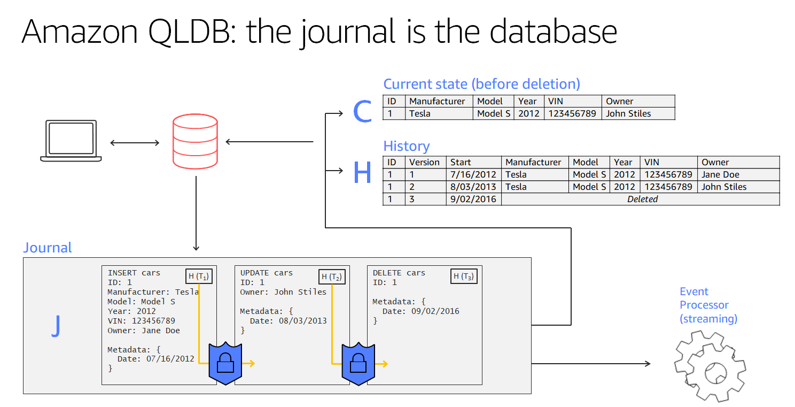
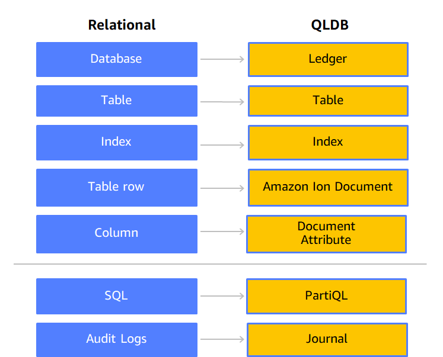

# Overview
+ Amazon Quantum Ledger Database (Amazon QLDB) is a fully managed **ledger database** that provides a transparent, immutable, and cryptographically verifiable transaction log owned by a central trusted authority. 
+ You can use Amazon QLDB to track all application data changes, and maintain a complete and verifiable history of changes over time.
+ Ledgers are typically used to **record a history of economic and financial activity in an organization**.
+ Ledger applications are often implemented using custom audit tables or audit trails created in relational databases.
+ Amazon QLDB is a new class of database that helps eliminate the need to engage in the complex development effort of building your own ledger-like applications. With QLDB, the history of changes to your data is immutable—it can't be overwritten or altered in place
+ QLDB is fully managed, **serverless**, and highly available. The service **automatically scales to support the demands** of your application, and you don't need to provision instances or capacity. Multiple copies of your data are **replicated within an Availability Zone and across Availability Zones in an AWS Region**.
# Journal first
+ QLDB uses an **immutable transactional log**, known as a journal. The journal is **append-only** and is composed of a sequenced and hash-chained set of blocks that contain your committed data.
+ In Amazon QLDB, the **journal is the core of the database**. Structurally similar to a transaction log, the journal is an immutable, append-only data structure that stores your application data along with the associated metadata.
+ QLDB uses the journal to determine the current state of your ledger data by materializing it into queryable, user-defined tables. 

+ In this example, an application connects to a ledger and runs transactions that insert, update, and delete a document into a table named cars.
+ The data is first written to the journal in sequenced order.
+ Then the data is materialized into the table with built-in views. These views let you query both the current state and the complete history of the car, with each revision assigned a version number.
+ You can also export or stream data directly from the journal.
# Compare Relational database and QLDB

# Core concepts and terminology in Amazon QLDB
## QLDB data object model
+ **Ledger**: Your first step is to create a ledger, which is the primary AWS resource type in QLDB.
+  **Journal and tables**
    + To start writing data in a QLDB ledger, you first create a table with a basic CREATE TABLE statement.
    + Ledger data consists of revisions of documents that are committed to the ledger's journal.
+ **Documents**
    + Tables consist of revisions of QLDB documents, which are datasets in Amazon Ion struct format.
+ **System catalog**
    + Each ledger also provides a system-defined catalog resource that you can query to list all of the tables and indexes in a ledger.
## Data storage
+ **Journal storage** – The disk space that is used by a ledger's journal. The journal is append-only and contains the complete, immutable, and verifiable history of all the changes to your data.
+ **Indexed storage** – The disk space that is used by a ledger's tables, indexes, and indexed history. Indexed storage consists of ledger data that is optimized for high-performance queries.
## QLDB API model
+ **Amazon QLDB – The QLDB resource management API** (also known as the control plane). This API is used only for managing ledger resources and for non-transactional data operations.
+ **Amazon QLDB Session – The QLDB transactional data API**. You can use this API to run data transactions on a ledger with **PartiQL statements**. 
# Accessing Amazon QLDB
+ Using the AWS Management Console
+ Using the AWS CLI (management API only)
+ Using the Amazon QLDB shell (data API only)
+ Using the API： write application code with a QLDB driver or an AWS SDK to interact with your ledger using the APIs
# Amazon QLDB concurrency model
+ QLDB supports SQL-like query capabilities, and **delivers full ACID transactions**
+ In addition, QLDB data items are documents, delivering schema flexibility and intuitive data modeling.
## Optimistic concurrency control
+ In QLDB, concurrency control is implemented using **optimistic concurrency control (OCC)**. OCC operates on the principle that multiple transactions can frequently complete without interfering with each other.
+ Using OCC, transactions in QLDB **don't acquire locks on database resources** and **operate with full serializable isolation**. QLDB runs concurrent transactions in a serial manner, such that it produces the same effect as if those transactions were started serially.
+ Before committing, each transaction performs a validation check to ensure that no other committed transaction has modified the data that it's accessing. If this check reveals conflicting modifications, or the state of the data changes, the committing transaction is rejected. However, the transaction can be restarted.
## Using indexes to avoid full table scans
+ In QLDB, every PartiQL statement (including every SELECT query) is processed in a transaction and is subject to a transaction timeout limit.
+ As a best practice, you should **run statements with a WHERE predicate clause that filters on an indexed field or a document ID**. QLDB requires an equality operator on an indexed field to efficiently look up a document; for example, WHERE indexedField = 123 or WHERE indexedField IN (456, 789).
+ Without this indexed lookup, QLDB needs to do a full table scan when reading documents. This can** cause query latency and transaction timeouts**, and also increases the chances of an OCC conflict with competing transactions.
## Insertion OCC conflicts
+ OCC conflicts can include documents that are newly inserted—not only documents that previously existed. Consider the following diagram, in which two concurrent users (Alice and Bob) are working with the same table in a ledger. They both want to insert a new document only under the condition that a predicate value does not yet exist.
## Making transactions idempotent（幂等）
+ The insert transaction in the previous section is also an example of an idempotent transaction. In other words, running the same transaction multiple times produces identical results
# Streaming journal data from Amazon QLDB
+ Amazon QLDB uses an immutable transactional log, known as a journal, for data storage. The journal tracks every change to your committed data and maintains a complete and verifiable history of changes over time.
+ You can create a stream in QLDB that captures every document revision that is committed to your journal and delivers this data to **Amazon Kinesis Data Streams** in near-real time.
+ A QLDB stream writes your data to Kinesis Data Streams in three types of records: **control, block summary, and revision details**.
# Benefits of Amazon QLDB
+ **Immutable and Transparent** : Amazon QLDB has a built-in, immutable journal that stores an accurate and sequenced entry of every data change.
+ **Cryptographically Verifiable**: Amazon QLDB uses a cryptographic hash function (SHA-256) to generate a secure output file of your data’s change history, known as a digest. The digest acts as proof of your data’s change history, allowing you to look back and validate the integrity of your data changes.
+ **Serverless**: Because Amazon QLDB is serverless, you don’t have to worry about provisioning capacity or configuring read and write limits. 
# Views in Amazon QLDB:
+ **User** view: Shows the latest non-deleted revision of your application-defined data only. This is the default view in QLDB.
+ **Committed** view: Shows the latest non-deleted revision of both your application-defined data and the system-generated metadata. This is the full system-defined table that corresponds directly to your user table.
+ **History** view: Shows the revisions from the system-defined view of your table. This view includes both your data and the associated metadata in the same schema as the committed view.

# Reference
+ [Amazon QLDB](https://docs.aws.amazon.com/qldb/latest/developerguide/what-is.html)
+ [Amazon Quantum Ledger Database (QLDB) Service Primer](https://explore.skillbuilder.aws/learn/course/466/play/1335/amazon-quantum-ledger-database-qldb-service-primer)