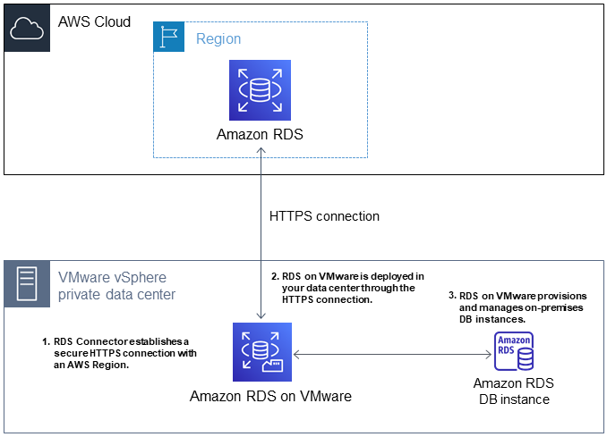
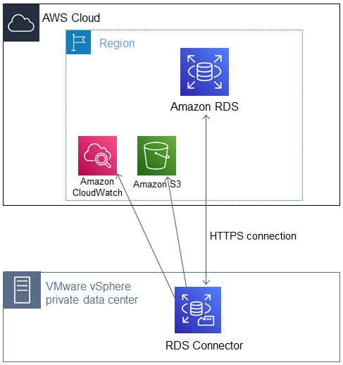
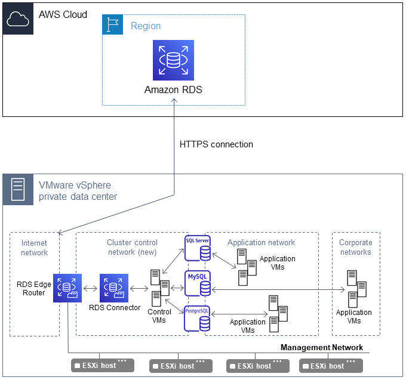
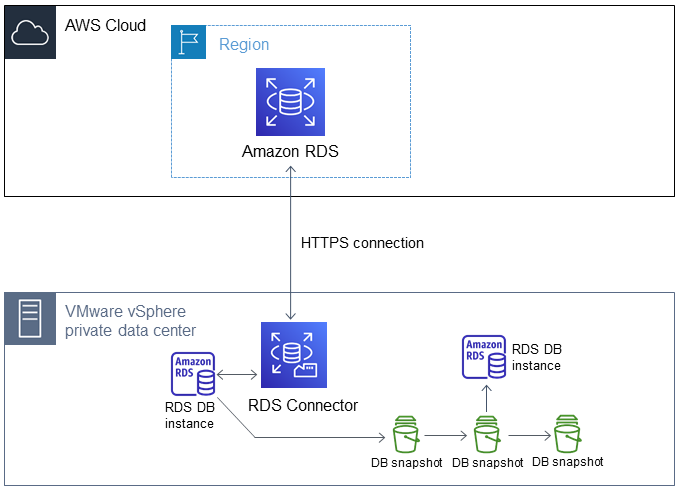

# Overview
+ Amazon Relational Database Service (Amazon RDS) is a web service that makes it **easier to set up, operate, and scale a relational database** in the AWS Cloud. It provides cost-efficient, resizable capacity for an industry-standard relational database and manages common database administration tasks
+ Amazon RDS **doesn't provide shell access** to DB instances.
+ Amazon RDS currently supports the **Db2， MySQL, MariaDB, PostgreSQL, Oracle, and Microsoft SQL Server DB** engines
+ You can get **high availability** with **a primary instance and a synchronous secondary instance** that you can fail over to when problems occur.
+ You can also use MariaDB, Microsoft SQL Server, MySQL, Oracle, and PostgreSQL **read replicas** to increase read scaling.
# DB instances
+  A *DB instance* is **an isolated database environment** in the AWS Cloud.
+ Your DB instance can contain **multiple user-created databases**. 
+ Each DB instance runs a *DB engine*, each DB engine has a set of parameters in a **DB parameter group** that control the behavior of the databases that it manages.
+ You can run your DB instance in several Availability Zones, an option called a **Multi-AZ deployment**. By launching instances in separate Availability Zones, you can protect your applications from the failure of a single location. 
    + When you choose this option, Amazon **automatically provisions and maintains a secondary standby DB instance** in a different Availability Zone.
    + Your primary DB instance is **synchronously replicated** across Availability Zones **to the secondary instance**. 
+ A *security group* controls the access to a DB instance.
+ Each DB instance has a DB instance identifier, the DB instance identifier must be unique for that customer in an AWS Region
+ The identifier is used as **part of the DNS hostname** allocated to your instance by RDS.
+ The **DB instance class** determines the computation and memory capacity of an Amazon RDS DB instance.
+ Amazon RDS supports three types of instance classes: **Standard, Memory Optimized, and Burstable Performance**.
+ Amazon RDS use **Amazon Elastic Block Store (Amazon EBS)** volumes for database and log storage
## Instance Storage
+ DB instance storage comes in three types: **Magnetic, General Purpose (SSD), and Provisioned IOPS (PIOPS)**
+ General Purpose SSD – General Purpose SSD volumes offer cost-effective storage that is ideal for a broad range of workloads 
    + Baseline I/O performance for General Purpose SSD storage is **3 IOPS for each GiB**, with a **minimum of 100 IOPS.**
    + This relationship means **that larger volumes have better performance**.
    + Volumes below 1 TiB in size also have ability to burst to 3,000 IOPS for extended periods of time. Burst is not relevant for volumes above 1 TiB. Instance I/O credit balance determines burst performance.
+ Provisioned IOPS – Provisioned IOPS storage is designed to meet the needs of **I/O-intensive workloads**, particularly database workloads, that require low I/O latency and consistent I/O throughput. 
    + Provisioned IOPS storage is optimized for **online transaction processing (OLTP)** workloads that have consistent performance requirements. 
    + When you create a DB instance, you specify the IOPS rate and the size of the volume.
    + The ratio of IOPS to allocated storage (in GiB) must be at least 0.5 (1.0 on RDS for SQL Server) and not more than 50
    + For production OLTP use cases, we recommend that you use **Multi-AZ deployments** for enhanced fault tolerance with **Provisioned IOPS storage** for fast and predictable performance.
    + You can also use Provisioned IOPS SSD storage with **read replicas for MySQL, MariaDB or PostgreSQL**.
+ Magnetic – Amazon RDS also supports magnetic storage for **backward compatibility**.  
    + Doesn't allow you to scale storage when using the SQL Server database engine.
    + Doesn't support storage autoscaling.
    + Doesn't support elastic volumes.
    + Limited to a maximum size of 3 TiB.
    + Limited to a maximum of 1,000 IOPS.
+ The following system-related activities consume I/O capacity and might reduce database instance performance while in progress: 
    + Multi-AZ standby creation
    + Read replica creation
    + Changing storage types
+ **Database workload** might reduce database instance performance: 
    + The throughput limit of the underlying instance type is reached.
    + Queue depth is consistently less than 1 because your application is not driving enough I/O operations.
    + You experience query contention in the database even though some I/O capacity is unused.
## Configuring an Amazon RDS DB instance
+ You can configure a DB instance with **an option group and a DB parameter group**. 
+ An *option group* **specifies features**, called options, that are available for a particular Amazon RDS DB instance.
+ A *DB parameter group* acts as **a container for engine configuration values** that are applied to one or more DB instances.
+ By using **Amazon RDS Proxy**, you can allow your applications to pool and share database connections to improve their ability to scale. 
    + RDS Proxy makes applications more resilient to database failures by automatically connecting to a standby DB instance while preserving application connections.
    + RDS Proxy also enables you to enforce AWS Identity and Access Management (IAM) authentication for databases, and securely store credentials in AWS Secrets Manager.
+ Working with option groups 
    + Some DB engines offer additional features that make it easier to manage data and databases, and to provide additional security for your database. Amazon RDS **uses option groups to enable and configure these features**.
    + An *option group* can specify features, called options, that are available for a particular Amazon RDS DB instance.
    + Options can have **settings that specify how the option works**.
    + Two types of options, **persistent and permanent**
        + Persistent options can't be removed from an option group while DB instances are associated with the option group. 
        + Permanent options, such as the TDE option for Oracle Advanced Security TDE, can **never be removed** from an option group
+ Working with DB parameter groups 
    + A *DB parameter group* acts as a **container for engine configuration values** that are applied to one or more DB instances.
## Managing a DB instance
+ stop
    + You can stop and start DB instances that are running the following engines: 
        + Db2
        + MariaDB
        + Microsoft SQL Server
        + MySQL
        + Oracle
        + PostgreSQL
    + Stopping and starting a DB instance is supported for all DB instance classes, and in all AWS Regions.
    + When you stop a DB instance it **retains** its ID, Domain Name Server (DNS) endpoint, parameter group, security group, and option group. When you start a DB instance, it has the **same configuration** as when you stopped it.
    + If you stop a DB instance that has a public IP address, Amazon RDS **releases its public IP address**. When the DB instance is restarted, it has a different public IP address.
    + You can't stop a DB instance that has a read replica, or that is a read replica
    + You can't stop an Amazon RDS for **SQL Server DB instance in a Multi-AZ** configuration.
    + You **can't modify** a stopped DB instance.
    + You **can't delete an option group** that is associated with a stopped DB instance.
    + You **can't delete a DB parameter group** that is associated with a stopped DB instance.
+ Working with read replicas 
    + Amazon RDS uses the **MariaDB, Microsoft SQL Server, MySQL, Oracle, and PostgreSQL DB** engines' built-in replication functionality to create a special type of DB instance called a read replica from a source DB instance
    + The source DB instance becomes the primary DB instance. Updates made to the primary DB instance are **asynchronously copied to the read replica**. 
    + You can **reduce** the load on your primary DB instance by routing read queries from your applications to the read replica.
    + The read replica operates as a DB instance that allows only **read-only** connections. 
    + In some cases, a read replica resides in a **different AWS Region** from its primary DB instance.
    + If you delete a source DB instance without deleting its read replicas in the same AWS Region, each read replica is **promoted to a standalone DB instance.** 
    
    | Feature or behavior | MySQL and MariaDB | Oracle | PostgreSQL | SQL Server |
    | --- | --- | --- | --- | --- |
    | What is the replication method? | Logical replication. | Physical replication. | Physical replication. | Physical replication. |
    | How are transaction logs purged? | RDS for MySQL and RDS for MariaDB keep any binary logs that haven't been applied. If a primary DB instance has no cross-Region read replicas, Amazon RDS for Oracle keeps a minimum of two hours of transaction logs on the source DB instance. Logs are purged from the source DB instance after two hours or after the archive log retention hours setting has passed, whichever is longer. Logs are purged from the read replica after the archive log retention hours setting has passed only if they have been successfully applied to the database. In some cases, a primary DB instance might have one or more cross-Region read replicas. If so, Amazon RDS for Oracle keeps the transaction logs on the source DB instance until they have been transmitted and applied to all cross-Region read replicas. | PostgreSQL has the parameter `wal_keep_segments` that dictates how many write ahead log (WAL) files are kept to provide data to the read replicas. The parameter value specifies the number of logs to keep. | The Virtual Log File (VLF) of the transaction log file on the primary replica can be truncated after it is no longer required for the secondary replicas. The VLF can only be marked as inactive when the log records have been hardened in the replicas. Regardless of how fast the disk subsystems are in the primary replica, the transaction log will keep the VLFs until the slowest replica has hardened it. |
    | Can a replica be made writable? | Yes. You can enable the MySQL or MariaDB read replica to be writable. | No. An Oracle read replica is a physical copy, and Oracle doesn't allow for writes in a read replica. You can promote the read replica to make it writable. The promoted read replica has the replicated data to the point when the request was made to promote it. | No. A PostgreSQL read replica is a physical copy, and PostgreSQL doesn't allow for a read replica to be made writable. | No. A SQL Server read replica is a physical copy and also doesn't allow for writes. You can promote the read replica to make it writable. The promoted read replica has the replicated data up to the point when the request was made to promote it. |
    | Can backups be performed on the replica? | Yes. You can enable automatic backups on a MySQL or MariaDB read replica. | No. You can't create manual snapshots of Amazon RDS for Oracle read replicas or enable automatic backups for them. | Yes, you can create a manual snapshot of a PostgreSQL read replica, but you can't enable automatic backups. | No. You can't create manual snapshots of Amazon RDS for SQL Server read replicas or enable automatic backups for them. |
    | Can you use parallel replication? | Yes. MySQL version 5.6 and later and all supported MariaDB versions allow for parallel replication threads. | Yes. Redo log data is always transmitted in parallel from the primary database to all of its read replicas. | No. PostgreSQL has a single process handling replication. | Yes. Redo log data is always transmitted in parallel from the primary database to all of its read replicas. |
    | Can you maintain a replica in a mounted rather than a read-only state? |  No. |Yes. The primary use for mounted replicas is cross-Region disaster recovery. An Active Data Guard license isn't required for mounted replicas. | No. | No. |
# Multi-AZ
+ Multi-AZ deployments can have **one standby or two standby DB instances**.
+ When the deployment has one standby DB instance, it's called a **Multi-AZ DB instance deployment**. A Multi-AZ DB instance deployment has one standby DB instance that provides failover support, but **doesn't serve read traffic**.
+ When the deployment has **two standby DB instances**, it's called a **Multi-AZ DB cluster deployment**. A Multi-AZ DB cluster deployment has standby DB instances that provide failover support and **can also serve read traffic**.
+ A Multi-AZ DB instance deployment has the following characteristics:
    + There is only one row for the DB instance.
    + The value of Role is **Instance or Primary**.
    + The value of **Multi-AZ** is Yes.
+ A Multi-AZ DB cluster deployment has the following characteristics:
    + There is a cluster-level row with three DB instance rows under it.
    + For the cluster-level row, the value of Role is **Multi-AZ DB cluster**.
    + For each instance-level row, the value of Role is **Writer instance or Reader instance**.
## Multi-AZ DB instance deployments
+ Multi-AZ deployments for **MariaDB, MySQL, Oracle, and PostgreSQL DB** instances use **Amazon's failover technology**. **SQL Server** DB instances use **SQL Server Database Mirroring (DBM) or Always On Availability Groups (AGs)**. 
+ You **can't choose the Availability Zones** for the primary and secondary DB instances in a Multi-AZ DB deployment. Amazon RDS chooses them for you randomly. 
+ In a Multi-AZ deployment, Amazon RDS **automatically provisions and maintains a synchronous standby replica** in a different Availability Zone.
+ The primary DB instance is **synchronously replicated** across Availability Zones to a standby replica
+ The **standby replica can't serve read traffic**.
+ DB instances using Multi-AZ deployments can have increased write and commit **latency compared to a Single-AZ deployment**, due to the synchronous data replication that occurs
+ If you have a DB instance in a Single-AZ deployment and modify it to a Multi-AZ deployment (for engines other than Amazon Aurora), Amazon RDS takes several steps： 
    +  First, Amazon RDS **takes a snapshot** of the primary DB instance from your deployment
    + and then **restores the snapshot into another Availability Zone**.
    + Amazon RDS then **sets up synchronous replication** between your primary DB instance and the new instance.
+ In the event of a planned or unplanned outage of your DB instance, Amazon RDS **automatically switches to a standby replica** in another Availability Zone if you have enabled Multi-AZ 
+ The failover mechanism **automatically changes the Domain Name System** (DNS) record of the DB instance to point to the standby DB instance.
+ The JVM caches DNS name lookups. When the JVM resolves a hostname to an IP address, it caches the IP address for a specified period of time, known as the *time-to-live* (TTL).
+ Because AWS resources use DNS name entries that occasionally change, we recommend that you **configure your JVM with a TTL value of no more than 60 seconds**.
## Multi-AZ DB cluster deployments
+ A Multi-AZ DB cluster deployment is a **semisynchronous**, high availability deployment mode of Amazon RDS with **two readable standby DB instances**. 
+ A Multi-AZ DB cluster has **a writer DB instance and two reader DB instances in three separate Availability Zones in the same AWS Region**.
+ Multi-AZ DB clusters provide high availability, increased capacity for read workloads, and lower write latency when compared to Multi-AZ DB instance deployments.
+ You can import data from an on-premises database to a Multi-AZ DB cluster
+ With a Multi-AZ DB cluster, Amazon RDS replicates data from the writer DB instance to both of the reader DB instances **using the DB engine's native replication capabilities**. When a change is made on the writer DB instance, it's sent to each reader DB instance.
+ Multi-AZ DB cluster deployments use **semisynchronous** replication, which **requires acknowledgment from at least one reader DB instance** in order for a change to be committed. 
+ Reader DB instances act as **automatic failover targets** and also serve read traffic to increase application read throughput. If an outage occurs on your writer DB instance, RDS manages failover to one of the reader DB instances. RDS does this based on which reader DB instance has the **most recent change record**.
+ Multi-AZ DB clusters typically have **lower write latency when compared to Multi-AZ DB instance deployments**. 
### Limitations for Multi-AZ DB clusters
+ Multi-AZ DB clusters support only Provisioned IOPS storage.
+ You can't change a Single-AZ DB instance deployment or Multi-AZ DB instance deployment into a Multi-AZ DB cluster. As an alternative, you can restore a snapshot of a Single-AZ DB instance deployment or Multi-AZ DB instance deployment to a Multi-AZ DB cluster.
+ You can't change a Multi-AZ DB cluster deployment into a Single-AZ DB instance or Multi-AZ DB instance. As an alternative, you can restore a snapshot of a Multi-AZ DB cluster deployment to a Single-AZ DB instance deployment or Multi-AZ DB instance deployment.
+ Multi-AZ DB clusters don't support modifications at the DB instance level because all modifications are done at the DB cluster level.
### Working with Multi-AZ DB cluster read replicas
+ You can also create one or more **DB instance read replicas** from a Multi-AZ DB cluster. DB instance read replicas let you scale beyond the compute or I/O capacity of the source Multi-AZ DB cluster by directing excess read traffic to the read replicas. Currently, you can't create a Multi-AZ DB cluster read replica from an existing Multi-AZ DB cluster.
# Using Amazon RDS Blue/Green Deployments for database updates
+ A blue/green deployment copies a production database environment to a separate, synchronized staging environment.
+ By using Amazon RDS Blue/Green Deployments, you can make changes to the database in the staging environment without affecting the production environment. 
+ When you are ready, you can promote the staging environment to be the new production database environment, with downtime typically under one minute.
# Backing up and restoring an Amazon RDS DB instance
+ Amazon RDS creates and saves automated backups of your DB instance during the **backup window** of your DB instance. 
+ RDS creates **a storage volume snapshot** of your DB instance, backing up the entire DB instance and not just individual databases.
+ Backups are stored in Amazon S3.
+ The first snapshot of a DB instance contains the data for the full DB instance. Subsequent snapshots of the same DB instance are **incremental**, which means that only the data that has changed after your most recent snapshot is saved.
+ If you chose to retain automated backups when you delete a DB instance, the automated backups are saved for the full retention period. If you don't choose **Retain automated backups** when you delete a DB instance, all automated backups are deleted with the DB instance
+ Manual snapshots are not deleted. You can have up to **100 manual snapshots per Region**.
+ For MariaDB, MySQL, Oracle, and PostgreSQL, I/O activity is not suspended on your primary during backup for **Multi-AZ** deployments, because the **backup is taken from the standby**
+ You can set the **backup retention period to between 0 and 35 days**. Setting the backup retention period to **0 disables automated backups**.
+ For the MySQL/MariaDB DB engine, automated backups are only supported for the **InnoDB storage engine**
+ For added disaster recovery capability, you can configure your Amazon RDS database instance to replicate snapshots and transaction logs to a destination AWS Region of your choice.Backup replication is available for RDS DB instances running the following database engines: 
    + Oracle Database version 12.1.0.2.v10 and higher
    + PostgreSQL version 9.6 and higher
    + Microsoft SQL Server version 2012 and higher 
+ Backup replication isn't supported for encrypted SQL Server DB instances.
+ You can copy a snapshot **within the same AWS Region**, you can copy a snapshot **across AWS Regions**, and you can copy shared snapshots.
+ If you copy an encrypted snapshot, the **copy of the snapshot must also be encrypted**.
+ You can also encrypt a copy of an unencrypted snapshot. This way, you can quickly add encryption to a previously unencrypted DB instance.
+ To share an automated DB snapshot, **create a manual DB snapshot** by copying the automated snapshot, and then share that copy.
+ RDS uploads transaction logs for DB instances to Amazon S3 every 5 minutes.You can restore to any point in time within your backup retention period.
+ You cannot restore from a DB snapshot to an existing DB instance; **a new DB instance is created when you restore**.
# Monitoring metrics in an Amazon RDS instance
+ Viewing and responding to **Amazon RDS recommendations**
+ Viewing metrics in the **Amazon RDS console**
+ Viewing combined metrics in the Amazon RDS console
+ Monitoring Amazon RDS metrics with **Amazon CloudWatch**
+ Monitoring DB load with **Performance Insights** on Amazon RDS
+ Analyzing performance anomalies with **Amazon DevOps Guru for Amazon RDS**
+ Monitoring OS metrics with **Enhanced Monitoring**
# Monitoring events, logs, and streams in an Amazon RDS DB instance
+ **Amazon EventBridge** is a serverless event bus service that makes it easy to connect your applications with data from a variety of sources. EventBridge delivers a stream of real-time data from your own applications, Software-as-a-Service (SaaS) applications, and AWS services. EventBridge routes that data to targets such as AWS Lambda. This way, you can monitor events that happen in services and build event-driven architectures.
+ **Amazon CloudWatch Logs** provides a way to monitor, store, and access your log files from Amazon RDS instances, AWS CloudTrail, and other sources. Amazon CloudWatch Logs can monitor information in the log files and notify you when certain thresholds are met. You can also archive your log data in highly durable storage.
+ **AWS CloudTrail** captures API calls and related events made by or on behalf of your AWS account. CloudTrail delivers the log files to an Amazon S3 bucket that you specify. You can identify which users and accounts called AWS, the source IP address from which the calls were made, and when the calls occurred.
+ **Database Activity Streams** is an Amazon RDS feature that provides a near **real-time stream of the activity** in your DB instance. Amazon RDS **pushes activities to an Amazon Kinesis data stream**. The Kinesis stream is created automatically. From Kinesis, you can configure AWS services such as Amazon Kinesis Data Firehose and AWS Lambda to consume the stream and store the data.
# Working with Amazon RDS on AWS Outposts
+ Amazon RDS on AWS Outposts extends **RDS for SQL Server, RDS for MySQL, and RDS for PostgreSQL** databases to AWS Outposts environments.
+ RDS on Outposts supports automated backups of DB instances. 
+ RDS on Outposts supports automated maintenance and upgrades of DB instances
+ RDS on Outposts uses encryption at rest for DB instances and DB snapshots using your AWS KMS key. 
# Amazon RDS Proxy:
+ By using Amazon RDS Proxy, you can allow your applications to **pool and share database connections** to improve their ability to scale.
+ RDS Proxy makes applications **more resilient to database failures by automatically connecting to a standby DB instance** while preserving application connections.
+ By using RDS Proxy, you can also **enforce AWS Identity and Access Management (IAM) authentication for databases, and securely store credentials in AWS Secrets Manager**.
+ Benefits
    + Increases scalability, resiliency to a database failure, and security
    + Supports pooling and sharing of application connections for increased efficiency
    + Deploys across multiple Availability Zones, reducing failover times by up to 66 percent
    + Integrates with AWS Secrets Manager and IAM
    + Helps users get started quickly in the console
    + Provides all the benefits of a database proxy without patching or management overhead

# Best practices
+ Monitor your memory, CPU, and storage usage.
+ **Scale up** your DB instance when you are approaching storage capacity limits. 
+ Enable **automatic backups** and set the backup window to occur during the daily low in write IOPS
+ If your database workload requires more I/O than you have provisioned, recovery after a failover or database failure will be slow. To increase the I/O capacity of a DB instance, do any or all of the following: 
+ Migrate to a different DB instance class with **high I/O capacity**.
+ Convert from magnetic storage to either **General Purpose or Provisioned IOPS** storage, depending on how much of an increase you need. 
+ If you are already using Provisioned IOPS storage, provision **additional throughput** capacity.
+ If your client application is caching the Domain Name Service (DNS) data of your DB instances, set a **time-to-live (TTL) value of less than 30 seconds**
+ Test failover for your DB instance to understand how long the process takes
+ An Amazon RDS performance best practice is to allocate enough RAM so that your **working set resides almost completely in memory**.  
    + To tell if your working set is almost all in memory, check the ReadIOPS metric (using Amazon CloudWatch) while the DB instance is under load.
    + The value of ReadIOPS should be **small and stable**.
    + Using Enhanced Monitoring to identify operating system issues
    + Using metrics to identify performance issues
    + One of the best ways to improve DB instance performance is to **tune（improve） your most commonly used and most resource-intensive queries** to make them less expensive to run. 
# Working with DB parameter groups
+ We recommend that you try out DB parameter group changes on a test DB instance before applying parameter group changes to your production DB instances.
# Amazon RDS on VMware
+ Amazon Relational Database Service (Amazon RDS) is a web service that makes it easier to set up, operate, and scale a relational database in the cloud.
+ Amazon RDS includes Amazon RDS on VMware, which provides these services in an on-premises, private environment.
+ Using Amazon RDS on VMware, you can set up, operate, and scale databases in VMware environments.
+ Amazon RDS on VMware automates time-consuming database management tasks, such as provisioning, patching, and backups. This automation frees you to focus on developing and tuning your applications.
+ Amazon RDS on VMware provides the following features: 
    + Automates administrative tasks for your on-premises databases in VMware vSphere environments
    + Provides a simple interface for creating, modifying, and managing your databases using the AWS Management Console, AWS CLI, and RDS API
    + Enables easy scaling of the compute, storage, and memory resources in your on-premises DB instance
    + Provides CloudWatch metrics for your on-premises databases
    + Enables manual or automatic backup of your on-premises databases
    + Supports restoring a DB instance from a snapshot and point-in-time restore
## Onboarding Amazon RDS on VMware
+ To onboard Amazon RDS on VMware, you **create a custom Availability Zone** from the AWS Management Console in the AWS Region.
+ You then download the Amazon RDS on VMware Installer from the AWS Management Console to the on-premises vSphere cluster where you want to use the service.
+ When you run the Installer, it deploys the local components for Amazon RDS on VMware on your vSphere cluster and connects your cluster to the Amazon RDS service running in the AWS Region.
+ You can then create a new database using the AWS Management Console, AWS CLI, or RDS API by choosing the appropriate database engine and DB instance class size.

## Connecting to an AWS Region from a vSphere cluster
+ The RDS connector uses an outbound HTTPS connection to connect to an AWS Region

## Provisioning and managing on-premises DB instances
 

##  Backing up and restoring on-premises DB instances
+  You can create automated or manual snapshots of your DB instances. These snapshots are stored on your vSphere cluster.

# Reference
+ [Amazon Relational Database Service](https://docs.aws.amazon.com/AmazonRDS/latest/UserGuide/Welcome.html)
+ [Amazon Relational Database On Vmware](https://docs.aws.amazon.com/AmazonRDS/latest/RDSonVMwareUserGuide/rds-on-vmware.html)
