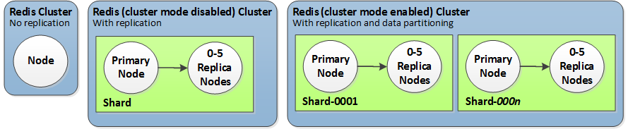
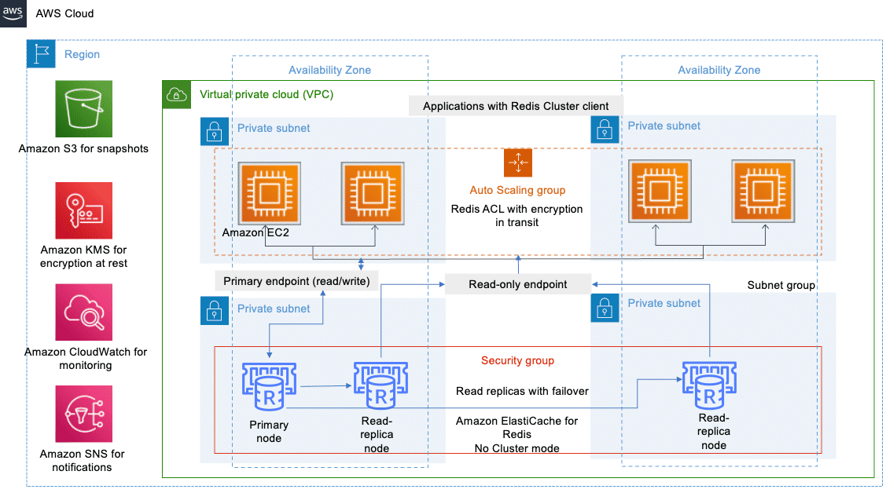
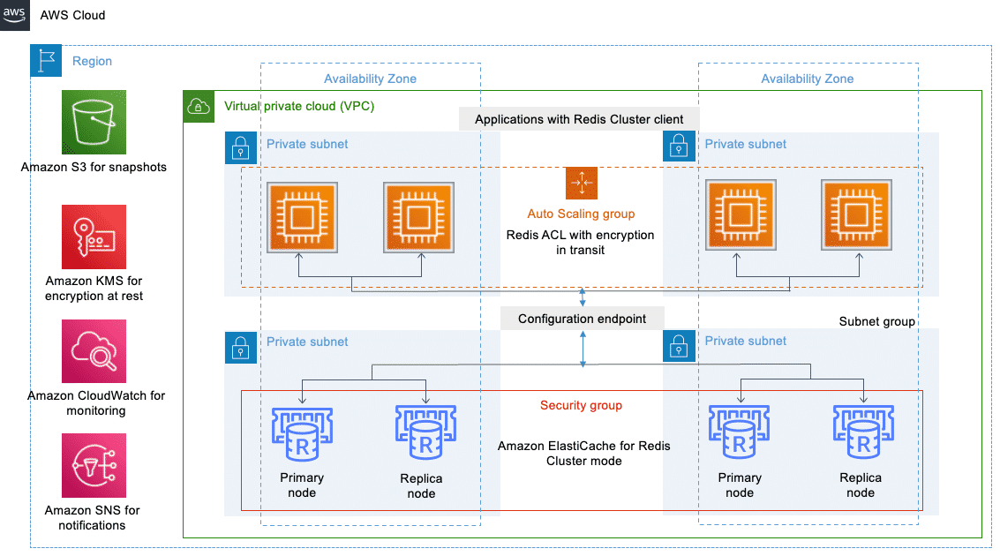
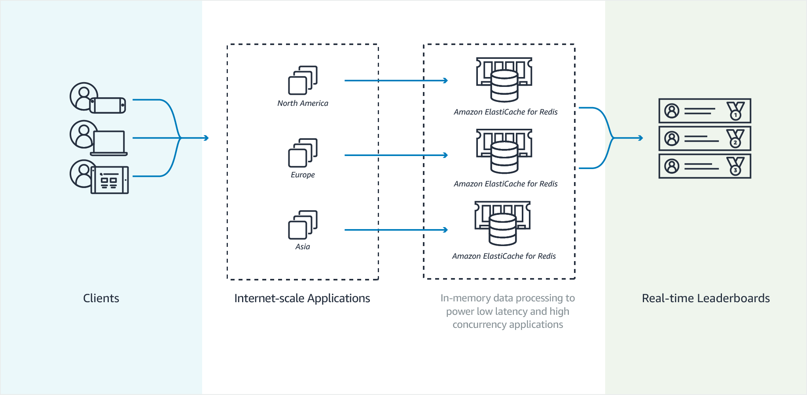
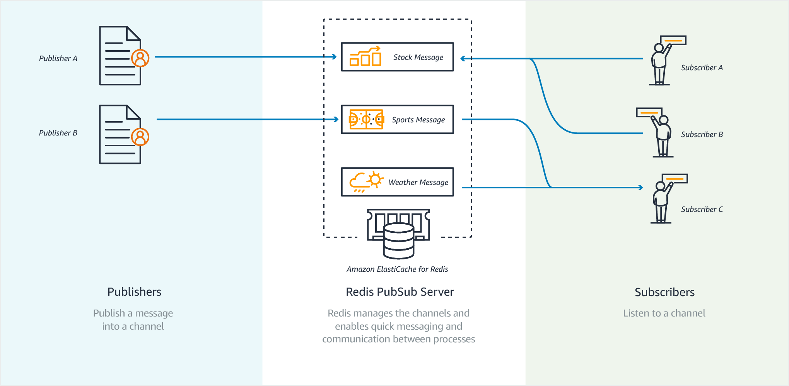
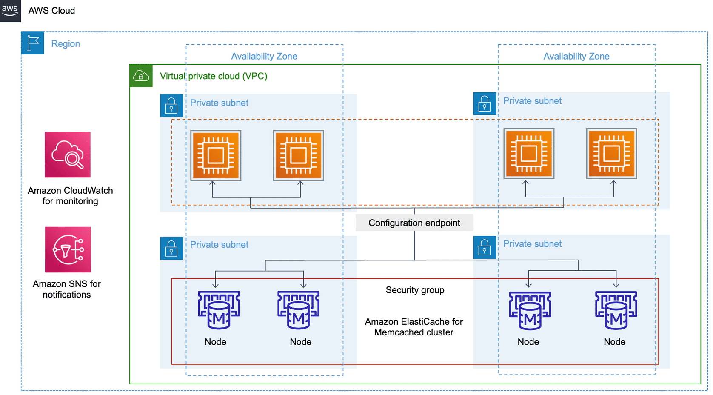
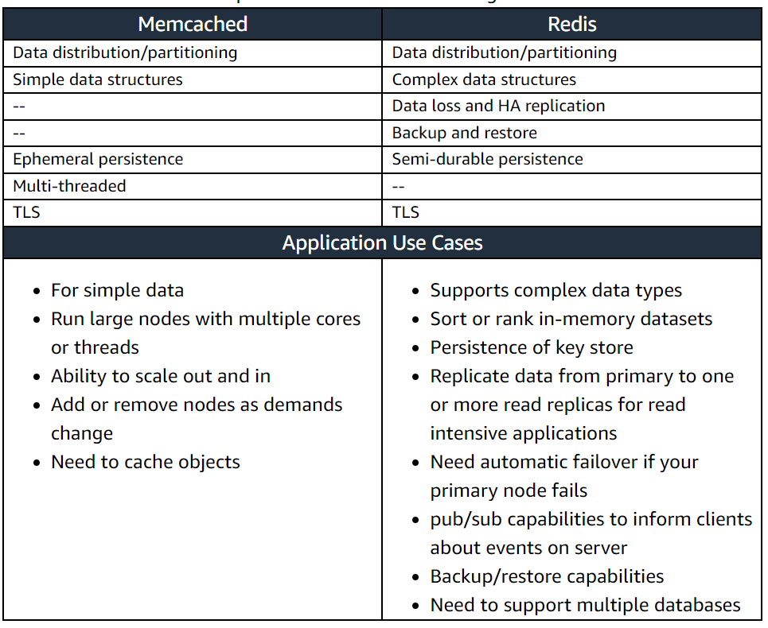

# Overview
+ Amazon ElastiCache is a web service that makes it easy to set up, manage, and scale a distributed in-memory data store or cache environment in the cloud.
+ It provides a high-performance, scalable, and cost-effective caching solution.
+ Amazon ElastiCache supports the **Memcached and Redis** cache engines.
    + Redis, which stands for Remote Dictionary Server, is a fast, open-source data structure store. It is commonly used as** a distributed in-memory data store used as a database, cache, streaming engine, and message broker**. Redis supports different kinds of abstract data structures, such as strings, lists, maps, sets, sorted sets, HyperLogLogs, bitmaps, streams, and spatial indices.
    + Memcached is an intuitive, high-performance in-memory data store. It offers a mature, scalable, open-source solution for delivering **sub-millisecond response times**, which makes it useful as a cache or a non-durable session store.
# ElastiCache for Redis
+ ElastiCache for Redis has multiple features that help make the service more reliable for critical production deployments: 
+ Automatic detection of and recovery from cache node failures.
+ **Multi-AZ** for a failed primary cluster to a read replica, in Redis clusters that support replication.
+ Redis (cluster mode enabled) supports **partitioning your data across up to 500 shards**.
+ For Redis version 3.2 and later, all versions support **encryption in transit and encryption at rest encryption** with authentication. This support helps you build HIPAA-compliant applications.
+ Flexible Availability Zone placement of nodes and clusters for increased fault tolerance.
+ Integration with other AWS services such as Amazon EC2, Amazon CloudWatch, AWS CloudTrail, and Amazon SNS. This integration helps provide a managed in-memory caching solution that is high-performance and highly secure.
+ ElastiCache for Redis **manages backups, software patching, automatic failure detection, and recovery**.
+ You can have automated backups performed when you need them, or manually create your own backup snapshot. You can use these backups to restore a cluster. The ElastiCache for Redis restore process works reliably and efficiently.
+ You can get **high availability with a primary instance and a synchronous secondary instance that you can fail over** to when problems occur. You can also **use read replicas to increase read scaling**.
+ You can control access to your ElastiCache for Redis clusters by using AWS Identity and Access Management to define users and permissions. You can also help protect your clusters by putting them in a virtual private cloud (VPC).
## ElastiCache for Redis components and features
+ The basic building block of ElastiCache for Redis is the **cluster**.
+ **A cluster is a collection of one or more cache nodes**, all of which run an instance of the Redis cache engine software.
+ Each ElastiCache for Redis cluster runs a Redis engine version
+ The computation and memory capacity of a cluster is determined by its instance type or node type
+ Cluster node storage comes in two types: **Standard and memory-optimized**. 
+ You can create your cluster in several Availability Zones, an option called a **Multi-AZ deployment**. 
    + When you choose this option, Amazon automatically provisions and maintains a secondary **standby node instance in a different Availability Zone**.
    + Your primary node instance is **synchronously replicated** across Availability Zones to the secondary instance. 
+ A **security group** controls the access to a cluster.
+ A *node* is the smallest building block of an ElastiCache deployment. 
+ If necessary, you can scale the nodes in a cluster up or down to a different instance type.
+ You can purchase nodes on a pay-as-you-go basis, where you only pay for your use of a node. Or you can purchase reserved nodes at a much-reduced hourly rate.
+ A Redis *shard* (called a *node group* in the API and CLI) is a **grouping of one to six related nodes**.
+ A *multiple node shard* implements replication by having **one read/write primary node and 1–5 replica nodes**. 
+ A Redis *cluster* is a logical grouping of one or more shards, **Data is partitioned across the shards in a Redis** (cluster mode enabled) cluster

+ Redis (cluster mode enabled) clusters can have **up to 500 shards**, with your data partitioned across the shards.
+ Cache **parameter groups** are an easy way to manage runtime settings for supported engine software. Parameters are used to **control memory usage, eviction policies, item sizes**, and more.
+ A global datastore is a collection of one or more clusters that replicate to one another **across Regions**, whereas a replication group replicates data across a cluster mode enabled cluster with multiple shards. 
+ **Primary (active) cluster**– A primary cluster **accepts writes** that are replicated to all clusters within the global datastore. A primary cluster also **accepts read** requests.
+ **Secondary (passive) cluster**– A secondary cluster **only accepts read** requests and replicates data updates from a primary cluster. **A secondary cluster needs to be in a different AWS Region than the primary cluster**.
## ElastiCache for Redis non-cluster mode
+ **Only one primary instance support is available for up to five read replicas per primary node**.
+ **Automatic failover is supported**. In the event that the primary node fails, one of the replicas is promoted to the primary role.
+ All **write activity takes place in the primary node**. Read activity may happen from any one of the nodes.
+ **Multi-AZ configuration** is supported.
+ As a cluster with **a single shard**, it is suitable when **a small number of keys are used**.
+ Non-cluster mode is used when a small number of large nodes make up the cluster.

## ElastiCache for Redis cluster mode
+ Supports up to five read replicas per primary node and **supports multiple primary nodes (shards)**, up to a total of 500 nodes (with no replica)
+ Uses automatic node promotion 
+ **Supports sharding as a means to distribute the load**. Cluster mode is used when deploying a number of smaller nodes. It supports automatic node promotion in the event of primary node failure. The configuration endpoint is automatically updated.

## Common ElastiCache Use Cases
+ In-Memory Data Store: Consider caching your data if the following is true: 
    + Your data is slow or expensive to get when compared to cache retrieval.
    + Users **access** your data **often**.
    + Your data stays **relatively the same**, or if it changes quickly staleness is not a large issue.
+ Gaming Leaderboards (Redis Sorted Sets)

+ Messaging (Redis Pub/Sub): In the pub/sub paradigm, you **send a message to a specific channel** not knowing who, if anyone, receives it. The people **who get the message are those who are subscribed to the channel**.  
    + To send a message to all subscribers to a channel, use the `PUBLISH` command, specifying the channel and the message. 
    + To receive messages on a channel, you subscribe to the channel. You can subscribe to a single channel, multiple specified channels, or all channels that match a pattern
 

+ Caching
+ Session stores
+ Geospatial
+ Message queues
+ IoT streaming
+ Machine learning
## Caching strategies
+ **lazy loading** is a caching strategy that loads data into the cache only when necessary.
+ **write-through** strategy adds data or updates data in the cache **whenever data is written to the database**.
+ Lazy loading allows for stale data but doesn't fail with empty nodes. Write-through ensures that data is always fresh, but can fail with empty nodes and can populate the cache with superfluous data. By adding a time to live (TTL) value to each write, you can have the advantages of each strategy. At the same time, you can and largely avoid cluttering up the cache with extra data.
## Redis replication
+ Redis implements replication in two ways: 
    + With a single shard that contains all of the cluster's data in each node—Redis (cluster mode disabled)
    + With data partitioned across up to 500 shards—Redis (cluster mode enabled)
### Append only files (AOF)
+ By default, the data in a Redis node on ElastiCache resides only in memory and isn't persistent. If a node is rebooted, or if the underlying physical server experiences a hardware failure, the data in the cache is lost.
+ With AOF, the node writes all of the commands that change cache data to an append-only file. When a node is rebooted and the cache engine starts, the AOF is "replayed." The result is a warm Redis cache with all of the data intact.
+ If you are enabling AOF to protect against data loss, consider **using a replication group with Multi-AZ enabled instead of AOF**. 
    + Generally, this functionality is much faster than rebuilding the primary from an AOF file. For greater reliability and faster recovery, we recommend that you create a replication group with one or more read replicas in different Availability Zones and enable Multi-AZ instead of using AOF. 
## Scaling ElastiCache for Redis clusters
+ Scaling single-node clusters for Redis (Cluster Mode Disabled) 
    + To change the data capacity of your Redis (cluster mode disabled) cluster, you must scale vertically
    + **scaling up to a larger node type** to increase data capacity,
    + **scaling down to a smaller node type **to reduce data capacity.
+ Scaling Redis (Cluster Mode Disabled) clusters with replica nodes 
    + To change the data capacity of your cluster you must **scale it up to a larger node type, or down to a smaller node type**.
    + **To change the read capacity** of your cluster, **add more read replicas**, up to a maximum of 5, or remove read replicas.
+ Scaling clusters in Redis (Cluster Mode Enabled)
    + Horizontal scaling allows you to **change the number of node groups (shards) in the replication group** by adding or removing node groups (shards). The online resharding process allows scaling in/out while the cluster continues serving incoming requests.
    + Vertical Scaling - **Change the node type to resize the cluster**. The online vertical scaling allows scaling up/down while the cluster continues serving incoming requests.
    + We recommend using **online horizontal scaling** , because it allows your cluster to continue serving requests during the scaling process.
# Amazon ElastiCache for Memcached
+ ElastiCache for Memcached has multiple features to enhance reliability for critical production deployments: 
+ Automatic detection and recovery from cache node failures.
+ Automatic discovery of nodes within a cluster enabled for automatic discovery, so that no changes need to be made to your application when you add or remove nodes
+ Flexible Availability Zone placement of nodes and clusters.
+ Integration with other AWS services such as Amazon EC2, Amazon CloudWatch, AWS CloudTrail, and Amazon SNS to provide a secure, high-performance, managed in-memory caching solution.
## Common ElastiCache Use Cases
+ In-Memory Data Store: Consider caching your data if the following is true: 
    + Your data is slow or expensive to get when compared to cache retrieval.
    + Users access your data often.
    + Your data stays relatively the same, or if it changes quickly staleness is not a large issue.
+ Caching
+ Session stores
+ Multithreaded applications
+ API counters

## ElastiCache for Memcached components and features
+ A *node* is the smallest building block of an ElastiCache deployment. A node can exist in isolation from or in some relationship to other nodes. 
+ The Memcached engine **supports Auto Discovery.** *Auto Discovery* is the ability for client programs to automatically identify all of the nodes in a cache cluster, and to initiate and maintain connections to all of these nodes. With Auto Discovery, your application doesn't need to manually connect to individual nodes. Instead, your application connects to a **configuration endpoint**. 
+ A Memcached *cluster* is a **logical grouping of one or more nodes**, Data is **partitioned across the nodes** in a Memcached cluster.
+ Memcached supports up to **300 nodes per customer** for each AWS Region with **each cluster having 1–40 nodes**. 
+ For improved fault tolerance, locate your Memcached nodes in **various Availability Zones (AZs)** within the cluster's AWS Region. That way, a failure in one AZ has **minimal impact** upon your entire cluster and application. 
+ As demand upon your Memcached cluster changes, you can **scale out or in by adding or removing nodes**, which repartitions your data across the new number of nodes.
# What are the benefits of ElastiCache?
+ **Fully managed**
    + ElastiCache automates common administrative tasks required to operate a distributed in-memory key-value environment.
    + After a cluster is provisioned, ElastiCache automatically detects and replaces failed nodes, helping provide a resilient system.
+ **Workload scalability**
    + With ElastiCache, you can add or remove nodes as you need them.
    + You have the option to either scale up vertically by adding larger instances or scale out horizontally by adding more instances of the same type.
    + ElastiCache for Redis also supports autoscaling the cluster by increasing or decreasing the number of shards to handle write traffic. It can also increase or decrease the number of read replicas to handle read traffic. Constantly monitored, pre-defined cloud-watch metrics start the autoscaling process when needed.
+ **Compatibility**
    + ElastiCache supports two engines that are fully API-compatible with popular open-source caching technologies: Redis and Memcached. 
+ **Extreme performance**
    + ElastiCache improves the performance of applications by helping you retrieve information from a fast, managed, in-memory system, instead of relying entirely on slower disk-based databases. 
+ **Secure and reliable**
    + ElastiCache is a highly secure service with features such as network isolation, TLS, encryption at rest or in transit, multi-AZ, and automatic failover.
# Compare two engines

# How much does ElastiCache cost?
+ You are charged hourly based on the number of nodes, node type, and pricing model you select. ElastiCache is priced in four different dimensions.
+ ON-DEMAND NODES
+ RESERVED NODES
+ BACKUP STORAGE
+ DATA TRANSFER

AWS Pricing Calculator
# Reference
+ [Amazon Elasti Cache](https://docs.aws.amazon.com/AmazonElastiCache/latest/red-ug/WhatIs.html)
+ [Amazon ElastiCache Getting Started](https://explore.skillbuilder.aws/learn/course/14572/amazon-elasticache-getting-started)
+ [Data Modeling for Amazon ElastiCache for Redis](https://explore.skillbuilder.aws/learn/course/14775/data-modeling-for-amazon-elasticache-for-redis)