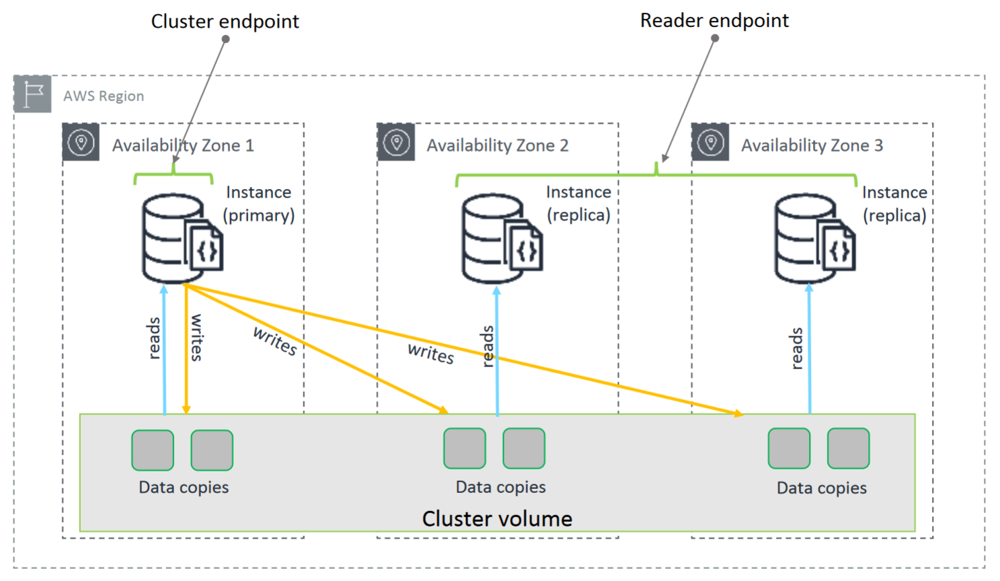

# Overview
+ Amazon DocumentDB (with MongoDB compatibility) is a fast, reliable, and fully managed database service.
+ Amazon DocumentDB is a type of **nonrelational database** that is designed to **store and query JSON documents**.
+ Amazon DocumentDB makes it easy to set up, operate, and scale **MongoDB-compatible databases** in the cloud.
+ With Amazon DocumentDB, you can run the same application code and use the same drivers and tools that you use with MongoDB.
# Features of Amazon DocumentDB
+ Amazon DocumentDB **automatically grows the size of your storage volume** as your database storage needs grow. Your storage volume grows in increments of 10 GB, up to a **maximum of 64 TB**
+ With Amazon DocumentDB, you can **increase read throughput** to support high-volume application requests by **creating up to 15 replica instances**.
+ Amazon DocumentDB lets you **scale the compute and memory resources** for each of your instances up or down.
+ Amazon DocumentDB **runs in Amazon Virtual Private Cloud** (Amazon VPC), so you can isolate your database in your own virtual network.
+ Amazon DocumentDB continuously monitors the health of your cluster. 
+ On instance failure, Amazon DocumentDB **automates failover** to one of up to 15 Amazon DocumentDB replicas that you create in other Availability Zones.
+ The backup capability in Amazon DocumentDB enables **point-in-time recovery** for your cluster
+ With Amazon DocumentDB, you can **encrypt your databases** using keys that you create and control through AWS Key Management Service (AWS KMS)
# Data modeling
+ the NoSQL data model displays data in a **JSON-like structure** within a single document.
+ Access patterns and queries define the data model, which, in turn, define the way the data is stored.
+ **Normalization** is a design technique for organizing data into tables or collections in a database. Normalization divides larger tables into smaller tables and links them through relationships—primary keys (PKs) and foreign keys (FKs). 
    + The purpose of normalization is to eliminate redundant or repetitive data and ensure that data is stored logically and consistently.
+ When data is **always accessed together, storing it all in the same document is optimal**. The major advantage with the **embedded** model is that there are fewer calls to the database. This is because all the needed data for an entity, such as nutrition information, is retrieved in a single query. 
+ The other option for designing your schema is to **reference** another piece of data from other collections and join it by doing multiple queries. Or you can join at the database level by using the $lookup operator.
    + This will also reduce the overall amount of data duplication. However, this requires more queries to retrieve the data, and joins can be expensive.
## Database relationships
+ One-to-one relationship: In Amazon DocumentDB, the one-to-one (1:1) relationship data can be modeled as key-value pairs using the embedded model
+ One-to-many relationship： You can model the one-to-many (1:n) relationship in several ways using Amazon DocumentDB. 
    + array
    + reference
+ Many-to-many relationship: Many-to-many (m:n) relationships have two-way embedding
## Patterns
+ With Amazon DocumentDB, you can design your data models by your application's access patterns
+ Common application patterns are the **subset pattern, precompute pattern, and schema versioning pattern**. 
+ The **subset pattern splits your individual documents into multiple collections** based on how frequently the data is used. 
    + Using a subset pattern can help avoid the issue of having your working set exceed the capacity of RAM because of large documents.
    + You can apply this design pattern when you have a **one-to-many or many-to-many relationship or when the documents' sizes increase beyond the recommended 8 KB**. This will lower the overall size of the working set, reducing the memory constraints.
+ Instead of your application performing complex functions every time it retrieves a set of documents, you can store the function output in the document itself.
    + You can use the **precompute pattern whenever calculations must run against data**, such as when you need sums, grouping, or aggregation repeatedly. 
    + If your application is read-intensive, these computations are amplified, potentially causing more resource usage and cost. By applying this design pattern, you are reducing or avoiding repetitive processing, and queries become more performant. 
+ The schema versioning pattern is great for when application downtime is not an option and updating the schema might take hours, days, or weeks to complete.
    + Additionally, the schema versioning pattern provides developers with the opportunity to better decide when and how schema updates will take place. It also allows turning on feature flags on a subset of documents. 
    + Schema versioning is ideal for database schema changes that make it possible for the application to **process both different schema versions while documents are being updated**.
# basic concepts
+ CLUSTER
    + **Cluster**: A cluster consists of 0–16 instances and a cluster storage volume that manages the data for those instances.
    + **Cluster volume**: Uses a cloud-native storage service to replicate data six ways across three Availability Zones, providing highly durable and available storage. An Amazon DocumentDB cluster has exactly one cluster volume, which can store up to 128 TiB of data.
+ INSTANCES
    + **Primary instance**: Supports **read/write operations** and performs all data modifications to the cluster volume. Each Amazon DocumentDB cluster has one primary instance.
    + **Replica instance**: Supports **read-only operations**. An Amazon DocumentDB cluster can have up **to 15 replicas** in addition to the primary instance. Having multiple replicas starts the distribution of read workloads. Additionally, by placing replicas in separate Availability Zones, you also increase your cluster availability.
+ PARAMETER GROUP
     + A parameter group is a collection of Amazon DocumentDB configuration values. Cluster parameter groups act as a container for engine configuration values that are applied to all instances in the cluster, such as activating or deactivating auditing events.
+ SUBNET GROUPS
    + A database (DB) subnet group is a **collection of subnets (typically private) that you create in a VPC that you designate for your clusters**.
    + Each DB subnet group will have subnets in **at least two Availability Zones** in a given Region.
    + When creating a DB cluster in a VPC, you must select a DB subnet group.
# Clusters
+ A *cluster* consists of **0 to 16 instances and a cluster storage volume** that manages the data for those instances.
+ All writes are done through the primary instance.
+ All instances (primary and replicas) support reads.
+ An Amazon DocumentDB *cluster volume* is a **virtual database storage volume** that spans multiple Availability Zones.
+ The cluster's data is stored in the cluster volume with copies in **three different Availability Zones**.
+ An Amazon DocumentDB cluster consists of two components: 
    + **Cluster volume**—Uses a cloud-native storage service to replicate data **six ways across three Availability Zones**, providing highly durable and available storage. An Amazon DocumentDB cluster has exactly one cluster volume, which can store **up to 64 TB** of data.
    + **Instances**—Provide the processing power for the database, writing data to, and reading data from, the cluster storage volume. An Amazon DocumentDB cluster can have 0–16 instances.

# Amazon DocumentDB Endpoints
+  The *cluster endpoint* connects to your cluster’s current primary instance. 
+  If your cluster’s current primary instance fails, and your cluster has at least one active read replica, the cluster endpoint automatically redirects connection requests to a new primary instance.
+ The *reader endpoint* load balances read-only connections across all available replicas in your cluster. 
+ An *instance endpoint* connects to a specific instance within your cluster.
+ Connecting to the cluster endpoint in replica set mode is the recommended method for general use.
# Amazon DocumentDB Storage
+ Amazon DocumentDB data is stored in a *cluster volume*, which is a single, virtual volume that uses solid state drives (SSDs). A cluster volume consists of **six copies of your data**, which are replicated automatically across multiple Availability Zones in a single AWSRegion.
# Amazon DocumentDB Reliability
+ **Storage Auto-Repair**: When a segment of a cluster volume fails, Amazon DocumentDB **immediately repairs** the segment. It uses the data from the other volumes that make up the cluster volume to help ensure that the data in the repaired segment is current.+ **Survivable Cache Warming:** Amazon DocumentDB manages its page cache in a separate process from the database so that the page cache can survive independently of the database. 
+ **Crash Recovery**: Amazon DocumentDB is designed to recover from a crash almost instantaneously, and to continue serving your application data.
# High Availability
+ Amazon DocumentDB supports highly available cluster configurations by **using replicas as failover targets for the primary instance**. If the primary instance fails, an Amazon DocumentDB replica is promoted as the new primary, with a brief interruption during which read and write requests made to the primary instance fail with an exception.
+ Replicas that are intended for use as failover targets should be of the **same instance class** as the primary instance. 
# Document Database Use Cases
+ Document databases are useful for workloads that **require a flexible schema for fast, iterative development**. 
+ Document databases are a practical solution to **online profiles in which different users provide different types of information**. 
+ Real-Time Big Data
+ Content Management
#  Transactions
+ To use the transactions feature, you need to meet the following requirements: 
    + You must be using the Amazon DocumentDB 4.0 engine.
    + You must use a driver compatible with MongoDB 4.0 or greater.
# Two types of data scans
+ A **collection scan** inspects the entire collection, document by document, to find a match. This action is **compute and I/O intensive**.
+ An **index scan** limits the number of documents that are scanned. When implemented correctly, indexes **improve query performance by decreasing processing time**. Amazon DocumentDB supports secondary indexes for quickly looking up requested data, which can help workload performance.
+ Typically, applications only need specific fields returned from a database, rather than the entire document. If these fields are indexed, a database can perform an index scan, so there's no need to fetch the documents from storage or cache. This is known as a covered query and results in fewer round trips and I/O operations.
+ An index covers a query when the following apply:
    + All the fields in the query are part of an index.
    + All the fields returned in the results are in the same index.
    + Fields in the query are not part of an array or a sub-document. 
# Monitoring Tools
+ Monitoring tools, such as the **built-in profiler, Amazon CloudWatch, Amazon CloudWatch Logs Insights, and the MongoDB Shell**, can help you monitor the performance of your Amazon DocumentDB clusters and instances.
## Built-in profiler
+ With the built-in profiler, you can **log the processing time and details of operations performed on your cluster**.
+ The profiler is useful for **monitoring the slowest operations** on your cluster to help you improve individual query performance and overall cluster performance.
+ You can set a query runtime threshold in milliseconds and the sample size of collected long-running operations. 
## CloudWatch
+ CloudWatch collects monitoring and operational data in the form of logs, metrics, and events.
+ Through integration with CloudWatch, you can use Amazon DocumentDB to gather and analyze over 50 operational metrics.
+ You can also **configure alarms** to be notified if a metric value breaches a certain threshold.
+ Building on this, you can set up Amazon CloudWatch Events to **take corrective action** if a breach occurs.
## CloudWatch Logs Insights
+ After logs are exported to CloudWatch, you can use CloudWatch Logs Insights to analyze them.
## MongoDB Shell
+ Amazon DocumentDB is MongoDB compatible. This means you can use a majority of the applications, drivers, and tools used with MongoDB databases with Amazon DocumentDB—with little or no change.
# Optimize your aggregation pipeline queries.
+ Amazon DocumentDB supports aggregation operations, which are used to process multiple documents and return computed results. 
+ Using different stages, aggregation pipelines can be built to group, count, or compute operations like averages, maximum, and minimum on groups of documents.
+ An aggregation pipeline can become complex and potentially require a large amount of compute and memory resources.
# Best Practices
+ Deploy a cluster consisting of **two or more Amazon DocumentDB instances in two AWS Availability Zones**
+ Connect to your Amazon DocumentDB cluster with the **cluster endpoint and in replica set** mode
+  When importing data into Amazon DocumentDB, you should **create your indexes** before importing large datasets.
+ One of the best ways to improve cluster performance is to **tune your most commonly used and most resource-intensive queries** to make them less expensive to run.
+ Document deletion resulting from TTL index expiry is a best effort process.
+ For production workloads, it is recommended to deploy an Amazon DocumentDB cluster with **a minimum of three instances, each in a separate Availability Zone**. This will provide an availability target of 99.99 percent. In the case of an instance being unavailable, your cluster automatically creates a replacement to backfill the instance in minutes. 
    + Your **application layer should also be deployed in the same Availability Zones as your Amazon DocumentDB instances** to help ensure the lowest network latencies with the database layer.
+ Instead of opening and closing connections for every request, you can configure your application driver to use **connection pooling**. To make sure that the application doesn’t run out of connections in the pool, **set the max pool size to 10–20 percent more than the number of concurrent queries that the application runs**.
+ Indexing best practices
    + Limit indexes for each collection
    + Check for and remove unused indexes
    + Ensure that indexes fit in memory
    + Create indexes on fields with high cardinality
# Migrating to Amazon DocumentDB
+ **AWS Database Migration Service (AWS DMS)** is a cloud service that makes it easy to migrate relational databases and non-relational databases to Amazon DocumentDB.
# Global cluster
+ A global cluster consists of **one primary region and up to five read-only secondary regions**.
+ You issue **write operations directly to the primary cluster** in the primary region and Amazon DocumentDB automatically **replicates the data to the secondary regions using dedicated infrastructure**.
+ Latency is typically under a second
+ global cluster features: 
    + **Recovery from region-wide outages**
    + **Global reads with local latency**
    + **Scalable secondary clusters**
    + **Fast replication from primary to secondary clusters** 
# What are the benefits of Amazon DocumentDB?
+ Performance at scale
+ Flexibility
+ Fully managed
+ Highly available
+ Durability
+ Security and compliance
+ Compatibility
# How much does Amazon DocumentDB cost?
+ On-demand instances
+ Database I/O
+ Database storage
+ Backup storage
# What are typical use cases for Amazon DocumentDB?
+ **Store and query CMS data**: Much of the content that we read today—from news articles, to blogs, to recipes, to patient records—all of that data lends itself well to a document model because it’s dynamic and changing. Improve the customer experience through fast, reliable access to reviews, images, and other content stored in your CMS.
+ **Manage user profiles, preferences, and requests**: Generate customer recommendations, and facilitate online transactions. You can manage millions of user profiles and preferences.
+ **Scale mobile and web applications**: Build applications that can scale to process millions of user requests per second with millisecond latency. Amazon DocumentDB facilitates storing the data you are collecting, going back and forth between devices.
+ **Manage inventory and catalog storage**: Customers use document storage to record output of machine learning experiments, inventory descriptions, and pharmaceutical trials.
+ **Handle gaming and user profiles**: Store user data, profiles, friend data, and battle data that can experience heavy traffic as high as tens of millions of requests per day.
+ **Customize marketing**: Track customers who purchase similar items. Create custom marketing campaigns using features such as nested indexes, one-time queries, and aggregations.
# Reference
+ [Amazon DocumentDB](https://docs.aws.amazon.com/documentdb/latest/developerguide/what-is.html)
+ [Getting Started with Amazon DocumentDB (with MongoDB compatibility](https://explore.skillbuilder.aws/learn/course/12290/play/46406/getting-started-with-amazon-documentdb-with-mongodb-compatibility)
+ [Performance Tuning on Amazon DocumentDB](https://explore.skillbuilder.aws/learn/course/14394/play/96393/performance-tuning-on-amazon-documentdb)
+ [Data Modeling for Amazon DocumentDB](https://explore.skillbuilder.aws/learn/course/15024/play/72221/data-modeling-for-amazon-documentdb)
+ [Build With Amazon DocumentDB (with MongoDB compatibility)](https://explore.skillbuilder.aws/learn/course/15823/build-with-amazon-documentdb-with-mongodb-compatibility)