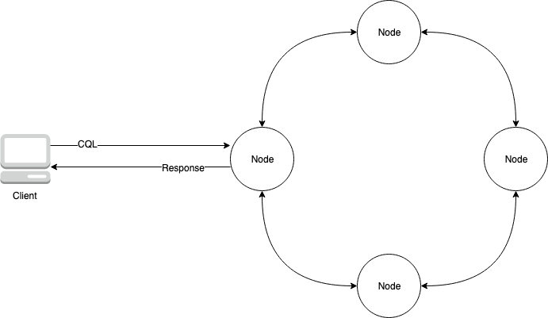
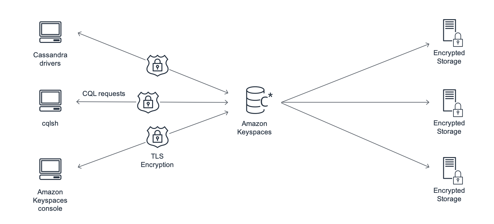

# Overview
+ Amazon Keyspaces (for Apache Cassandra) is a scalable, highly available, and managed **Apache Cassandra–compatible database service**.
+ With Amazon Keyspaces, you don’t have to provision, patch, or manage servers, and you don’t have to install, maintain, or operate software.
+ Amazon Keyspaces is **serverless**, so you pay for only the resources that you use, and the service automatically **scales tables up and down in response to application traffic**. You can build applications that serve thousands of requests per second with **virtually unlimited throughput and storage**.
+ Amazon Keyspaces makes it **easy to migrate, run, and scale Cassandra workloads** in the AWS Cloud. With just a few clicks on the AWS Management Console or a few lines of code, you can create keyspaces and tables in Amazon Keyspaces, without deploying any infrastructure or installing software.
+ With Amazon Keyspaces, you can run your existing Cassandra workloads on AWS using the same Cassandra application code and developer tools that you use today.
# What is Cassandra?
+ Cassandra is an open-source, wide-column database designed to handle large amounts of data.
+ A wide-column database is a type of **nonrelational database in which columns can vary across rows** in the same table.
+ Cassandra stores data in tables, also called **column families**, which are a collection of rows.
# How it works
## High-level architecture: Apache Cassandra vs. Amazon Keyspaces
+ Traditional Apache Cassandra is deployed in a cluster made up of one or more nodes.
+ The following diagram shows a simple Apache Cassandra cluster, consisting of four nodes.

+ A production Cassandra deployment might consist of hundreds of nodes, running on hundreds of physical computers across one or more physical data centers. This can cause an operational burden for application developers who need to provision, patch, and manage servers in addition to installing, maintaining, and operating software.
+ Amazon Keyspaces offers **two throughput capacity modes for reads and writes: on-demand and provisioned**. You can choose your table’s throughput capacity mode to optimize the price of reads and writes based on the predictability and variability of your workload.
+ With **on-demand mode**, you pay for only the reads and writes that your application actually performs. You do not need to specify your table’s throughput capacity in advance. Amazon Keyspaces accommodates your application traffic almost instantly as it ramps up or down, making it a good option for applications with unpredictable traffic.
+ **Provisioned capacity mode** helps you optimize the price of throughput if you have predictable application traffic and can forecast your table’s capacity requirements in advance. With provisioned capacity mode, you specify the number of reads and writes per second that you expect your application to perform. You can **increase and decrease the provisioned capacity for your table automatically by enabling automatic scaling**.
+ You can **change the capacity mode of your table once per day** as you learn more about your workload’s traffic patterns, or if you expect to have a large burst in traffic, such as from a major event that you anticipate will drive a lot of table traffic.
+ Amazon Keyspaces (for Apache Cassandra) stores **three copies of your data in multiple Availability Zones** for durability and high availability.
+ In addition, you benefit from a data center and network architecture that is built to meet the requirements of the most security-sensitive organizations.
+ **Encryption at rest is automatically enabled** when you create a new Amazon Keyspaces table and all **client connections require Transport Layer Security (TLS)**. + Additional AWS security features include **monitoring, AWS Identity and Access Management, and virtual private cloud (VPC) endpoints**

## Cassandra data model
+ Storage
    + You can visualize your Cassandra data in tables, with each row representing a record and each column a field within that record.
+ Table design: Query first
    + There are no JOINs in CQL.
    + Therefore, you should **design your tables with the shape of your data and how you need to access it** for your business use cases.
    + This might result in de-normalization with duplicated data.
    + You should design each of your tables specifically for a particular access pattern.
+ **Partitions**
    + Your data is stored in partitions on disk.
    + The number of partitions your data is stored in and how it is distributed across the partitions is determined by your partition key.
    + How you define your partition key can have a significant impact upon the performance of your queries.
+ **Primary key**
    + In Cassandra, data is stored as a **key-value pair**. To that end, every Cassandra table must have a primary key, which is the key to each row in the table.
    + **The primary key is the composite of a required partition key and optional clustering columns**. The data that comprises the primary key must be unique across all records in a table.
        + **Partition key** – The partition key portion of the primary key is required and **determines which partition of your cluster the data is stored in**. The partition key can be a single column, or it can be a compound value composed of two or more columns. You would use a compound partition key if a single column partition key would result in a single partition or a very few partitions having most of the data and thus bearing the majority of the disk I/O operations.
        + **Clustering column** – The optional clustering column portion of your primary key determines** how the data is clustered and sorted within each partition**. If you include a clustering column in your primary key, the clustering column can have **one or more columns**. If there are multiple columns in the clustering column, the sorting order is determined by the order that the columns are listed in the clustering column, from left to right.
## Accessing Amazon Keyspaces from an application
+ Amazon Keyspaces (for Apache Cassandra)** implements the Apache Cassandra Query Language (CQL) API**, so you can use** CQL and Cassandra drivers** that you already use. 
+ Updating your application is as easy as **updating your Cassandra driver or cqlsh configuration to point to the Amazon Keyspaces service endpoint**.

# Amazon Keyspaces use cases
+ Build applications that require **low latency** – Process data at high speeds for applications that require **single-digit-millisecond latency**, such as industrial equipment maintenance, trade monitoring, fleet management, and route optimization.
+ Build applications using **open-source technologies** – Build applications on AWS using open-source Cassandra APIs and drivers that are available for a wide range of programming languages, such as Java, Python, Ruby, Microsoft .NET, Node.js, PHP, C++, Perl, and Go. 
+ Move your Cassandra workloads to the cloud – Managing Cassandra tables yourself is time-consuming and expensive. With Amazon Keyspaces, you can set up, secure, and scale Cassandra tables in the AWS Cloud without managing infrastructure. 
# What is Cassandra Query Language (CQL)
+ Cassandra Query Language (CQL) is the primary language for communicating with Apache Cassandra. Amazon Keyspaces (for Apache Cassandra) is compatible with the CQL 3.x API (backward-compatible with version 2.x).
+ To run CQL queries, you can do one of the following:
    + Use the CQL editor on the AWS Management Console.
    + Run them on the cqlsh client.
    + Run them programmatically using an Apache 2.0 licensed Cassandra client driver.
# Supported Apache Cassandra consistency levels in Amazon Keyspaces
## Write consistency levels
+ Amazon Keyspaces **replicates all write operations three times across multiple Availability Zones** for durability and high availability.
+ Writes are durably stored before they are acknowledged using the **LOCAL_QUORUM** consistency level.
+ For each **1 KB write, you are billed 1 write capacity unit (WCU)** for tables using provisioned capacity mode or 1 write request unit (WRU) for tables using on-demand mode.
## Read consistency levels
+ Amazon Keyspaces supports **three read consistency levels: ONE, LOCAL_ONE, and LOCAL_QUORUM**.
+ During a LOCAL_QUORUM read, Amazon Keyspaces returns a response reflecting **the most recent updates from all prior successful write operations**.
+ Using the consistency level ONE or LOCAL_ONE can improve the performance and availability of your read requests, but the response **might not reflect the results of a recently completed write**.
+ For each **4 KB read using ONE or LOCAL_ONE consistency**, you are billed **0.5** read capacity units (RCUs) for tables using provisioned capacity mode or 0.5 read request units (RRUs) for tables using on-demand mode.
+ For each **4 KB read using LOCAL_QUORUM** consistency, you are billed **1** read capacity unit (RCU) for tables using provisioned capacity mode or 1 read request units (RRU) for tables using on-demand mode.
# keyspace
+ A keyspace groups related tables that are relevant for one or more applications. A keyspace contains one or more tables and defines the replication strategy for all the tables it contains.
# Migrating to Amazon Keyspaces
+ Loading data into Amazon Keyspaces using **cqlsh**
    + Step 1: Create the source CSV file and target table
    + Step 2: Prepare the data
    + Step 3: Set throughput capacity for the table
    + Step 4: Configure cqlsh COPY FROM settings
    + Step 5: Run the cqlsh COPY FROM command
+ Loading data into Amazon Keyspaces using **DSBulk**
    + Step 1: Create the source CSV file and target table
    + Step 2: Prepare the data
    + Step 3: Set throughput capacity for the table
    + Step 4: Configure DSBulk settings
    + Step 5: Run the DSBulk load command
# Integrating Amazon Keyspaces with Apache Spark
+ Apache Spark is an open-source engine for large-scale data analytics.
+ Apache Spark enables you to **perform analytics on data stored in Amazon Keyspaces more efficiently**.
+ You can also use Amazon Keyspaces to provide applications with consistent, single-digit-millisecond read access to analytics data from Spark.
+ The open-source **Spark Cassandra Connector** simplifies reading and writing data between Amazon Keyspaces and Spark.
+ Step 1: Configure Amazon Keyspaces for integration with the Apache Cassandra Spark Connector
+ Step 2: Configure the Apache Cassandra Spark Connector
+ Step 3: Create the application configuration file
+ Step 4: Prepare the source data and the target table in Amazon Keyspaces
+ Step 5: Write and read Amazon Keyspaces data using the Apache Cassandra Spark Connector
# Serverless resource management in Amazon Keyspaces (for Apache Cassandra)
+ Storage in Amazon Keyspaces
    + You **do not need to provision storage** to tables upfront. Amazon Keyspaces **scales your table storage up and down automatically** as your application writes, updates, and deletes data.
    + Amazon Keyspaces configures keyspaces with a **replication factor of three** by default. You **cannot modify** the replication factor.
+ Read/write capacity modes in Amazon Keyspaces
    + On-demand capacity mode
    + Provisioned throughput capacity mode
+ Managing throughput capacity automatically with Amazon Keyspaces auto scaling
+ Using Burst Capacity Effectively in Amazon Keyspaces
    + Amazon Keyspaces provides some flexibility in your per-partition throughput provisioning by providing burst capacity.
    + Whenever you're not fully using a partition's throughput, Amazon Keyspaces reserves a portion of that unused capacity for later bursts of throughput to handle usage spikes.
    + Amazon Keyspaces currently retains up to 5 minutes (300 seconds) of unused read and write capacity. During an occasional burst of read or write activity, these extra capacity units can be consumed quickly—even faster than the per-second provisioned throughput capacity that you've defined for your table.
# Multi-Region Replication for Amazon Keyspaces (for Apache Cassandra)
+ You can use Amazon Keyspaces **Multi-Region Replication** to replicate your data with automated, fully managed, **active-active replication** across the AWS Regions of your choice.
+ With active-active replication, **each Region is able to perform reads and writes in isolation**. You can improve both availability and resiliency from regional degradation, while also benefiting from low-latency local reads and writes for global applications.
+ With Multi-Region Replication, Amazon Keyspaces asynchronously **replicates data between Regions, and data is typically propagated across Regions within a second**. Also, with Multi-Region Replication, you no longer have the difficult work of resolving conflicts and correcting data divergence issues, so you can focus on your application.
+ By default, Amazon Keyspaces replicates data **across three Availability Zones within the same AWS Region** for durability and high availability. With Multi-Region Replication, you can create multi-Region keyspaces that replicate your tables in **up to six different geographic AWS Regions** of your choice.
+ Multi-Region Replication includes the following benefits:
    + Global reads and writes with single-digit millisecond latency.
    + Improved business continuity and protection from single-Region degradation.
    + High-speed replication across Regions.
    + Consistency and conflict resolution.
# Expiring data by using Amazon Keyspaces Time to Live (TTL)
+ Amazon Keyspaces (for Apache Cassandra) Time to Live (TTL) helps you simplify your application logic and optimize the price of storage by expiring data from tables automatically.
+ Amazon Keyspaces automatically filters out expired data so that expired data isn't returned in query results or available for use in data manipulation language (DML) statements. Amazon Keyspaces typically deletes expired data from storage within 10 days of the expiration date.  
+ In Amazon Keyspaces, you can set a default TTL value for all rows in a table when the table is created.
+ You can also edit an existing table to set or change the default TTL value for new rows inserted into the table.
+ **Changing the default TTL value of a table doesn't modify the TTL value of any existing data in the table**.
+ The default TTL value for a table is **zero**, which means that data **doesn't expire automatically**. If the default TTL value for a table is greater than zero, an expiration timestamp is added to each row.
+ TTL values are set in seconds, and the maximum configurable value is 630,720,000 seconds, which is the equivalent of 20 years
# What are the benefits of Amazon Keyspaces?
+ Compatible with Cassandra
+ No servers to manage
+ Performance at scale
+ Time to live (TTL)
+ Highly available
+ Backup and recovery
+ Secure
+ Integrates with AWS services
# What else should I keep in mind about Amazon Keyspaces?
+ Amazon Keyspaces supports virtually unlimited storage.
+ Amazon Keyspaces is a serverless, fully managed database service.
+ Amazon Keyspaces doesn’t require tuning of JVM, compactions, or tombstones.
+ Some metrics are different in Amazon Keyspaces compared to Cassandra.
+ Amazon Keyspaces is designed to efficiently gain compliance and governance.

# Reference
+ [Amazon Keyspaces (for Apache Cassandra)](https://docs.aws.amazon.com/keyspaces/latest/devguide/what-is-keyspaces.html)
+ [Getting Started with Amazon Keyspaces (for Apache Cassandra)](https://explore.skillbuilder.aws/learn/course/13688/play/57250/getting-started-with-amazon-keyspaces-for-apache-cassandra)